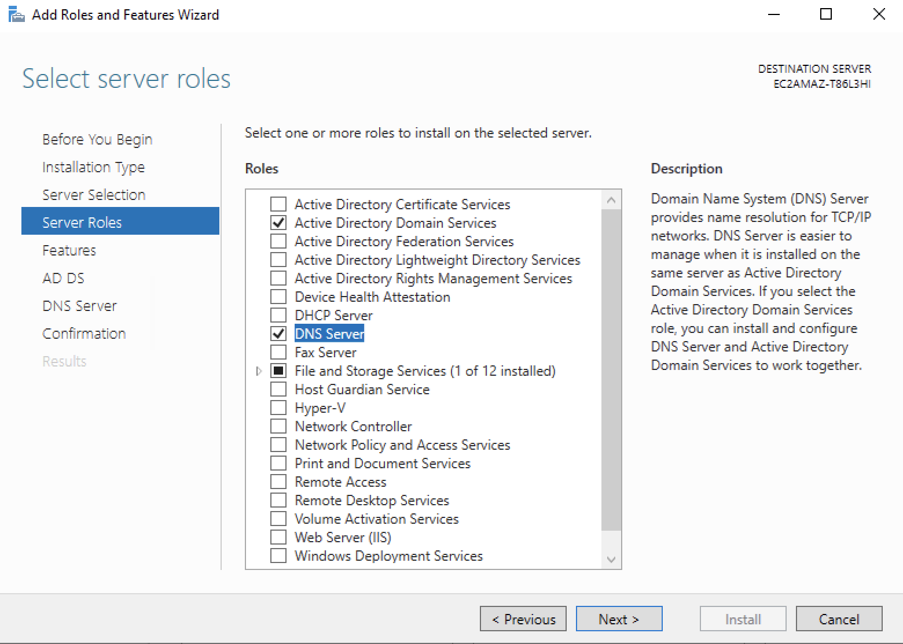

# Installing Active Directory using the GUI

1. Login to your Windows 2022 server as the Administrator

2. Launch Server Manager


3. Select the Add Roles and Features option


4. Select Next to Continue


5. Select Role Based or Feature Based installation 


6. Make sure the Select a Server from the Server pool option is select and click next.


7. Make sure Active Directory Domain Services and DNS Server are selected and click next. You may be prompted to accept the defaults for installing these services.



8. Now select next to continue the installation 


9. Now select next to continue


10. Now select next to continue


11. Now select next to continue


12. Now select next to continue


13. The installation should begin

14. Once the installation is complete click on the close button


15. Now go to the upper right hand corner of the screen and select the post installation task associated with promoting the server to a domain controller by selecting the "Promote this server to a domain controller" selection.


16. Now you will need to type in the name of the domain you are creating. The domain names typically are in the form of fully qualified domain names like tekperfect.com or microsoft.com. However, if the domain controller is public organization will often use a domain_name.internal name when creating it.


17. Next you will need to supply a password used to restore the domain in case of disaster. Please choose a password that will not be too difficult to remeber and store it in your password manager.


18. Select next to continue


19. Next you will need to accept the netbios name that will be used for the domain. Typially you will not need to change it and click on the next button.


20. Select next to continue


21. Select next to continue


22. To finalize the domain controller configuration click on the Install button.


23. Congratulations you have completed the installation of AD (Active Directory). Please reboot your system and login to the new domain with your Administrator credentials.

### Powershell Commands

List the top 5 processes using the most CPU time:

`Get-Process | sort CPU | select -last 5`

Get all processes that are using more than 50 MB of memory

`Get-Process | where-object {$_.WorkingSet -gt 5000000000}`

Set Execution Policy so that only remote signed scripts can be run

`Set-ExecutionPolicy -ExecutionPolicy RemoteSigned`

List the current state of the execution policy

`Get-ExecutionPolicy`

List the Exeution Policy options

`Get-ExecutionPolicy -List`

Allow you to run a script if it is blocked but the current execution policy

`Unblock-File -Path "filename.ps1"`

List all services with the name Windows

`Get-Service -Name Win*`

Get infomation about multiple services by seperating the list wiht a comma

`Get-Service -Name Winmgmt, WinRM, Spooler`

List service by display name

`Get-Service -DisplayName "Print Spooler"`

List servies and their dependencies

`Get-Service dhcp -DependentServices`

List service details in table format

`Get-Service Spooler | Format-List *`

List event logs on computer

`Get-EventLog -List`

Get the 5 most recent event logs from a specific event log type

`Get-EventLog -Newest 5 -LogName "Application"`

Get error events from a specifc log type

`Get-EventLog -LogName System -EntryType Error`

Obtain Vent logs from multiple computerss

`Get-EventLog -LogName "Windows PowerShell" -ComputerName "Server0", "Server1", "Server2"`

Get all events in an event log that have include a specific word in the message value

`Get-EventLog -LogName "Windows PowerShell" -Message "*failed*"`

Get events from an event log with using a source and event ID:

`Get-EventLog -Log "Application" -Source "Outlook" | where {$_.eventID -eq 34}`

Get loge events based on specific time period

`Get-EventLog -Log "Windows PowerShell" -EntryType Error -After $Jan31 -before $June1`

# Installing Active Directory using Powershell

## Install AD Powershell commands

1. Install Active Directory using the following commands from Powershell. You will need to specify the domain name when running the third command.


2. `get-windowsfeature`


3. `install-windowsfeature AD-Domain-Services`


4. `Install-ADDSForest -CreateDnsDelegation:$false -DatabasePath “C:\Windows\NTDS” -DomainMode “Win2012R2” -DomainName “domain_name.com” -DomainNetbiosName “DOMAIN_NAME” -ForestMode “Win2012R2” -InstallDns:$true -LogPath “C:\Windows\NTDS” -NoRebootOnCompletion:$false -SysvolPath “C:\Windows\SYSVOL” -Force:$true`

### Install AD Management Tools

1. `Add-WindowsFeature RSAT-AD-PowerShell`

2. `Install-WindowsFeature AD-Domain-Services -IncludeManagementTools`

### Create AD User from commands in Powershell.

1. This is the command to create a user will all of the required and optional fields you would need to create a new users.

2. `New-ADUser -Name "Full Name" -GivenName "First_Name" -Surname "Last_Name" -SamAccountName "username" -AccountPassword (ConvertTo-SecureString -AsPlainText “xxxxxxxxxxxx” -Force) -ChangePasswordAtLogon $True -Company "Company_Name" -Title "title" -State "State" -City "City" -Description "User Description" -EmployeeNumber "xx" -Department "Department" -DisplayName "Full Name" -Country "US" -PostalCode "xxxxx" -Enabled $True`

3. This is the command to create a new user with the recommend fields.

4. `New-ADUser -Name "Full Name" -GivenName "First_Name" -Surname "Last_Name" -SamAccountName "username" -AccountPassword (ConvertTo-SecureString -AsPlainText “xxxxxxxxxxxx” -Force) -ChangePasswordAtLogon $True -DisplayName "Full Name" -Enabled $True`

5. This command will allow you to se or reset the password for a particular user

6. `Set-ADAccountPassword -Identity “New_User”`

7. This is a script that will allow you to bulk add users to a specific group. Pleaset note this script must be modified to fit your specific use case.

```
# Start transcript
Start-Transcript -Path C:\scripts\Add-ADUsers.log -Append

# Import AD Module
Import-Module ActiveDirectory

# Import the data from CSV file and assign it to variable
$Users = Import-Csv "C:\scripts\users.csv"

# Specify target group name (pre-Windows 2000) where the users will be added to
# You can add the distinguishedName of the group. For example: CN=Domain Admins,OU=Groups,OU=Company_Name,DC=domain_name,DC=domain_extension
$Group = "Domain Admins"

foreach ($User in $Users) {
    # Retrieve UPN
    $UPN = $User.UserPrincipalName

    # Retrieve UPN related SamAccountName
    $ADUser = Get-ADUser -Filter "UserPrincipalName -eq '$UPN'" | Select-Object SamAccountName

    # User from CSV not in AD
    if ($ADUser -eq $null) {
        Write-Host "$UPN does not exist in AD" -ForegroundColor Red
    }
    else {
        # Retrieve AD user group membership
        $ExistingGroups = Get-ADPrincipalGroupMembership $ADUser.SamAccountName | Select-Object Name

        # User already member of group
        if ($ExistingGroups.Name -eq $Group) {
            Write-Host "$UPN already exists in $Group" -ForeGroundColor Yellow
        }
        else {
            # Add user to group
            Add-ADGroupMember -Identity $Group -Members $ADUser.SamAccountName -WhatIf
            Write-Host "Added $UPN to $Group" -ForeGroundColor Green
        }
    }
}
Stop-Transcript

```

8. To import users into AD using a csv file you can use the following script. Please note this script must be modified.

```

# Define the CSV file location and import the data
$Csvfile = "C:\scripts\importadusers.csv"
$Users = Import-Csv $Csvfile

# Import the Active Directory module
Import-Module ActiveDirectory

# Loop through each user
foreach ($User in $Users) {
    $GivenName = $User.'First name'
    $Surname = $User.'Last name'
    $DisplayName = $User.'Display name'
    $SamAccountName = $User.'User logon name'
    $UserPrincipalName = $User.'User principal name'
    $StreetAddress = $User.'Street'
    $City = $User.'City'
    $State = $User.'State/province'
    $PostalCode = $User.'Zip/Postal Code'
    $Country = $User.'Country/region'
    $JobTitle = $User.'Job Title'
    $Department = $User.'Department'
    $Company = $User.'Company'
    $ManagerDisplayName = $User.'Manager'
    $Manager = if ($ManagerDisplayName) {
        Get-ADUser -Filter "DisplayName -eq '$ManagerDisplayName'" -Properties DisplayName |
        Select-Object -ExpandProperty DistinguishedName
    }
    $OU = $User.'OU'
    $Description = $User.'Description'
    $Office = $User.'Office'
    $TelephoneNumber = $User.'Telephone number'
    $Email = $User.'E-mail'
    $Mobile = $User.'Mobile'
    $Notes = $User.'Notes'
    $AccountStatus = $User.'Account status'

    # Check if the user already exists in AD
    $UserExists = Get-ADUser -Filter "SamAccountName -eq '$SamAccountName'" -ErrorAction SilentlyContinue

    if ($UserExists) {
        Write-Warning "User '$SamAccountName' already exists in Active Directory."
        continue
    }

    # Create new user parameters
    $NewUserParams = @{
        Name                  = "$GivenName $Surname"
        GivenName             = $GivenName
        Surname               = $Surname
        DisplayName           = $DisplayName
        SamAccountName        = $SamAccountName
        UserPrincipalName     = $UserPrincipalName
        StreetAddress         = $StreetAddress
        City                  = $City
        State                 = $State
        PostalCode            = $PostalCode
        Country               = $Country
        Title                 = $JobTitle
        Department            = $Department
        Company               = $Company
        Manager               = $Manager
        Path                  = $OU
        Description           = $Description
        Office                = $Office
        OfficePhone           = $TelephoneNumber
        EmailAddress          = $Email
        MobilePhone           = $Mobile
        AccountPassword       = (ConvertTo-SecureString "P@ssw0rd1234" -AsPlainText -Force)
        Enabled               = if ($AccountStatus -eq "Enabled") { $true } else { $false }
        ChangePasswordAtLogon = $true # Set the "User must change password at next logon" flag
    }

    # Add the info attribute to OtherAttributes only if Notes field contains a value
    if (![string]::IsNullOrEmpty($Notes)) {
        $NewUserParams.OtherAttributes = @{info = $Notes }
    }

    try {
        # Create the new AD user
        New-ADUser @NewUserParams
        Write-Host "User $SamAccountName created successfully." -ForegroundColor Cyan
    }
    catch {
        # Failed to create the new AD user
        $ErrorMessage = $_.Exception.Message
        if ($ErrorMessage -match "The password does not meet the length, complexity, or history requirement") {
            Write-Warning "User $SamAccountName created but account is disabled. $_"
        }
        else {
            Write-Warning "Failed to create user $SamAccountName. $_"
        }
    }
}

```

9. To create new groups in AD you can use the following AD Powershell command

10. `New-ADGroup -name GroupName -GroupScope Global`

## Active Directory Commands

1. To quickly list all the groups in your domain, with members, run this command:

2 `dsquery group -limit 0 | dsget group -members –expand`

3. To find all users whose accounts are set to have a non-expiring password, run this command:

4. `dsquery * domainroot -filter “(&(objectcategory=person)(objectclass=user)(lockoutTime=*))” -limit 0`

5. To list all the FSMO role holders in your forest, run this command:

6. `netdom query fsmo`

7. To refresh group policy settings, run this command:

8. `gpupdate /force`

9. To check Active Directory replication on a domain controller, run 
this command:

10. `repadmin /replsummary`

11. To force replication from a domain controller without having to go 
through to Active

12. Directory Sites and Services, run this command:

13. `repadmin /syncall`

14. To see what server authenticated you (or if you logged on with 
cached credentials) you can run either of these commands:

15. `set l`

16. `echo %logonserver%`

17. To see what account you are logged on as, run this command:

18. `whoami`

19. To see what security groups you belong to, run this command:

20. `whoami /groups`

21. To see the domain account policy (password requirements, lockout 
thresholds, etc) run this command:

22. `net accounts`

### System Administration and the GUI 

1. Windows supports several useful keyboard shortcuts:

`Windows Key+G`

2. Display gadgets in front of other windows.

`Windows Key++ (plus key)`

3. Zoom in, where appropriate.

`Windows Key+- (minus key)`

4. Zoom out, where appropriate.

`Windows Key+Up Arrow`

5. Maximize the current window.

`Windows Key+Down Arrow`

6. Minimize the current window.

`Windows Key+Left Arrow`

7. Snap to the left hand side of the screen

`Windows Key+Right Arrow`

8. Snap to the right hand side of the screen.

9. To quickly launch an application as an administrator (without the right-click, run as administrator), type the name in the Search programs and files field, and then press Ctrl-Shift-Enter.

10. Need to make a quick screencast to show someone how to do 
something? The Problem Steps Recorder can create an MHTML file that shows what you have done by creating a screen capture each time you take an action. Click the Start button and type ‘psr’ to open the Problem Steps Recorder.

11. Windows includes a screen scraping tool called the Snipping Tool. I have tons of users request a license for SnagIt, only to find this free tool (it’s under Accessories) does what they need.

12. A great way to save all your command line tools and make them available across all your computers is to install Dropbox or Google Drive, create a folder to save all your scripts and tools, and add that folder to your path. That way, they can be called from the command line or any other scripts, and if you update a script, it will carry across to any other machine you have.

13. You can free up disk space on your servers by disabling hibernate. Windows will create a hiberfil.sys equal to the amount of RAM. This is very useful with VMs that have lots of RAM but smaller C: drives. To disable hibernation, and reclaim that space, run this command:

`powercfg -h off`

14. You can get to the complete collection of Sysinternals tools online. You can even invoke them from the run command. Use the url: http://live.sysinternals.com or the UNC path: \\live.sysinternals.com\tools.

15. Speaking of the Sysinternals tools, almost any command line in this article can be run remotely on another machine (as long as you have administrative rights) using the psexec command included in the Sysinternals tools.

16. You can kill RDP sessions at the command line when you find that all the RDP sessions to a server are tied up.
regsvr32 query.dll (You only have to do this the first time.)

`query session /server:servername`

`reset session # /server:servername`

17. You can create a list of files and display the last time they were accessed, which is very useful when a network drive is low on space and users swear they have to have that copy of Office 2003 on the network. My advice? If they haven’t touched it in two years, burn it to DVD or write it to tape and then delete it from disk:

`dir /t:a /s /od >> list.txt` 

18. You can see all the open files on a system by running this command:

`openfiles /query`

19. You can pull all the readable data out of a corrupt file using this command:

`recover filename.ext`

20. Need to pause a batch file for a period of time but don’t have the sleep command from the old resource kit handy? Here’s how to build a ten second delay into a script:

`ping -n 10 127.0.0.1 > NUL 2>&1`

21. If your Windows website has stopped responding, or is throwing a 500 error, and you are not sure what to do, you can reset IIS without having to reboot the whole server. Run this command:
iisreset

22. You can use && to string multiple commands together; they will run sequentially.

23. If you find yourself restarting services frequently, you can use 
that && trick to create a batch file called restart.cmd and use it to restart services:

`net stop %1 && net start %1`

24. You can download a Windows port of the wget tool from here, and use it to mirror websites using this command:

`wget -mk http://www.example.com/`

25. Now that you have mastered a bunch of powershell and command line options practice them to become proficient. 
