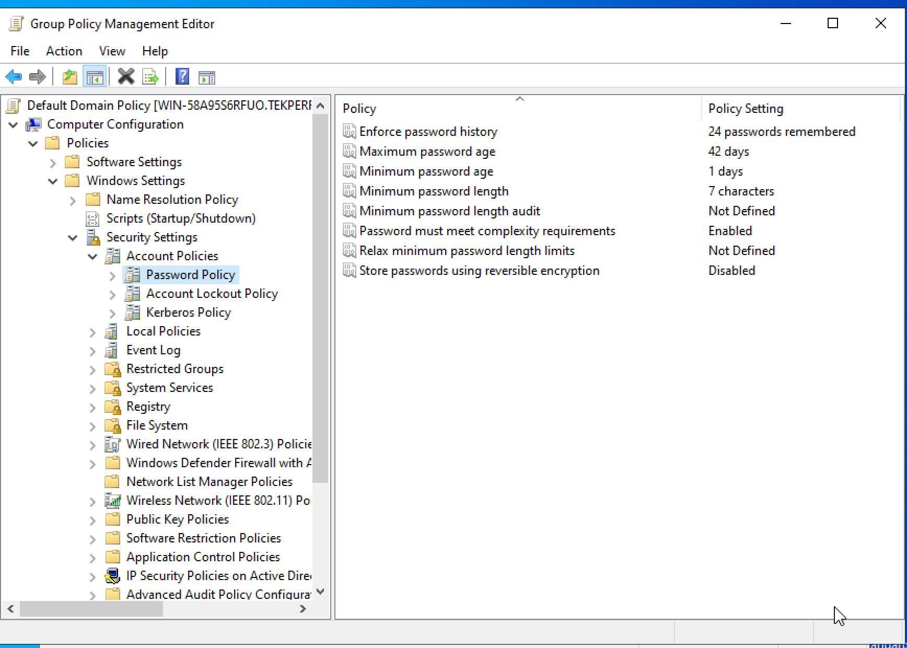

### Group Policy Management

1. When working in Windows domains group policy management is an essential part of you daily administration responsibilities.

2. What is a group policy? Group Policy management is an domain managment tool used for managing users and computers through Group Policy settings. You can manage Group Policy settings and Group Policy Preferences in an Active Directory Domain Services (AD DS) environment through the Group Policy Management Console (GPMC).

3. As part of our lesson we are going to make 3 group policy changes after you create 5 user acounts, 5 groups, and 5 OU's, Please create the following users groups and OU's.

 Create a user named edgar with the full name Edgar Allen Poe
 Create a user named francis with the full name Francis Ford Coppola
 Create a user named mark with the full name Mark Ruffalo
 Create a user named sonia with the full name Sonia Sotomayor
 Create a user named sydney with the full name Sydney Park 
 Create a user named dwayne with the full name Dwayne Johnson 
 Create a user named michelle with the full name Michelle Yeoh

 Create a group called engineering
 Create a group called finance
 Create a group called marketing
 Create a group called it
 Create a group called sales
 Create a group called devops
 Create a group called security

4. Assign each user to a group

5. After the users are assigned to a group create an OU for each of the groups under the domain that correspond to each of the groups that you created.

6. Move each of the users to OU's that they are associated with.

7. Now with all th pre work complete create a new server and join that server to the domain you already created. Your instructor will walk you through this process.

8. Once the system is joined to the domain you will login to your domain controller and modify the following group policies by running the Group Policy managment tool (GPMC).

### Default Domain Password Policy

Modify Default Domain Password Policy 
To modify the password policy you will need to modify the default domain policy. 

1. Open the group policy management console 

2.  Expand Domains, your domain, then group policy objects

3. Right click the default domain policy and click edit

4. Now navigate to Computer Configuration\Policies\Windows Settings\Security Settings\Account Policies\Password Policy

5. Now double click one of the settings to edit. For example, I’ll double chick on minimum password length. 

I’m going to change this setting from 7 to 14 characters and then click apply.

6. Next we are going to change the maximum password age to 90 days so that people onl have to change their password every three months 42 days is a little too heavy handed.

7. Next we are going to set the enforce the password history to 10 passwords 24 password is too much for most people to overcome.

8. After you have move those changes and applied them we are going to create a group policy from scratch.

9. Before we move on to creating a policy from scratch we are going to change the account lockout policy to lock an account after 5 failed login attempts. This is to protect account from brute force attacks. To modify the account lockout policy go "Account Policies", Account Lockout Policy, and change the duration and reset time to 10 minutes. This will slow down and attack while not keeping the user out of their account for too long if they remeber their password.

### Create a GPO from Scratch

1. On the left pane of the console tree, under the Domains option, right-click on the domain for which the group policy needs to be applied and click on the Create a GPO in this domain, and link it here option.

2. Create a new group policy and name it appropriately (For example, Logon Banner). Click on OK.

3. Right-click on the new group policy (Logon Banner) and click on Edit. This opens the GroupPolicy Management Editor.

4. In the left pane of the Group Policy Management Editor, navigate to Computer Configuration> Policies > Windows Settings > Security Settings > Local Policies and select Security Options.

5. On the right pane of the console, select the Interactive Logon: Message text for users attempting to logon policy. This is used to specify the text message to be displayed to the users at the time of logon.

6. In the Security Policy Settings tab, check the Define this policy settings in the template checkbox. Enter the logon message to be displayed and click Apply and OK.

7. Next, select the Interactive Logon: Message title for users attempting to login policy. This is used to specify the title that appears on the title bar of the Interactive logon window.

8. In the Security Policy Settings tab, check the Define this policy settings in the template checkbox. Enter an appropriate title and click Apply and OK.

9. After configuring the title and text of the interactive logon message, run the following command to apply the group policy from the command line. `gpupdate /force` 

10. Now that we have all of these policies in place you need to test them by using one of the accounts you created. By loggin into the new server you created to verify that the logon banner, password complexity, and account lockout are working properly. To make the testing easier you may need to add the accounts you arse testing with to the domain admins group so they can logon to the server. Typically we would use a Windows 11 or 10 workstation but provisioning client machines in AWS costs money.

11. If you are interested in where the current logon banner policy is located for the domain you can find it here.

