# Milestone 1 Lab

## Build and Ubuntu Server

1. Download the ubuntu server image from the following link below.

## Ubuntu Server Image Link 👇🏾

2. Use parallels to build the server and follow the prompts during the install process.

3. To start the Ubuntu server installation after you have successfully downloaded the iso image you will need to open parallels control center and click on the plus button in the upper right hand corner.

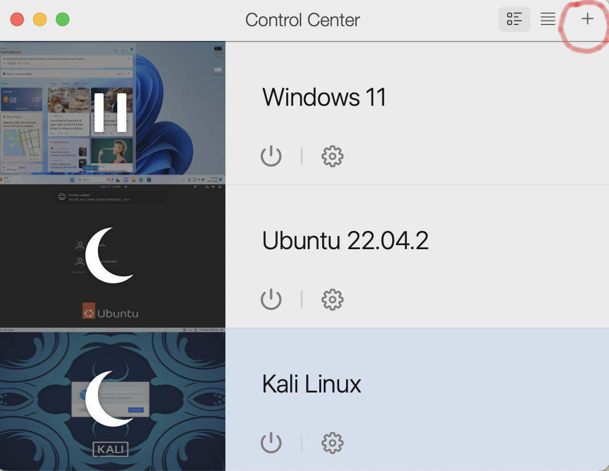

4. Now select the install Windows, Linux, or MacOS from an image file button

5. Now select the choose manually button.

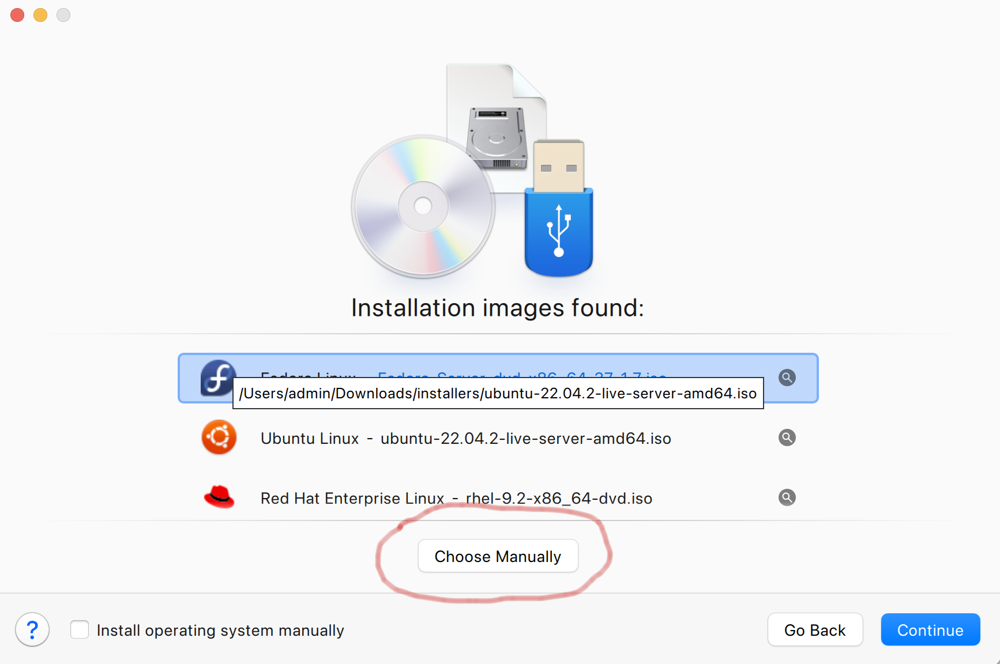

6. Next you need to click on the select file link.

7. Next you need to select the Download folder where you downloaded the image and then select the image named ubuntu-22.04.3-live-server-arm64.iso.

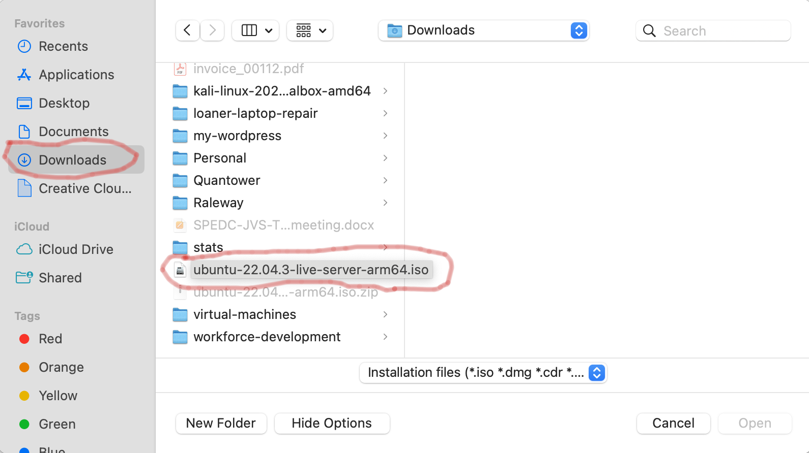

8. Next click on the continue button.

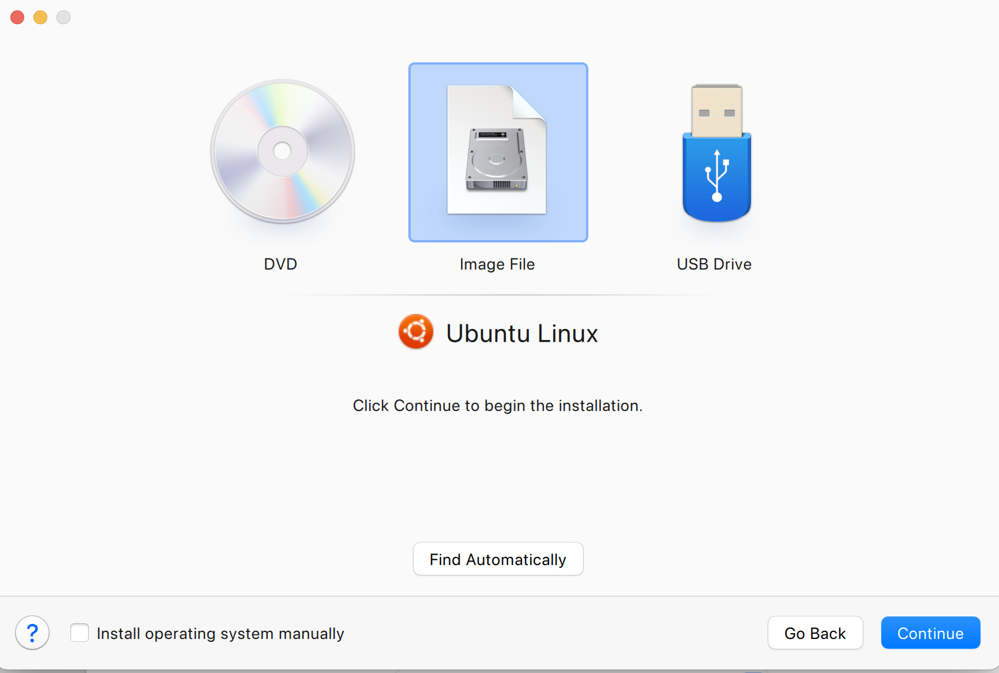

9. Now type in Ubuntu Linux Server in the name field and click on the create button.

10. Next you will begin the installation wizard via a set of prompts. The mouse cannot be used during the install process you will need to use the keyboard. Most of the options will be default but please pay attention to the images in these instructions to be certain you select the correct options.

11. To start the install click in the VM windows and hit the enter key.

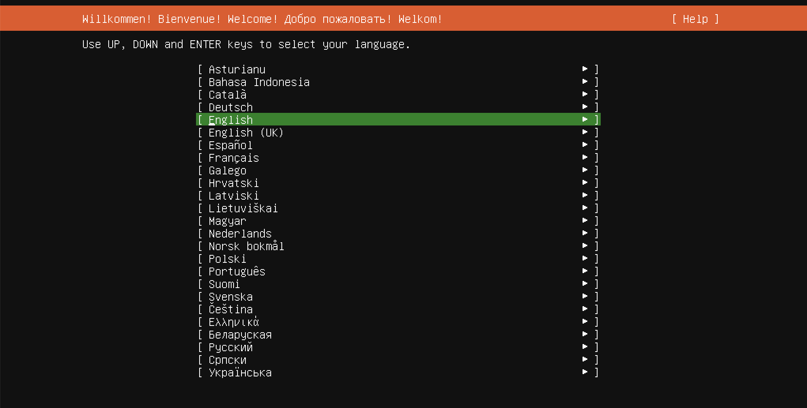

12. English should be selected by default all you need to do is hit enter to continue.

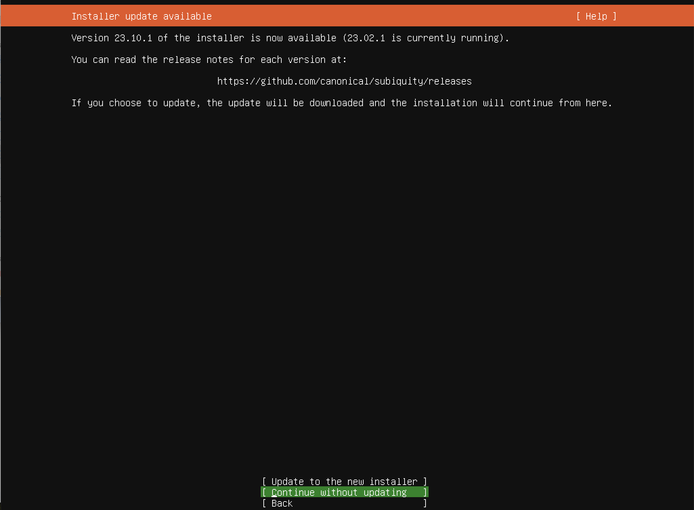

13. Use the tab key until Continue without updating is selected. Please note you may not see this screen and you may just need to just select continue and press the enter key.

14. Accept the default keyboard selection and tab to Done and press enter to continue.

15. Continue to accept the defaults and hit enter to continue.

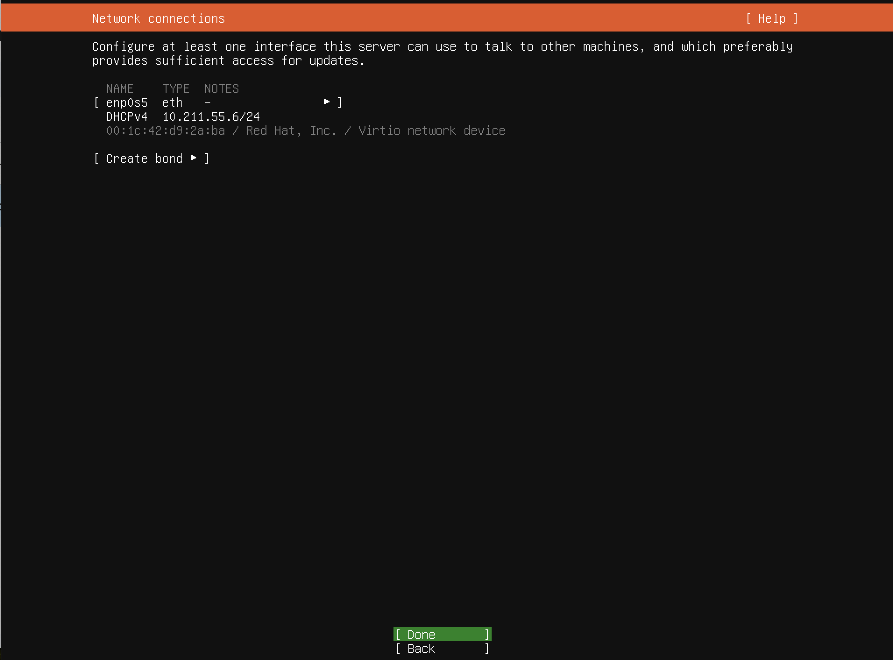

16. Accept the network defaults and hit enter to continue.

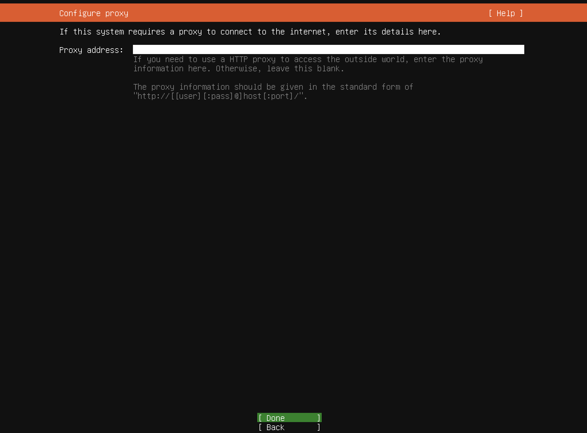

17. Accept the proxy default of nothing and enter enter to continue.

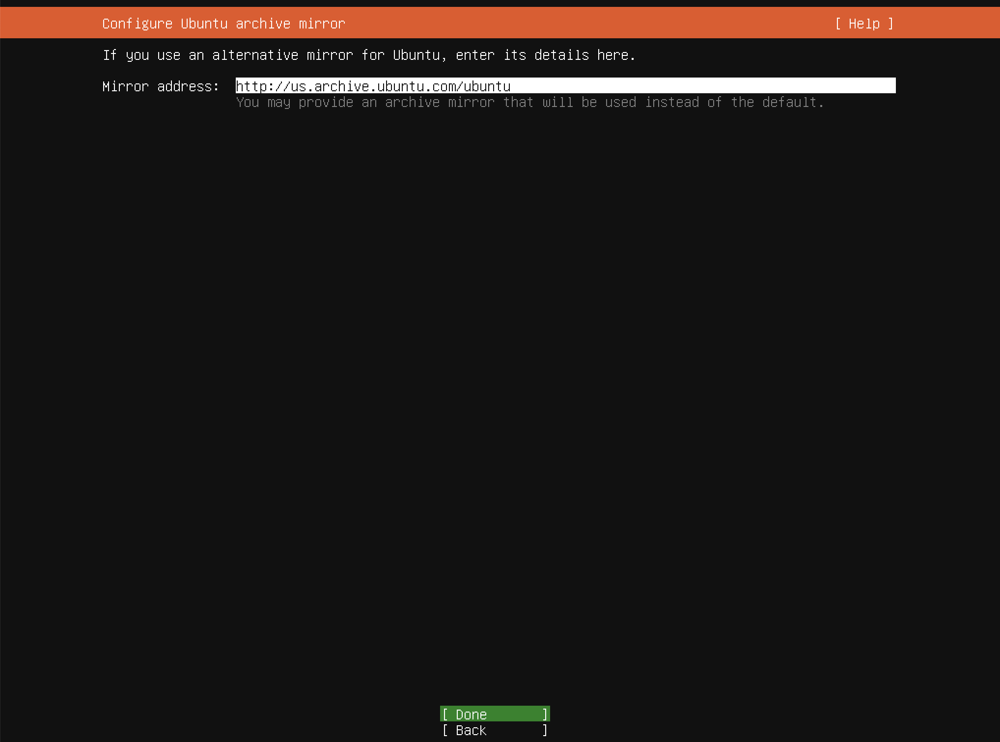

18. Accept the mirror default and hit enter to continue.

19. Make sure use an entire disk has an x in the check box field and set up this disk as an LVM group is selected the other selections should not be checked and tab down to the done selection and hit the enter key.

20. Accept the defaults and hit enter to continue

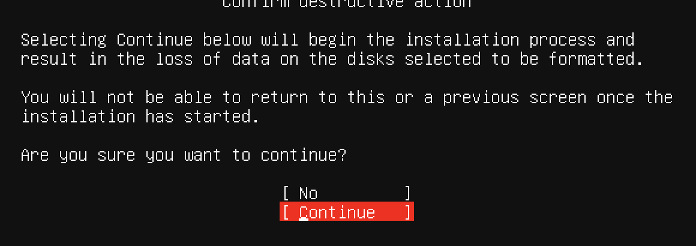

21. Next you will see a box about being sure you wish to continue. Tab to the continue option and press enter.

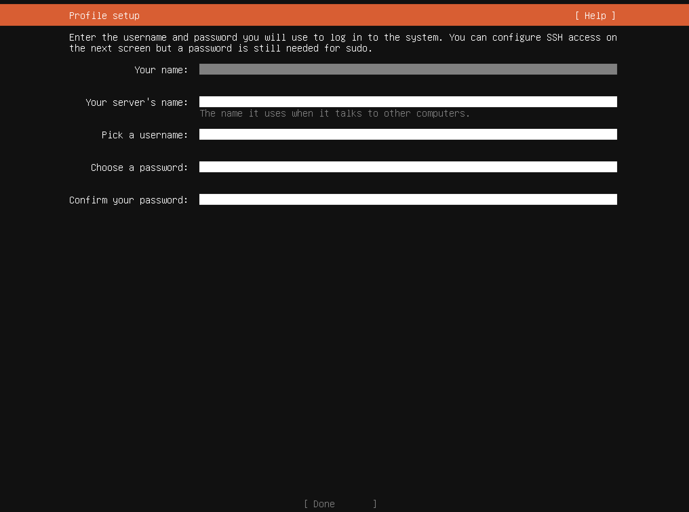

22. Now enter your full name, a name for your server ubuntu-server or somthing similar, a username like your first name, and pick a password that you will remeber but will meet the security requirements. Please make sure you use lowercase characters for your username and server name.

23. One the next screen you are going to make sure skip for now is selected and tab to the continue button and press enter.

24. Now on the next screen please make sure Install OpenSSH server is selected and tab to the done option and press enter.

25. On the next screen just done make any changes just tab to the done button and press enter.

26. Your installation should begin please make sure to wait until the updates have finished before you select the reboot now option.

27. Once the installation is complete and your system is rebooted you shold be taken to a blank login screen where you will enter the username and password you created.

28. If you encounter any errors or issues during the installation please ask your instructor for assistance.
