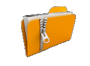

# Milestone 1 Lab

## Build an Ubuntu Server

1. Download the ubuntu server image from the following link below.

## Ubuntu Server Image Link 👇🏾

2. Use parallels to build the server and follow the prompts during the install process.

3. To start the Ubuntu server installation after you have successfully downloaded the iso image you will need to open parallels control center and click on the plus button in the upper right hand corner.

4. Now select the install Windows, Linux, or MacOS from an image file button

5. Now select the choose manually button.

6. Next you need to click on the select file link.

7. Next you need to select the Download folder where you downloaded the image and then select the image named ubuntu-22.04.3-live-server-arm64.iso.

8. Next click on the continue button.

9. Now type in Ubuntu Linux Server in the name field and click on the create button.

10. Next you will begin the installation wizard via a set of prompts. The mouse cannot be used during the install process you will need to use the keyboard. Most of the options will be default but please pay attention to the images in these instructions to be certain you select the correct options.

11. To start the install click in the VM windows and hit the enter key.

12. English should be selected by default all you need to do is hit enter to continue.

13. Use the tab key until Continue without updating is selected. Please note you may not see this screen and you may just need to just select continue and press the enter key.

14. Accept the default keyboard selection and tab to Done and press enter to continue.

15. Continue to accept the defaults and hit enter to continue.

16. Accept the network defaults and hit enter to continue.

17. Accept the proxy default of nothing and enter enter to continue.

18. Accept the mirror default and hit enter to continue.

19. Make sure use an entire disk has an x in the check box field and set up this disk as an LVM group is selected the other selections should not be checked and tab down to the done selection and hit the enter key.

20. Accept the defaults and hit enter to continue

21. Next you will see a box about being sure you wish to continue. Tab to the continue option and press enter.

22. Now enter your full name, a name for your server ubuntu-server or somthing similar, a username like your first name, and pick a password that you will remeber but will meet the security requirements. Please make sure you use lowercase characters for your username and server name.

23. One the next screen you are going to make sure skip for now is selected and tab to the continue button and press enter.

24. Now on the next screen please make sure Install OpenSSH server is selected and tab to the done option and press enter.

25. On the next screen just done make any changes just tab to the done button and press enter.

26. Your installation should begin please make sure to wait until the updates have finished before you select the reboot now option.

27. Once the installation is complete and your system is rebooted you shold be taken to a blank login screen where you will enter the username and password you created.

28. If you encounter any errors or issues during the installation please ask your instructor for assistance.

# Download Lab Files

1. Download all the lab files below to your mac
## Sample Videos 👇🏾

2. Download all the lab files below to your mac
## Sample Log 👇🏾

3. Download all the lab files below to your mac
## Sample Images 👇🏾

4. Download all the lab files below to your mac
## Sample Documents 👇🏾

5. Download all the lab files below to your mac
## Command Completion Exercises 👇🏾

6. Download all the lab files below to your mac
## Audio Files 👇🏾

7. Download all the lab files below to your mac
## Ascii Art Exercises 👇🏾

8. Download all the lab files below to your mac
## Sample Archives 👇🏾

# INSTALLING APPLICATIONS AND SERVICES

**\* Lab Exercises**

Installing applications

1. `sudo apt install apache2`

2. `sudo apt install mysql-server`

3. `sudo apt install postgresql`

4. `sudo apt install unzip`

5. `sudo apt install net-tools`

6. Now I want you to do the following to complete these labs. Create 5 new users with the following names: `barack sonia hiro priyanka dwayne` Their full names when creating he accounts should be `Barack Obama Sonia Sotomayor Hiro Murai Priyanka Chopra Dwayne Johnson`.

7. Now create 5 groups `finance hr it marketing sales` using the following command `sudo groupadd group_name`

8. Create 6 diretories the first directory should be called groupdata and it should be located off of the root folder so if you ran a pwd command in the folder is should look like this `/groupdata`. Now the other 5 directories should be located under the groupdata folder and be called `finance hr it marketing sales`

9. Use the sudo usermod command to add each of the users to one of the groups you just created `sudo usermod -a -G groupName userName` 

10. For example if you wanted to add barack to the it group you would run the following command `sudo usermod -a -G it barack`

11. Now I want to use the scp command to copy all the labs files you downloaded earlier on your Mac to /tmp folder location on your Ubuntu server. Remeber the sytax for the command is `scp filename_you_want_to_copy username@xxx.xxx.xxx.xxx:/tmp`

12. If you want to copy all the files in zip files you downloaded on your Mac with one scp command what would that command look like. (Hint: You would use the *.zip wildcard with the scp command.

13. After you have all of the zip files are copied over to your Ubuntu server VM move the files from your /tmp folder to your home folder.

14. What is the command to move the files from the /tmp folder to your home folder?
# RECONFIGURE APACHE WEB SERVER 

15. Once the files are in your home folder. Use the unzip command to unzip the files?

16. How do you know if the files are unzipped?

**\* Lab Exercises**

Fun with Apache2

1. Before you start making changes to your apache server you want to backup the main index.html file to a backup folder. This will ensure you can restore the apache server to it's original configuration.

2. To accomplish this taks you need to use the cd command to cd to the /var/www/html folder.

3. Create a directory in the /var/www/html folder called backup and copy the /var/www/html/index.html file into the backup folder.

4. Once you can confirm you have the back folder and the copy of the index.html folder run a pwd command while in the /var/www/html folder and you should see a folder called back cd into the backup folder and run an ls -al command and you should see the index.html file. If you do not then you either created the folder in the wrong location or you copy command did not work properly make sure you use sudo with most of your commands since you will be creating files and folders in priviliged directories.

5. After you have confirmed you have a backup copy of the index.html file edit the original index.html file located in the /var/www/html folder by using the vi command.

6. While in vi change the the following in the index.html`It works!` to `Your Name is the best`.

7. Obviously you want to use your actual name place of Your Name.

8. This exercise may be tricky for folks please reference the vi cheatsheet if you have any trouble editing the file.

## VI Cheatsheet 👇🏾

9. Save the changes and restart apache. Do know how to save changes in a file that you are editing in vi? (Hint <esc key> :wq)

10. To restart apache you need to run the following command `sudo /etc/init.d/apache2 restart`

11. Now open browser on your mac and plug in the IP address of your ubuntu server VM. Do you know what the IP address is and how to find it?

12. You should see the edited Apache2 page with your name is the best. If you don't see that then you may have missed a step or have a typo in the changes you made.

13. Copy the sample-1.png file located in images folder in your home directory to /var/www/html.

14. Now edit the index.html file located in /var/www/html with vi and change the line ` key so that your ssh, scp, cp, mv, rm, mkdir, adduser, chown, and chgrp commands are successful and you don't have typos.

5. Good luck with the exercises and please put all the commands in the assessment file located in the google drive folder associated with your name.   

# EXTRA CREDIT LAB

1. Download the resume html template from the following link 
## Resume Template 👇🏾

2. Using the scp command copy the file to your Ubuntu server to the /tmp folder.

3. Login to your Ubuntu server via your Mac terminal and copy the resume.zip file from the /tmp folder to your home directory.

4. Unzip the resume.zip file in your home folder using the unzip command.

5. Use the cp command to copy the entire resume folder to the /var/www/html folder.

6. Use vi to Edit the apache configuration file located at /etc/apache2/sites-enabled/000-default.conf.

7. Change the DocumentRoot line to point to the index.html file located in the resume folder you copied earlier. Please note the index.html file is located a few folders beneath the /var/www/html/resume directory so you will need to use the cd command to locate it.

8. Update the resume template with your name and skills and customize it so that it reflects the skills you have learned so far.

9. For an additional challenge find a download a picture of yourself from either your linked in profile or some other place and copy it to your Ubuntu server or specifiy a path to the file in the html code. Please ask your instructor if any of this information is unclear.

10. The purpose of this exercise is to further your comfort level with using the scp, cp, cd, vi, pwd, and ls commands.

