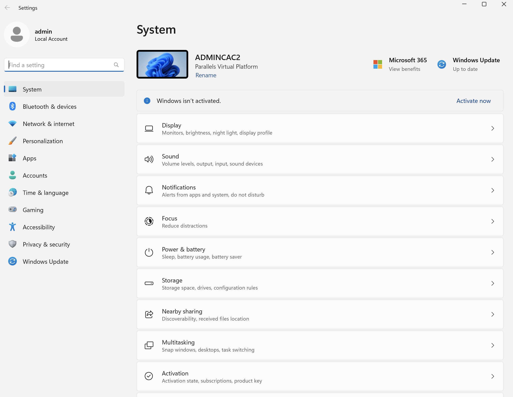
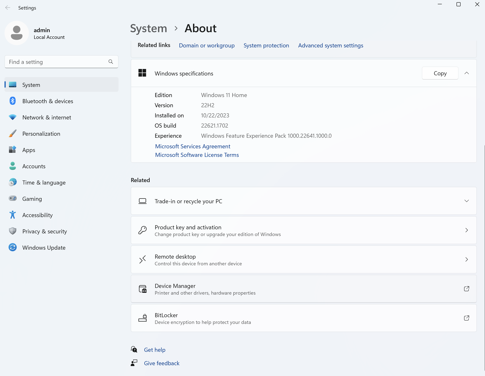
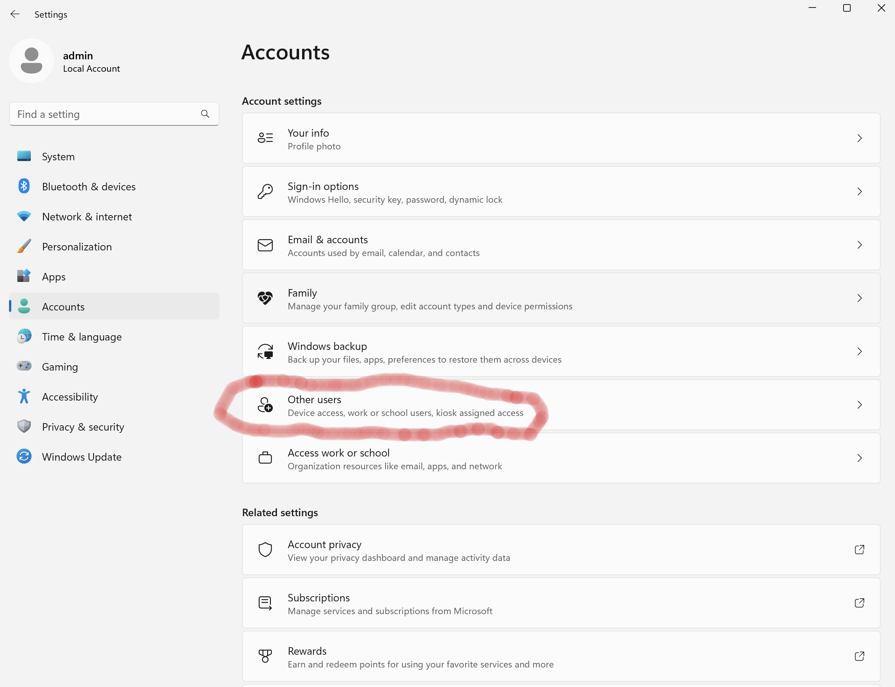
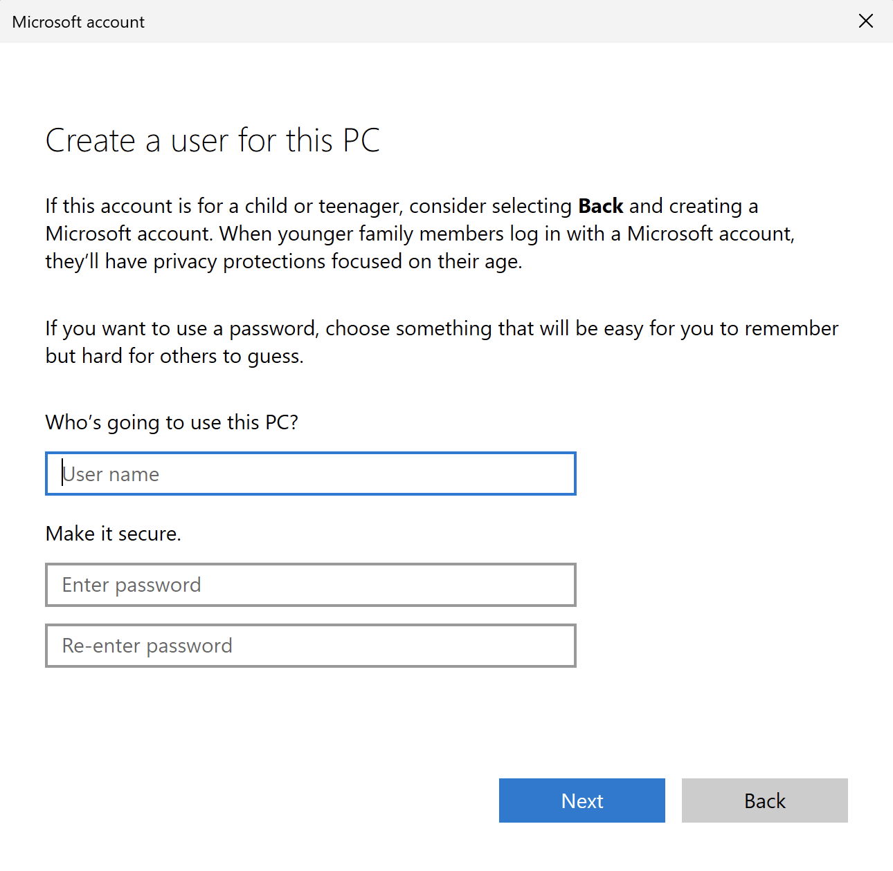
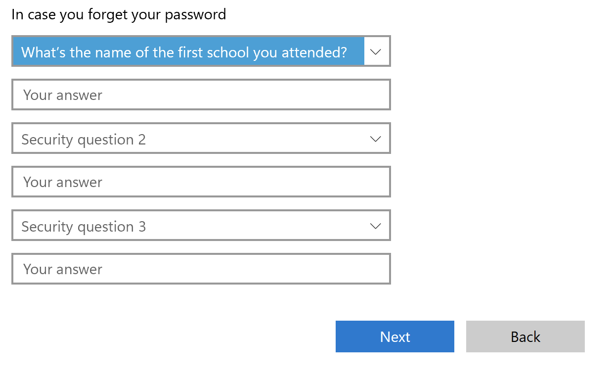
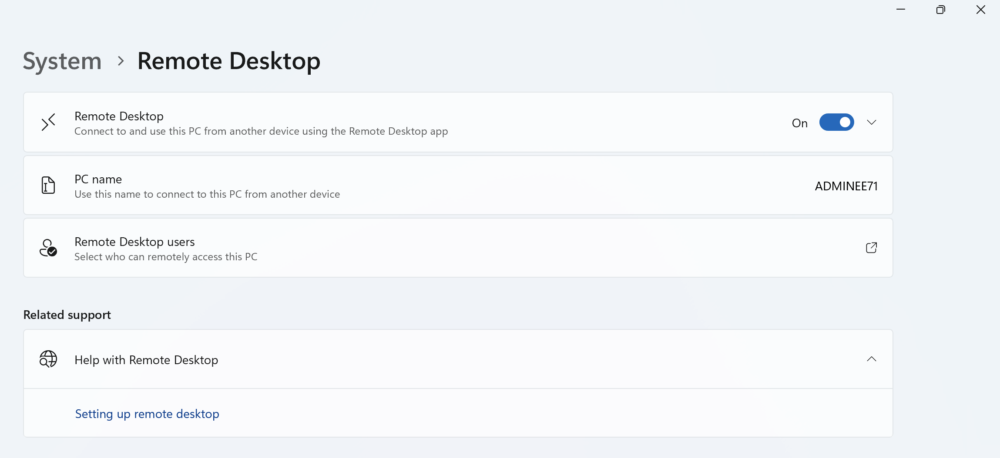
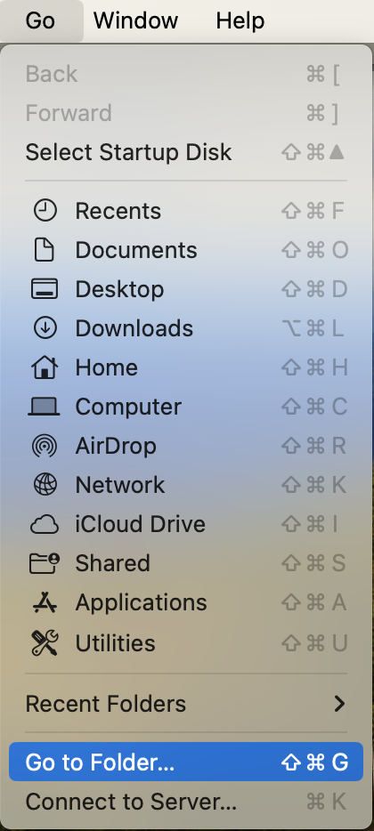

## Windows 11 Usage and Maintenance

1. Run the disk cleanup application and select the appropriate items to remove from the system. This task will allow an administrator to remove temporary files and other items from the recycle bin to free up disk space and make the system run more efficiently.

2. Disk defragmenter is a tool used to reorganize files into consecutative blocks stored on the drive and is useful with older systems with mechaniical drives but with the introduction of SSD drives it is not used very often. However, I do recommend running the tool and understanding how it works in order to be familar with it in case you need to use the tool on an older system or server.

3. Task Manager - Is an application you use to see or monitor what system processes are running on a desktop or server. If an application is using too much memory or CPU resources this is where you would find the running application and stop it or restart it depending on the state that it is in.

4. Disk Management - This tool allows you to create and partition drives attached to your Windows Server or Worksation. In order to understad the use of disk partitioning you will work with your instrutor to create two temporary disks and partition them as a spanned volume in order to create a RAID 1 drive.

5. RAID - This term stands for Redundant Array of Independant disks and is most commonly used to create RAID 0, RAID 1, and RAID 5 disks. Your instructor will explain them in greater detail.

6. Event Viewer - This application is used to access logs associated with the interworkings of the operating system. These logs report on administrative, application, security, system, and other events necessary to troubleshoot any potential issues with the operating system.

7. Creating Users - Under Windows server and workstation you can use the following application to create local accounts.

8. Settings - Under the settings application you can select Accounts which will allow you to create a local user. Please note when creating users they by default do not have administrator rights.

9. The other option to create local accounts is to use the following command via the command line `net user USER-NAME PASSWORD /add` for example if you were going to create the account barack you would use the following command `net user barack Ch@nge.me /add` please note that when using this command the password is displayed in clear text and it is adviseable to have the user change it immediately after they login for security purposes.

## Patching Windows

10. Windows Patching - To patch a Windows server or workstation you can use the Windows Update application located under Settings. This application allows you to download and review updates prior to installing them.

11. Another method of reviewing and installing updates is to install and use the Windows Update Powershell module.

12. In order to use this tool you must use the following commands.

13. `Get-ExecutionPolicy -List` This command displays the execution policy of your sytem by default it should be set to restricted. This means that script and unsiged software modules cannot be installed.

14. `Set-ExecutionPolicy RemoteSigned` This command sets the execution policy of your local system so that generally safe modules and scripts can be run on your workstation or server.

15. `Set-ExecutionPolicy Unrestricted` This command allows you to run any modue or script on your workstation or server and should only be used in select cases where you have to run a script or module you created that is from a trusted source.

16. For the purposes of running Windows updates from the command line having the ExecutionPolicy set to RemoteSigned is preferred.

17. After you have the execution policy set appropriately you will need to run the following commands.

18. `Install-Module PSWindowsUpdate` - This command install the Windows update module so you can list, view, and install updates from the command line via PowerShell.

19. `Get-WindowsUpdate` - This command will list the available updates for your systems.

20. `Get-WindowsUpdate -Install -Verbose` - This command will download and install all updates.

21. `Get-WindowsUpdate -Severity Important -Install -Verbose` - This command will install and download updates based on a specific severity level. Typically it is a safe practice to download and install all updates. However, patching is a process and should be tested with non production systems prior to deploying widespread updates.

## Adding Printers

** Add a printer Windows 10

If you are installing a local printer, connect the printer to your PC via USB or WiFi. Otherwise, for network or shared printers, proceed to the next step.

Right-click the Windows 10 Start menu and click Settings.

Then, on Windows Settings, click Devices.

On the left pane of the Devices settings screen, click Printers & scanners.

When Printers & scanners screen opens, click Add a Printers or scanner. Then, wait for the wizard to detect your printer.

If your printer is detected, proceed to install the drivers. As I mentioned at the beginning of this Itechguide, Windows 10 may not have a driver for your printer. In that instance, you have to manually download the driver. However, if your printer is NOT automatically detected, use the steps below to install your printer.

However if that does not work then following the remaining steps should help

Click The printer that I want isn’t listed. The Find a printer by other options screen will open.

You may need to select this option if you want to install a network printer.

Finally, to add a printer on Windows 10 from Windows Settings, on the Find a printer by other options screen, select one of the options, click Next and proceed to install your printer.

** Add a printer Windows 11

To add a printer, click on the Start button, type "Settings" in the search bar, and hit Enter. Alternatively, you can hit Windows+i to open Settings. On the left hand side of the Settings menu, click "Bluetooth & devices

Click "Add device" near the top right of the Printers and scanners page. Windows will attempt to detect your printer. Let this run for a bit --- say 30 seconds to a minute . Depending on your PC and the printer, it could take a little while to identify the printer correctly.

If your printer doesn't appear, click "Add manually." A pop-up window will present you with a few choices.

## Windows Changes

## Activate Windows and Upgrade it to Windows 11 Enterprise

1. Login to your Windows 11 VM and click on the start menu and type in "Settings" and open the Settings application

2. From the settings application choose "System" from the left hand navigation and scroll down to the activation selection

3. Click on the change button to change the product key and enter the produce key provided by your instructor

4. From this point follow along with your instructor to upgrade your verions of Windows 11 to Enterprise.

5. Once the upgrade is complete you will work with your instructor to create a new local account on your Windows 11 Enterprise system.

## Creating A Local Admin Account

1. Login to your Windows 11 VM and click on the start menu and type in "Settings" and open the Settings application

2. From the "Settings" application choose "Accounts" from the left hand navigation and scroll down to the "Other Users" selection

3. Now click on the add account button.

4. Next you will be prompted to provide a microsoft login for this user. We don't want to do that because we are creating a local account so choose the "I don't have this person's sign-in information" link.

5. Next you will be prompted to provide a couple of different accoutn options. We don't want to do that because we are creating a local account so choose the "Add a user without a Microsoft account" link.

6. You will then be prompted to provide the username, password, and 3 security questions associated with the account. Please make sure you remeber the answers to these questions just in case you forget your password otherwise you will need to rebuild your VM.

7. Once the account is created you will need to click on the account and select the "Change Account Type" button and change it from a "Standard User" to and Administrator.

8. The purpose of creating a local account with your credentials serves two purposes. Preparing for further customization of your Windows 11 VM and setting up an account that will allow us to use RDP from your Mac to your Windows 11 VM.

9. Similar to using ssh to connect to your Ubuntu but using a different protocol and a GUI.

10. Once you have made the account an administrator logout of the Admin account and back in again as the new user your created.

## Enabling Remote Desktop

1. Login to your Windows 11 VM and click on the start menu and type in "Settings" and open the Settings application

2. From the settings application choose "System" from the left hand navigation and scroll down to the "Remote Desktop Selection"

3. Now click on the slider to enable remote desktop

4. You have now successfully enable all the necessary things so that you can admin your Windows 11 system.

5. Please work with your instructor to install Royal TSX on your Mac so you can initiate an RDP session to your Windows 11 VM from your Mac

## VM Backups and Snapshots

1. Now that we have made a number of changes that we would like to save and revert back to in case you run into issues with your Windows 11 VM going forward. We should shutdown your Windows ll VM and then backup the associated VM file just in case it get corrupted or you make changes that would make it difficult to revert.

2. The first thing we want to do is click on your Mac's desktop and then select "Go" "Go To Folder".

3. In the path I want you to type in the following text "/Users/admin/Parallels" this should take you to the Parallels folder where the VM files are stored. Please be careful here. The first thing we are going to do is create a backup folder. Right click in the Window and select "New Folder" and call the folder "bakcup".

4. Now right click on your "Windows 11.pvm" file and select copy and the select your "backup" folder and right click on it and select "paste".

5. This should create a backup copy of your upgraded Windows 11 VM with remote desktop enabled.

6. This is a good place to backup because the VM does not have a bunch of customizations but enough so that you can perform basic tasks and connect to if from your Mac.

7. You can repeat these steps with any other VM's that you have cleanly shutdown that you wish to backup.

## This Section Applies to Windows 2019 and 2022 Server

##  Manage and View Windows Event and Application Logs

View Windows Server Event logs from command line

1. `Get-WinEvent -ListLog *`

Get Windows logs based on the type of log you want to view

2. `Get-WinEvent -LogName <LogName>`

View the last 10 lasest security event logs

3. `Get-WinEvent -LogName Security -Newest 10`

Obtain the last 5 events from the application log

4. `Get-WinEvent -LogName 'Application' -MaxEvents 5`

To filer for events with a specific event ID use the following syntax. 

5. `Get-WinEvent -FilterHashtable @{ Logname='Security'; Id='4672' }`

To further refine your PowerShell log searches, you can use the Get-Date cmdlet in your query. For example, to limit our query of Security log entries with ID 4672 to the last hour, we can use this command:

6. `Get-WinEvent -FilterHashtable @{ Logname='Security'; Id='4672'; StartTime=(Get-Date).AddHours(-1) }`

To search an event log for specific words in the event log message, use the Message parameter. For example, to search the Security event log for the word Logoon, use the following command:

7. `Get-WinEvent -LogName Security -Message *Logon*`

##  Manage Processes and Services

1. `Get-Process | Where-Object { $_.MainWindowTitle } | Format-Table ID,Name,Mainwindowtitle –AutoSize`

To stop a process using powershell use the following command

2. `Stop-Process -Name "ProcessName" -Force`

To stop a process by PID process identifier use the folloiwng command

3. `Stop-Process -ID PID -Force`

Another method of listing running tasks via the standard command prompt running as an adminstrator

4. `tasklist | more`

Query a specific service you are interested in

5. `sc queryex servicename`

Kill a process by PID process identifier. Please note The /f flag is used to kill the process forcefully. Failure to use the /F flag will result in nothing happening in some cases

6. `taskkill /f /pid [PID]`

To kill a process on a remote desktop or server 

7. `taskkill /S AnsibleServer /U RemoteAccountName /P RemoteAccountPassword /IM chrome.exe /F`

To stop start and restart services on a Windows server use the following commands via the standard command line

8. `net start [serviceName]`

9. `net stop [serviceName]`

To restart a service you would use Powershell

10. `Restart-Service -Name [serviceName]`

# Top Admin Commands

Gets items in a specified location. To list the folders in my drive C, I will run the command below:

1. `Get-ChildItem c:/`

You could use the Get-ChildItem Cmdlet to list items in a folder, then pipe the result to Copy-Item Cmdlet to copy the items to a new location. The command below will do the job:

2. `Get-ChildItem C:\folder-name | Copy-Item -Destination C:\NewFolder`

Once you know the name of the WMI class, you can execute Get-WmiObject to return useful information from a local or remote computer. Below is a list of the most important WMI classes you may need

3. `Get-WmiObject -List -Class Win32*`

or

4. `Get-WmiObject -Class Win32_OperatingSystem`

In order to run remote commands on another Windows server you can use the following command

5. `Enter-PSSession Computer1`

or if you want to run a command on multiple servers you can use this command

6. `Invoke-Command -ComputerName Computer1, Computer2, Computer3, -ScriptBlock {Get-Process}`

To open a persistent remote PS session on computers Computer1, Computer2, execute the command below:

7. `$session = New-PSSession -ComputerName Computer1, Computer2`

# Active Directory Powershell commands

To create a new computer object in a specified organizational unit (OU), enter the cmdlet:

1. `New-ADComputer -Name "ComputerName" -SamAccountName "ComputerName" -Path "OU=Computers,DC=Domain,DC=com"`

Create new security groups

2. `New-ADGroup -Name "Security Group Name" -SamAccountName "SecurityGroupName" -GroupCategory Security -GroupScope Global -DisplayName "Security Group Name" -Path "CN=Groups,DC=Domain,DC=com" -Description "Brief description of the what security group is used for"`

Create a new user account

3. `New-ADUser -Name "User Account Name" -SamAccountName "UserAccountName" -AccountPassword (ConvertTo-SecureString "password" -AsPlainText -Force) -DisplayName "User Name" -Enabled $True -GivenName "FirstName" -Path "CN=Users,,DC=Domain,DC=com" -Server "controller.domain.com" -Surname "LastName" -UserPrincipalName "username@domain.com"`

Create a new OU

4. `New-ADOrganizationalUnit -Name "OU Name" -Path "DC=Domain,DC=com"`

Add/remove users or computer objects to/from groups

5. `Add-ADGroupMember SecurityGroupName -Members Username01 -Server "controller.domain.com" Remove-ADGroupMember SecurityGroupName -Members Username01 -Server "controller.domain.com"`

Obtain the locally stored password from a computer object

6. `Get-AdmPwdPassword -ComputerName "computer.domain.net"`

Joining a computer to a domain

7. `Add-Computer -DomainName "domain.com" -Credential Domain\Username -Restart -Force`

Enable/Disable users, computers, or service accounts

8. `Enable-ADAccount -Identity "ComputerName"`

`Disable-ADAccount -Identity “Username”`

Unlock user accounts

9. `Unlock-ADAccount -Identity "Username"`

Locate disabled computer or user accounts

10. `Search-ADAccount -AccountDisabled | FT Name,ObjectClass`
