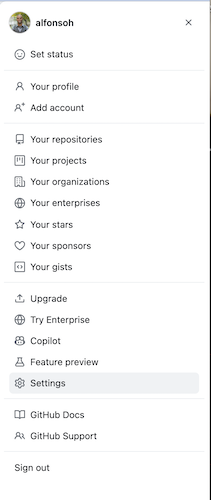

# Intro To Git

Step 0: Install git and create a GitHub account
The first two things you'll want to do are install git and create a free GitHub account.

Hombrew should already be installed but if it's not run this command

`/bin/bash -c "$(curl -fsSL https://raw.githubusercontent.com/Homebrew/install/HEAD/install.sh)"`

Downloading Git for Mac

1. Install git using Homebrew

`brew install git`

2. Install gh using Homebrew will allow you to setup gh auth so that the proper login credentials are used

`brew install gh`

3. After `gh` is installed you will need to run `gh auth login` which is an interactive setup to setup your gh command line credentials.

## Basic Git Commands

- Set your github username

`git config --global user.name "username"`

`git config --global user.email "email@email.com"`

`git config --global pull.rebase true`

### Copy a repo locally

`git clone https://github.com/username/repo_name`

- Add a file that you have created or made changes to 

`git add name_of_file`

- Commit your changes with a comment before they are pushed`

`git commit -m "this is a new file added to the repo"`

- Push your code to your repo

`git push`

- To view your current git configuration

`git config --list`

1. Create a repository by going to github.com and selecting your account and selecting repositories.

2. Now select the New Repository button to create the new repository.

3. After the new repository is created you can use of the the following clone commands to pull down a copy of the repository.

`git clone https://github.com/username/repo_name`

`gh repo clone tekperfect/devops-sandbox`

`git@github.com:username/repo_name`

4. Add a new file to the repo by using the touch command or vi.

Once you've added or modified files in a folder containing a git repo, git will notice that changes have been made inside the repo. But, git won't officially keep track of the file (that is, put it in a commit.

5. You can use the command `git status` to show the status of the modifications you have made.

On branch master
Initial commit
Untracked files:
(use "git add <file>..." to include in what will be committed)

The staging environment, the commit, are one of the most confusing parts when you're first learning git is the concept of the staging environment and how it relates to a commit.

A commit is a record of what files you have changed since the last time you made a commit. Essentially, you make changes to your repo (for example, adding a file or modifying one) and then tell git to put those files into a commit.

Commits make up the essence of your project and allow you to go back to the state of a project at any point.

So, how do you tell git which files to put into a commit? This is where the staging environment or index come in. As seen in previous step, when you make changes to your repo, git notices that a file has changed but won't do anything with it (like adding it in a commit).

To add a file to a commit, you first need to add it to the staging environment. To do this, you can use the `git add <filename>` or `git add .` command.

Once you've used the git add command to add all the files you want to the staging environment, you can then tell git to package them into a commit using the git commit command.

Note: The staging environment, also called 'staging', is the new preferred term for this, but you can also see it referred to as the 'index'.

3. Add a file to the staging environment
   Add a file to the staging environment using the git add command.

If you rerun the git status command, you'll see that git has added the file to the staging environment (notice the "Changes to be committed" line).

\$ `git status`
On branch master

Initial commit

Changes to be committed:
(use `git rm --cached <file>...` to unstage)

To reiterate, the file has not yet been added to a commit, but it's about to be.

4. Create a commit
   It's time to create your first commit!

Run the command `git commit -m "Your message about the commit"`

\$ `git commit -m "This is my first commit!"`
[master (root-commit) a694n2c] This is my first commit!
1 file changed, 1 insertion(+)
create mode 39904 myproject.py

The message at the end of the commit should be something related to what the commit contains - maybe it's a new feature, maybe it's a bug fix, maybe it's just fixing a typo. Don't put a message like "dumb code" or "blah blah blah". That makes the other people who have to read your code angry.

`git commit -m "Good description of commit"` (command to commit to files to your local repo)

`git push` (push the files from your local repo to Github so they are committed to your branch)

Git Continued
Here are some more advanced concepts once you master the process of adding, deleting, and changing files

5. Create a new branch
   Now that you've made a new commit, let's try something a little more advanced.

Say you want to make a new feature but are worried about making changes to the main project while developing the feature. This is where git branches come in.

6. Branches allow you to move back and forth between 'states' of a project. For instance, if you want to add a new page to your website you can create a new branch just for that page without affecting the main part of the project. Once you're done with the page, you can merge your changes from your branch into the master branch. When you create a new branch, Git keeps track of which commit your branch 'branched' off of, so it knows the history behind all the files.

Let's say you are on the master branch and want to create a new branch to develop your web page. Here's what you'll do: Run git checkout -b <my branch name>. This command will automatically create a new branch and then 'check you out' on it, meaning git will move you to that branch, off of the master branch.

After running the above command, you can use the git branch command to confirm that your branch was created:

`git branch`
master

- my-website-branch

The branch name with the asterisk next to it indicates which branch you're pointed to at that given time.

Now, if you switch back to the master branch and make some more commits, your new branch won't see any of those changes until you merge those changes onto your new branch.

7. Push a branch to GitHub
   Now we'll push the commit in your branch to your new GitHub repo. This allows other people to see the changes you've made. If they're approved by the repository's owner, the changes can then can be merged into the master branch.

To push changes onto a new branch on GitHub, you'll want to run git push origin yourbranchname. GitHub will automatically create the branch for you on the remote repository:

`git push origin my-website-branch`

Counting objects: 3, done.
Delta compression using up to 8 threads.
Compressing objects: 100% (2/2), done.
Writing objects: 100% (3/3), 313 bytes | 0 bytes/s, done.
Total 3 (delta 0), reused 0 (delta 0)
To https://github.com/yourname/mynewrepository.git

- [new branch] my-website-branch -> my-website-branch

You might be wondering what that "origin" word means in the command above. What happens is that when you clone a remote repository to your local machine, git creates an alias for you. In nearly all cases this alias is called "origin." It's essentially shorthand for the remote repository's URL. So, to push your changes to the remote repository, you could've used either the command: git push git@github.com:git/git.git yourbranchname or git push origin yourbranchname

(If this is your first time using GitHub locally, it might prompt you to log in with your GitHub username and password.)

If you refresh the GitHub page, you'll see note saying a branch with your name has just been pushed into the repository. You can also click the 'branches' link to see your branch listed there.

Now click the green button in the screenshot above. We're going to make a pull request!

Github Getting Fancy

8. Create a Pull Request (PR)

A pull request (or PR) is a way to alert a repo's owners that you want to make some changes to their code. It allows them to review the code and make sure it looks good before putting your changes on the master branch.

You might see a big green button at the bottom that says 'Merge pull request'. Clicking this means you'll merge your changes into the master branch.

Note that this button won't always be green. In some cases it'll be grey, which means you're faced with a merge conflict. This is when there is a change in one file that conflicts with a change in another file and git can't figure out which version to use. You'll have to manually go in and tell git which version to use.

Sometimes you'll be a co-owner or the sole owner of a repo, in which case you may not need to create a PR to merge your changes. However, it's still a good idea to make one so you can keep a more complete history of your updates and to make sure you always create a new branch when making changes.

9. Merge a PR
   Go ahead and click the green 'Merge pull request' button. This will merge your changes into the master branch.

> When you're done, I recommend deleting your branch (too many branches can become messy), so hit that grey 'Delete branch' button as well.
> You can double check that your commits were merged by clicking on the 'Commits' link on the first page of your new repo.
> This will show you a list of all the commits in that branch. You can see the one I just merged right up top (Merge pull request #2).

You can also see the hash code of the commit on the right hand side. A hash code is a unique identifier for that specific commit. It's useful for referring to specific commits and when undoing changes (use the git revert <hash code number> command to backtrack).

10. Get changes on GitHub back to your computer
    Right now, the repo on GitHub looks a little different than what you have on your local machine. For example, the commit you made in your branch and merged into the master branch doesn't exist in the master branch on your local machine.

> In order to get the most recent changes that you or others have merged on GitHub, use the git pull origin master command (when working on the master branch).

`git pull origin master`

remote: Counting objects: 1, done.

remote: Total 1 (delta 0), reused 0 (delta 0), pack-reused 0

Unpacking objects: 100% (1/1), done.`
From https://github.com/cubeton/mynewrepository

- branch master -> FETCH_HEAD
  b345d9a..5381b7c master -> origin/master
  Merge made by the 'recursive' strategy.
  myproject.py | 1 +
  1 file changed, 1 insertion(+)

This shows you all the files that have changed and how they've changed.

Now we can use the git log command again to see all new commits.

(You may need to switch branches back to the master branch. You can do that using the git checkout master command.)

`git log`

commit 6e270786db0e5ffd3e2cfc5edede89b64b83762c
Merge: 4f1cb17 5381b7c
Author: Your Name <your_email@yourdomain.com>
Date: Fri Sep 11 17:48:11 2015 -0400

    Merge branch 'master' of https://github.com/cubeton/mynewrepository

commit 4f1cb1798b6e6890da797f98383e6337df577c2a
Author: Your Name <your_email@yourdomain.com>
Date: Fri Sep 11 17:48:00 2015 -0400

    added a new file

commit 5381b7c53212ca92151c743b4ed7dde07d9be3ce
Merge: b345d9a 1e8dc08
Author: Your Name <your_email@yourdomain.com>
Date: Fri Sep 11 17:43:22 2015 -0400

    Merge pull request #2 from yourname/my-newbranch

    Added some more text to my file

commit 7e8cc0830b4db8c44efd80479ae886782768933d
Author: Your Name <your_email@yourdomain.com>
Date: Fri Sep 11 17:06:05 2015 -0400

Added some more text to my file

commit b345d9a25353037afdeaa9fcaf9f330effd157f1
Author: Your Name <your_email@yourdomain.com>
Date: Thu Jan 10 17:42:15 2019 -0400

This is my first commit!

11. Bask in your git glory
You've successfully made a PR and merged your code to the master branch. Congratulations! If you'd like to dive a little deeper, check out the files in this Git101 folder for even more tips and tricks on using git and GitHub.

I also recommend finding some time to work with your team on simulating a smaller group project like we did here. Have your team make a new folder with your team name, and add some files with text to it. Then, try pushing those changes to this remote repo. That way, your team can start making changes to files they didn't originally create and practice using the PR feature. And, use the git blame and git history tools on GitHub to get familiar with tracking which changes have been made in a file and who made those changes.

### Git Troubleshooting

1. Scenario 1 - You make changes to a repo or branch and when you try to commit them you receive an error message that your commit failed because the master or branch you are trying to changes has changes that were made prior to you making your changes. What do you do?

`git pull -r` 

or 

`git pull --rebase origin branch_name` 

2. Scenario 2 - You try to make changes to a repo or branch and when you try to commit them you receive an error message that your commit failed because the master or branch you are trying to changes has changes that were made prior to you making your changes. What do you do?

`git stash` and then run a `git pull --rebase origin branch_name` and then `git pop` to bring back you changes and then proceed with your git add, git commit, and git push commands. 

## Configure Your Profile

1. Login to Github and go to your profile in the upper right hand corner and select settings.

2. Select the Developer Settings option at the lower left hand side of the screen

3. Now expand the Personal Access Token options until you see "Fine Grained Tokens" and click on the "Generate New Token" button

4. Provide a name for the token and select the number of days you want the token to be valid for. I recommend making the token valid for at least 90 days or longer if you don't plan on rotating it often.

5. Now you are going to need to set the repository access for your token. I recommend that you provide it with full access and mirror the settings displayed below.

6. Now you are going to need to set the account permissions. I recommend that you provide it will full access to mirror the settings displayed below.

7. After you have verified that you have that you have the appropriate permissions click on the generate token button.

11-genrate-token.png

8. Finally you need to copy the token and save it to your lastpass account. This is an important step because if you don't save the token it will need to be regenerated and you cannot recover it.

The more you use git, the more comfortable you'll... wait for it... GIT!

Don’t git got. (I know the jokes are terrible.)
