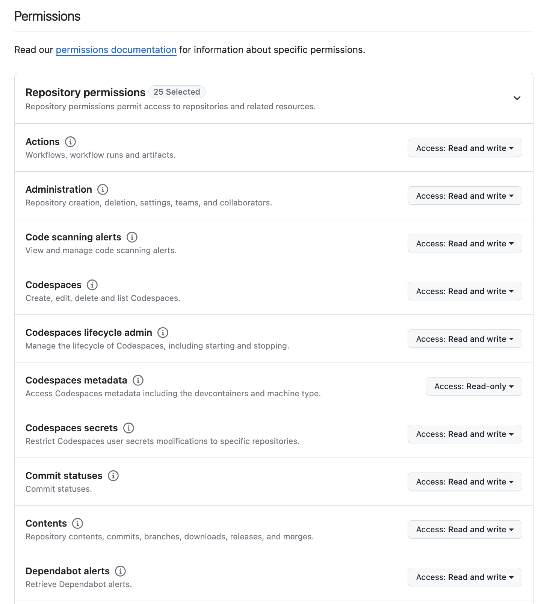

### Git Setup

Step 0: Install git and create a GitHub account
The first two things you'll want to do are install git and create a free GitHub account.

Windows install
https://git-scm.com/download/win

Hombrew should already be installed but if it's not run this command
/usr/bin/ruby -e "\$(curl -fsSL https://raw.githubusercontent.com/Homebrew/install/master/install)"

## Mac OS Install

`brew install git`

> If its already installed and you need to upgrade it:

`brew upgrade git`

# Intro To Git

Git - A program installed on most macs, available on windows with [GitBash](https://git-scm.com/downloads).

## Commands

- Set your github username

`git config --global user.name "username"`

- Set your github email

`git config --global user.email "email@domain.com"`

- View your current git config settings

`git config --list`

## Configure Your Profile

1. Login to Github and go to your profile in the upper right hand corner and select settings.

2. Select the Developer Settings option at the lower left hand side of the screen

3. Now expand the Personal Access Token options until you see "Fine Grained Tokens" and click on the "Generate New Token" button

4. Provide a name for the token and select the number of days you want the token to be valid for. I recommend making the token valid for at least 90 days or longer if you don't plan on rotating it often.

5. Now you are going to need to set the repository access for your token. I recommend that you provide it with full access and mirror the settings displayed below.

6. Now you are going to need to set the account permissions. I recommend that you provide it will full access to mirror the settings displayed below.

7. After you have verified that you have that you have the appropriate permissions click on the generate token button.

11-genrate-token.png

8. Finally you need to copy the token and save it to your lastpass account. This is an important step because if you don't save the token it will need to be regenerated and you cannot recover it.
