## What is the DVWA

### How to Setup the DVWA (Damn Vunerable Web Application)

Setup DVWA

1. Update your Ubuntu server

`sudo apt update`

`sudo apt upgrade -y`

2. Install all the necessary pacakges

`sudo apt -y install apache2 git php php-mysqli php-gd libapache2-mod-php mysql-server-8.0`

3. Prepare the MySQL database by logging into it MySQl and running the following commands

`sudo mysql -u root`

`CREATE DATABASE dvwa;`

`CREATE USER 'dvwa'@'localhost' IDENTIFIED BY 'password';`

`GRANT ALL ON dvwa.* TO 'dvwa'@'localhost';`

quit mysql by tying `quit;`

4. Download and install the DVWA

`cd /var/www/html`

`sudo git clone https://github.com/digininja/DVWA.git`

`sudo chown -R www-data:www-data /var/www/html/*`

5. Copy and update the configuration file to setup the DVWA to connect to your MySQl instance

`sudo cp /var/www/html/DVWA/config/config.inc.php.dist /var/www/html/DVWA/config/config.inc.php`

6. Edit the file in your favorite text editor

`sudo vi /var/www/html/DVWA/config/config.inc.php`

[

7. Now edit the default apache configuration file located in `/etc/apache2/sites-enabled/000-default.conf` and edit it to point to the DVWA folder you cloned in the /var/www/html directory.

8. Restart apache so that the changes you made take effect and test your web application to make sure it is workking correctly by browsing to the private IP of your Ubunutu server from your Mac

http://xxx.xxx.xxx.xxx/

9. If everything is working you should see a image similar to this in your browser

[

10. Great once the configuration and setup are complete you are now ready to use your Kali Linux instance to exploit this host

11. Now verfiy that you have burpsuite installed on your Kali instance.

`sudo apt install burpsuite`

12. If it is not already installed is should install

13. Launch burpsuit from the command linee

`burpsuite`

14. Accept the defaults to launch it. Please note that since you will be using community edition of burpsuite you will not be able to save your project settings so it will be a good idea to document them along the way in case you want to revisit this exercise.

15. Please make sure your proxy settings for Burpsuite look like the settings you see in the example below.

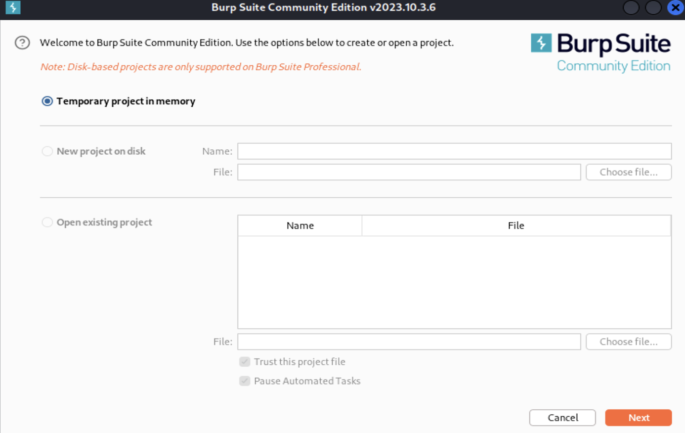

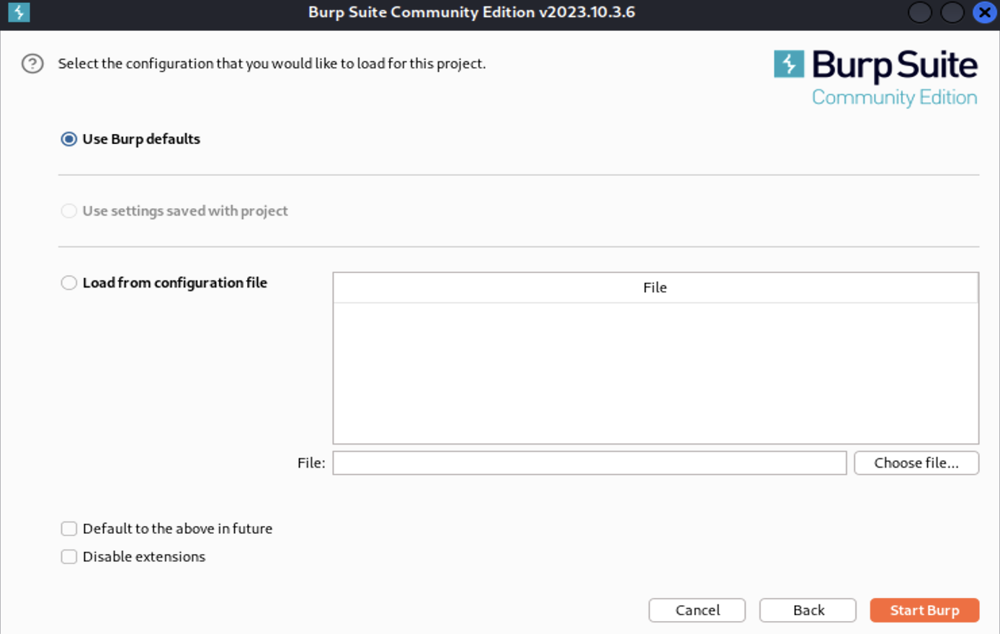

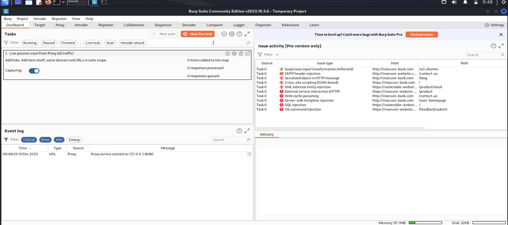

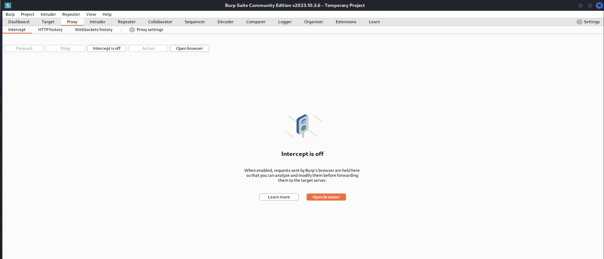

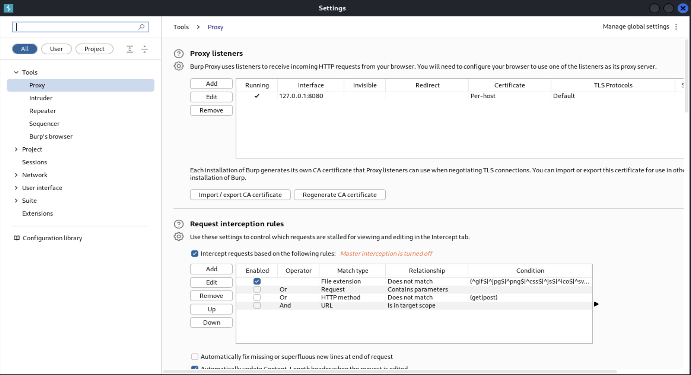

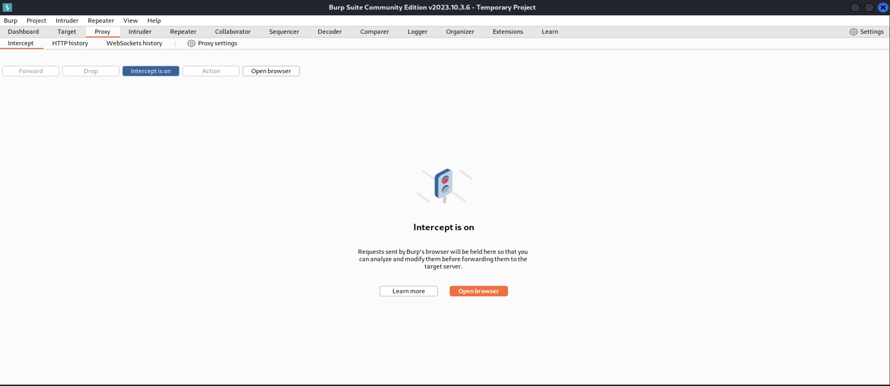

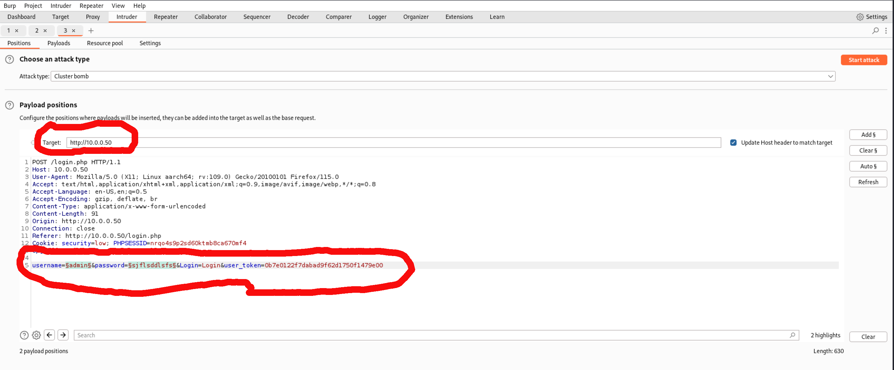

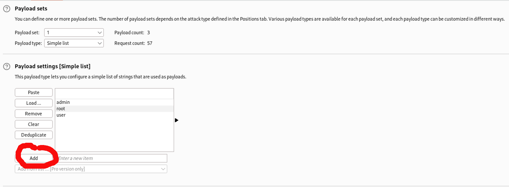

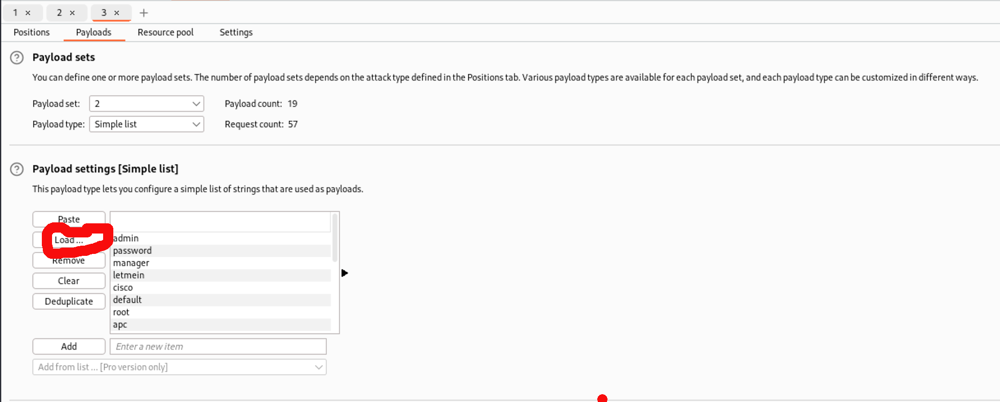

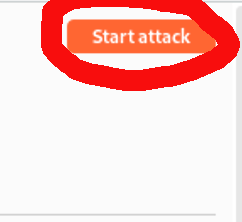

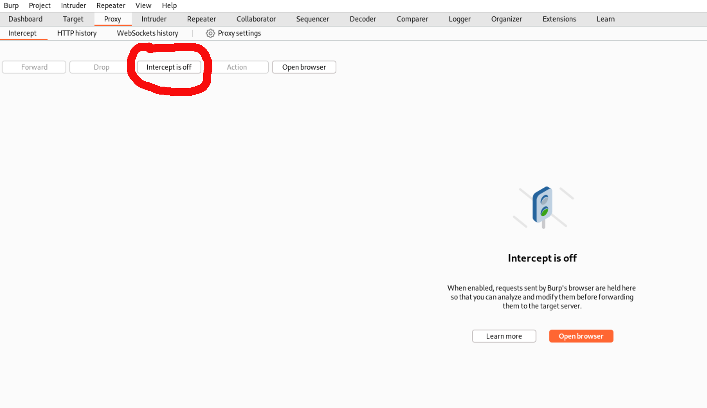

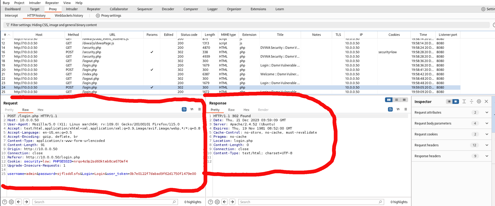

16. Now we need to configure Firefox with the same proxy settings so that you can intercept traffic between it and the DVWA server. See the illustrations below for an example of how to setup Firefox running on Kali.

[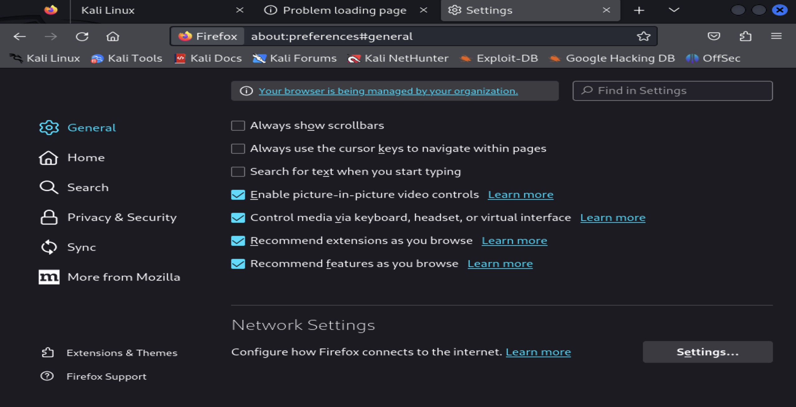

[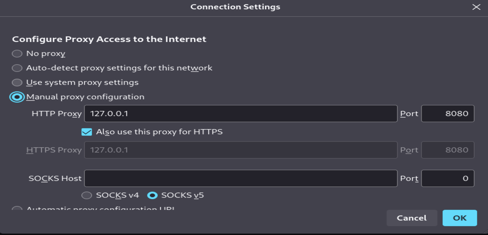
