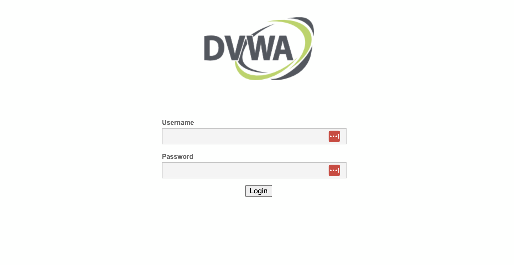

## What is the DVWA

### How to Setup the DVWA (Damn Vunerable Web Application)

Setup DVWA

1. Update your Ubuntu server

`sudo apt update && sudo apt upgrade -y`

2. Install all the necessary pacakges

`sudo apt -y install apache2 mariadb-server php php-mysqli php-gd libapache2-mod-php mysql-server-8.0`

3. Prepare the MySQL database by logging into it MySQl and running the following commands

`sudo mysql -u root`

`CREATE DATABASE dvwa;`

`CREATE USER 'dvwa'@'localhost' IDENTIFIED BY 'password';`

GRANT ALL PRIVILEGES ON dvwa.* TO 'dvwa'@'localhost' IDENTIFIED BY 'password';

4. Download and install the DVWA

`cd /var/www/html'
'sudo git clone https://github.com/digininja/DVWA.git .`
`sudo chown -R www-data:www-data /var/www/html/*`

5. Copy and update the configuration file to setup the DVWA to connect to your MySQl instance

`cp /var/www/html/config/config.inc.php.dist /var/www/html/config/config.inc.php`

6. Edit the file in your favorite text editor

`vi /var/www/html/config/config.inc.php`

[

7. Restart apache so that the changes you made take effect and test your web application to make sure it is workking correctly by browsing to the private IP of your Ubunutu server from your Mac

http://xxx.xxx.xxx.xxx/

8. If everything is working you should see a image similar to this in your browser

[

9. Great once the configuration and setup are complete you are now ready to use your Kali Linux instance to exploit this host

10. Please run through the UI with your instructor to make sure you understand how it works

[
