### Metasploitable VM setup M1

### What is Metasploitable?

Metasploitable  is a virtual machine image that includes lots of vulnerabilities intentionally that can be used to learn how to hack into a machine.

To build a Metaspoitable VM you will need the following tools:

1. UTM, that is a Virtual Machine engine that runs in M1 chips

2. Homebrew which you should already ahve installed

3. QEMU which can be installed using Homebrew

### Install UTM

1. Go to https://docs.getutm.app/installation/macos/

2. Click on the button Download from GitHub

3. Install the package.

### Install QEMU using HomeBrew

`brew install qemu`

### Download the Metasploitable Image
I have already prepared the image via the following link 👇🏾

[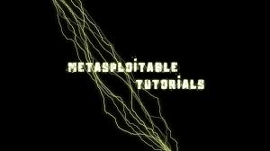](https://drive.google.com/file/d/1N1kaYIbw3qdYe-NlQ2uyTDqdssc72XHm/view?usp=drive_link)

*** Optional if you want to create a VM from scratch from the VMDK file. 👇🏾

Run the following command after you extract the metasploitable.vmdk from the zip file. Please note you must be in the file with the vmdk file to run the following command.

`qemu-img convert -O qcow2 -c metasploitable.vmdk metasploitable.qcow2`

If you want to download additional versions of the Metasploitable VM and set them up in UTM you can go to `https://drive.google.com/file/d/1N1kaYIbw3qdYe-NlQ2uyTDqdssc72XHm/view?usp=sharing`or search for Metasploitable VMDK via google.

To import the VM in UTM you will need to extract the zip file and follow the following steps.

1. Open UTM

2. Create a new VM (button with symbol +) and select "Emulate".

3. Click on other and "Other”

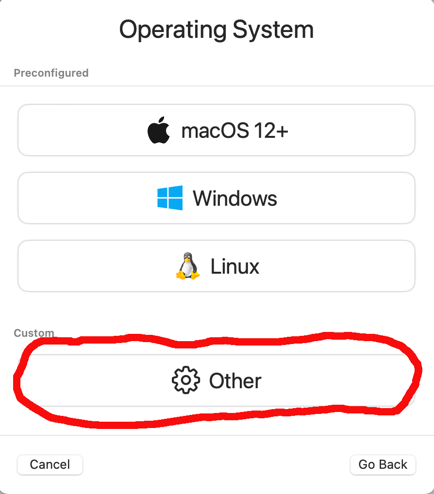

4. Click on skip “Skip ISO boot”

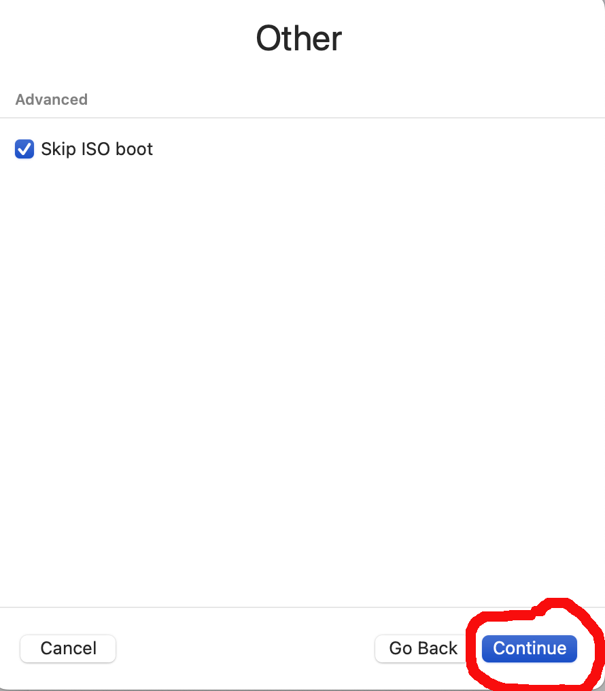

5. For hardware, leave it as is. but lower the RAM if you want, it only needs like 1024 MB.

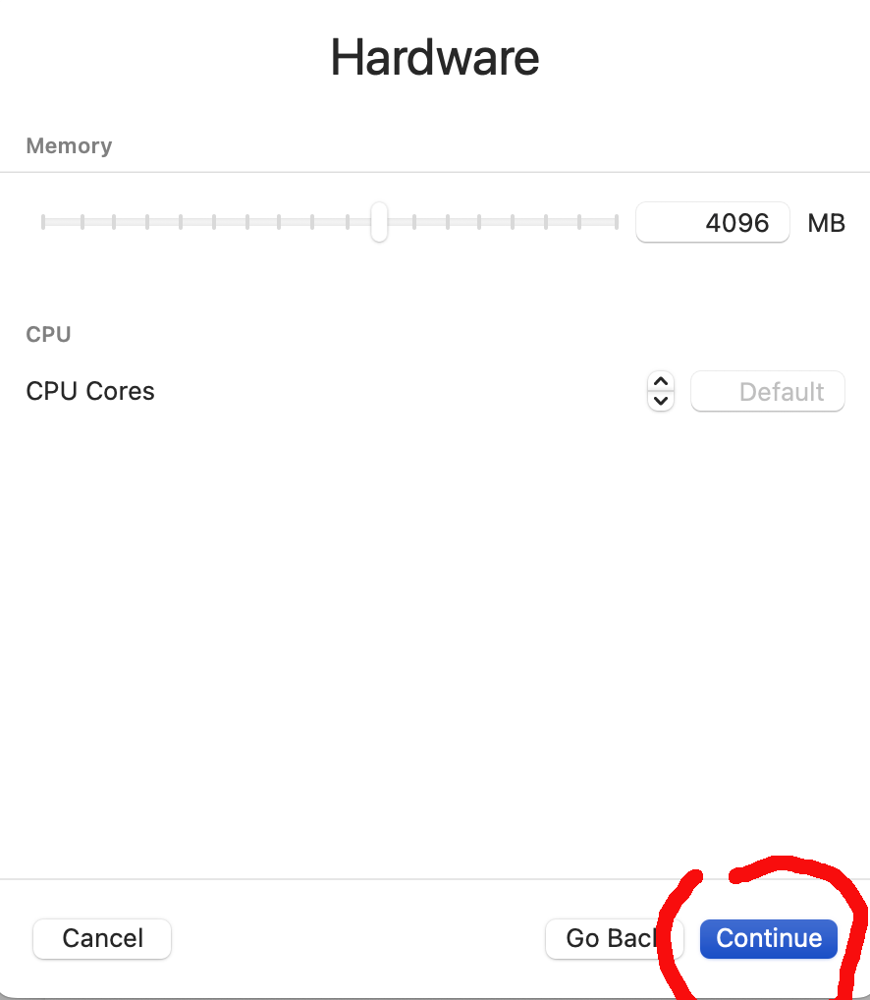

6. For the rest of the options just next, next, next... until you get to the "Summary" page.

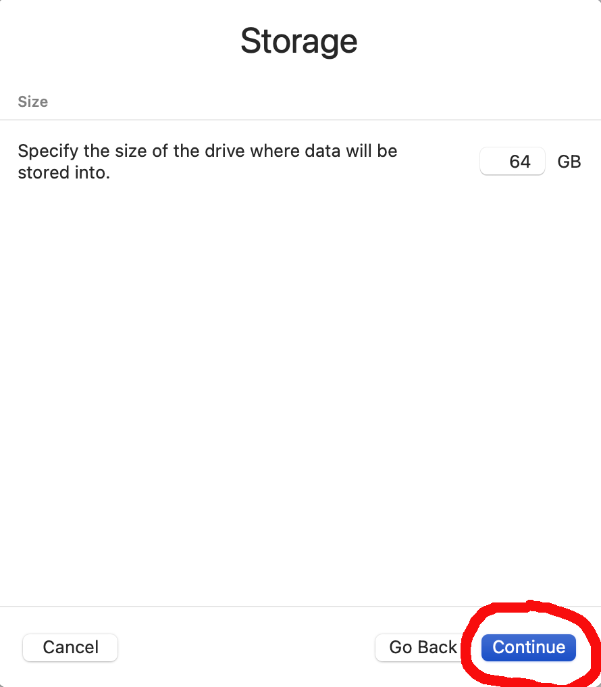

7. On the summary page, select "Open vm settings" then "Save".

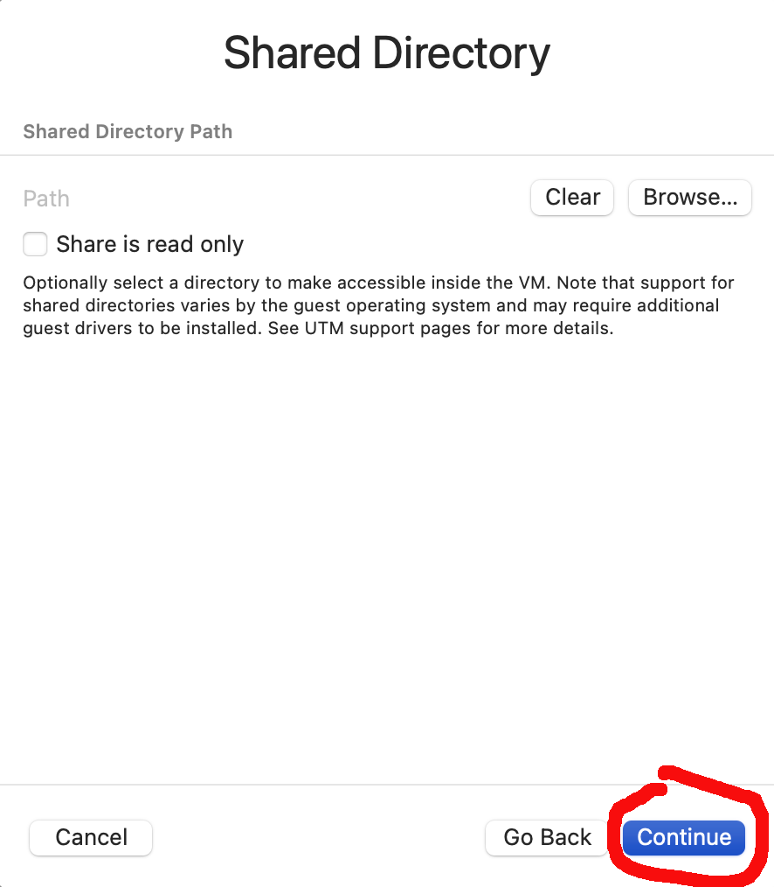

8. A new dialog box with the settings of the VM will appear. You can change the name of the VM.

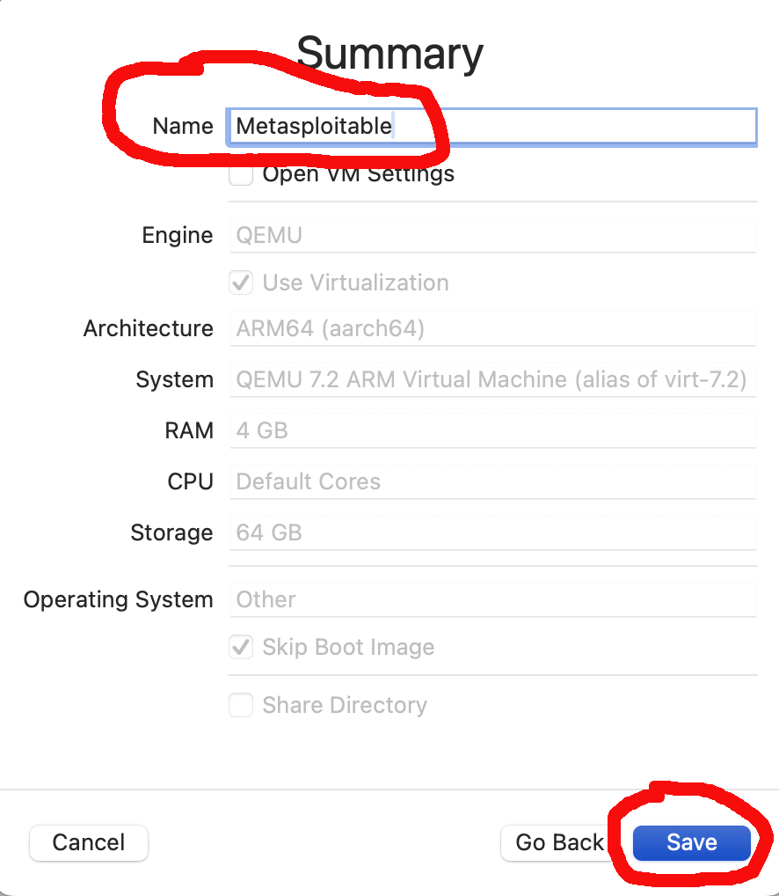

9. Click on the "QEMU" in the sidebar and uncheck "UEFI Boot".

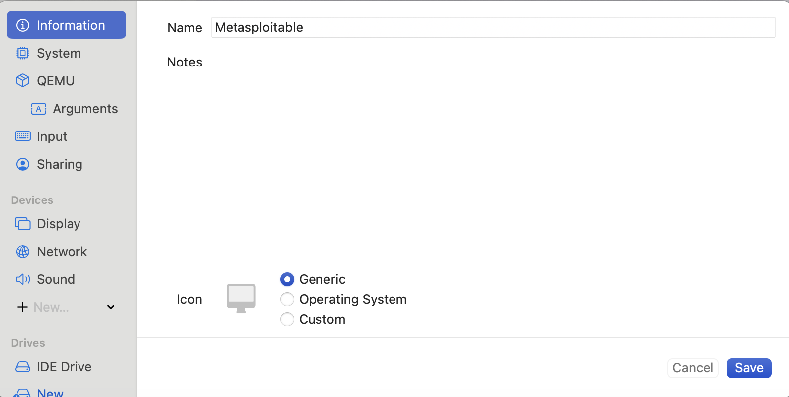

10. Under "Drives" section of the sidebar menu, select "IDE Drive" and delete it.

11. Now in the Drive section, click on "New Drive", and then in "Import".

12. Select the .qcow2 file you downloaded or created with the .qco2 extension and import it.

13. Click Save and then verify that your VM has the following settings before you start the VM. This is very important otherwise your VM will not appear on your bridged network or start properly and display the Metasploitable 2 banner after it is booted.

14. Verify your UTM settings are similar to the examples below before booting the Metasploitable image.

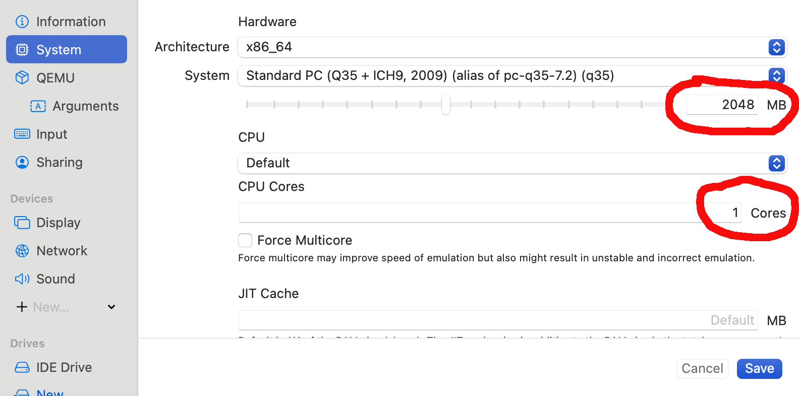

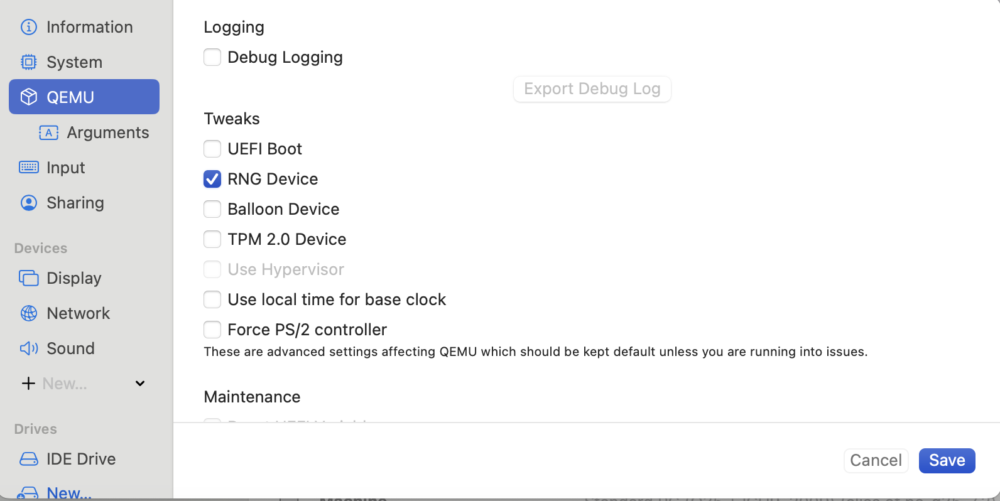

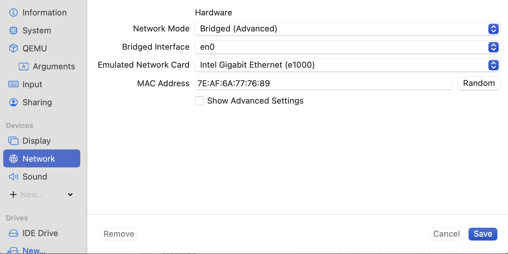

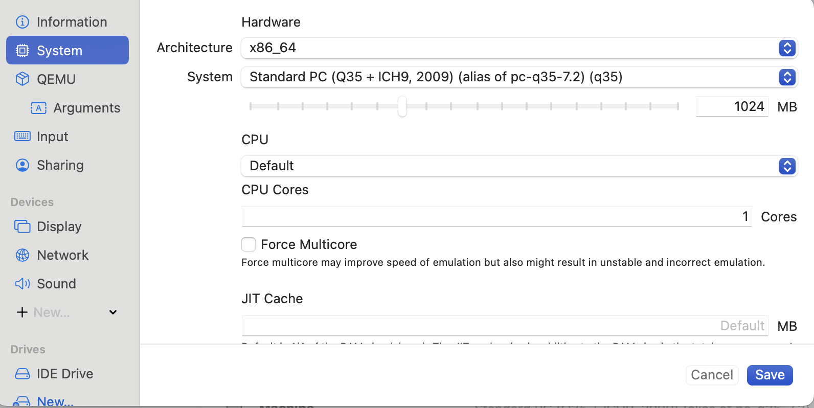

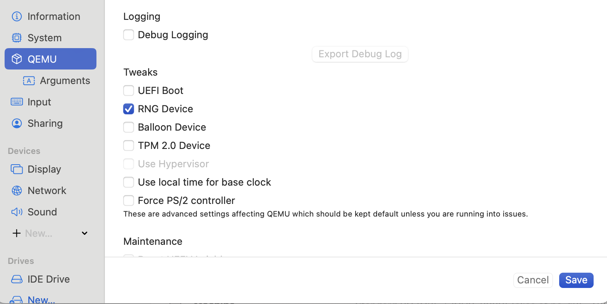

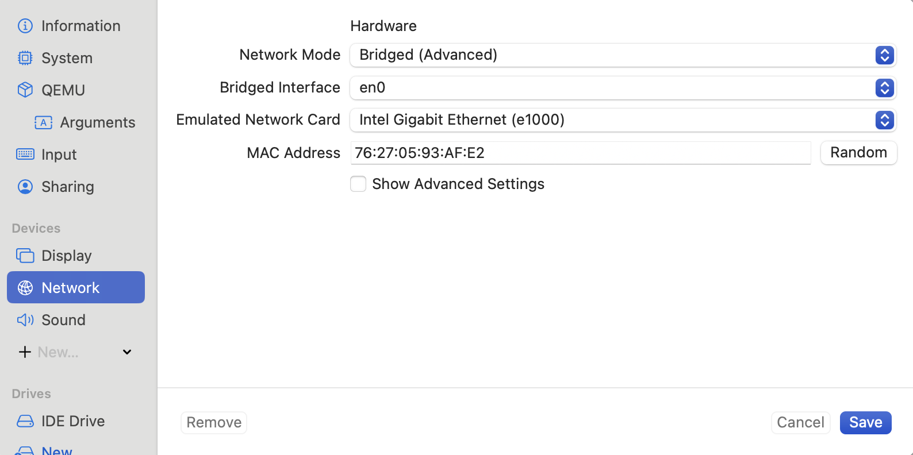
