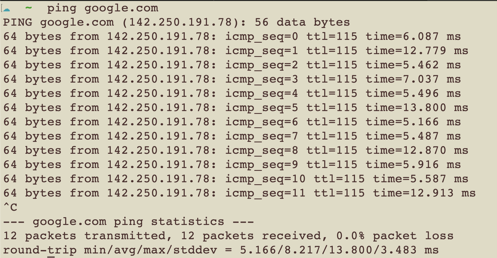

### Network Commands

1. We are going to run through some basic networking commands you can run on your Mac os and Linux System

2. The first command is ping.

3. Type `ping google.com`

4. You should see something similar to the image below. The ping command simply tells you if a host is up or down by sending ICMP packtets to the host or domain you are attempting to ping.



5. To stop the ping command press control+c

6. Now we are going to use the `nslookup` command

7. This command performs a DNS lookup of the domain you specified. Try it with several other domains. tekperfect.com, microsoft.com, and apple.com.


8. Note the differences when you use different domains

9. What do you think this command is doing?

10. Now we are going to run some similar commands to nslookup called host and dig.


11. Use both the host and dig command to lookup the google.com domain. What things are similar and what things are different?

12. See the images below for an example of the output


13. Now we are going to run a command called traceroute. This command displays that path your computer would take to get from your network to a particular destination, domain, host, or website on the Internet.

14. Let's run a `traceroute` to google.com


15. What's interesting about the output?

16. Now we are going to run a command simialr to traceroute called `mtr`. However, we may need to install it by using Homebrew. Luckily Hombrew is already installed on your laptops. So to install the package you simply need to run the command `brew install mtr`.

17. If the package is already installed great you just need to make sure the binary is in your path.

18. To do so run the following command sudo vi /etc/paths and add the following line to the paths file.

19. `/usr/local/sbin`

20. This will add the mtr command to your path so that you don't have to specify the folder the binary is in when you run the command.

21. Now lets run the following command `sudo mtr google.com`.


22. Now what do you see while running the mtr command that is different from running the traceroute command?

23. What do you see that is similar while running the mtr command those similaraties are also important. Why?

24. When troubleshooting network relate issues both the things that are similar and different are important.

25. Practice these commands with other domains and pay attention to the output. What command would you run in conjunction with these commands to capture the output.

### Ubuntu Server Networking

0. ssh to your Ubuntu server

1. Then backup your network configuration file of your Ubuntu server.

2. The file is named `00-installer-config.yaml`

3. What command would you run to locate the file (Hint you use the find command)

4. For example if I were looking for the Apache configuration file I would run the following command to locate it `sudo find / -name 000-default.conf`

5. After you use the find command to locate the file you have two options to back it up.
5a. You can cd into the directory and use the cp command to make a backup of the file.
5b. Or your can use the full path to the file with the cp command to make a backup of it.
5c. I suggest for simplicity purposes calling the backup copy of the file `00-installer-config.yaml.backup`

6. After you have made a backup of the file we are going to make changes to the file.

7. However before we make changes to the file what command would you run to see the contents of the file without editing it.

8. Your file should look something like the image below.


9. Now edit `00-installer-config.yaml` and add the following lines to it.

```
network:
  ethernets:
    enp0s5:
      addresses: [10.211.55.10/24]
      routes:
        - to: default
          via: 10.211.55.1
          on-link: True
      nameservers:
        addresses: [8.8.8.8, 8.8.4.4]
      dhcp4: false
      optional: true
  version: 2
```

10. Please note the spacing in the file is important. If you need to verify that your spacing is correct you can go to the following webiste to check it.

11. YAML Validator `https://www.yamllint.com/`

12. After you have verified that your file is valid please save it and run the following commands.

13. `sudo netplan generate`

14. `sudo netplan apply`

14a. You should get disconneted

14b. Why did you get disconnected?

14c. How do you reconnect to your Ubuntu server via your Mac terminal

14d. Run the ssh command again and use the IP address you specified in the network configuration file above

15. The static IP you just set on your VM will always be the IP you use to ssh to it unless we revert the `00-installer-config.yaml` file back to the default configuration.

16. How would you keep the original configuration file contents intact but invalidating them while adding the new network configuration. (Hint what is the first character in the configuration file).

17. If you are unable to get back into your VM can log back into your VM via Parallels and then run the ip addr command to determine the IP address.

18. Once you have successfully been able to get back into your VM from the Mac terminal restore the backup copy of the `00-installer-config.yaml` and then run the `sudo netplan generate` and `sudo netplan apply` command.

19. Your IP may revert back to it's old IP addrees

20. The last and final step in the changing of your Ubuntu Servers IP is to change the network adapter to bridged mode.

21. To do so you need to shutdown the Ubuntu VM and then run the following command via the Mac terminal

22. `sudo prlctl set "name of your vm" --device-set net0 --type bridged`

23. This will set the adapter of your vm to bridged mode which will allow it to operate on the same network your mac is configured for.

24. To verify that your Ubuntu server VM has obtained an IP similar to one your Mac has login to the VM directly via Parallels and run the ip addr command.

25. Once you have verified the new IP address of your VM you should be able to ssh to it via your Mac terminal.

26. If you VM is not accessiable via your Mac terminal after this change perform a full reboot of your VM.

27. If you still experience issues ask your instructor for assistance.

28. This exercise is designed to get you more familar with Linux server networking and reinforce the use of the ssh command, cp command, and vi. The labs in this course are designed to have you perform operations that ensure you can safely update changes to your VM and undo those changes as you would in a regular production environment.

29. If any parts of this lab were unclear please ask questions and assistance from your instructor.

30. However, the goal is to get through as much of the lab as possible without assistnace and only ask for assistance when necessary..

## Wireshark Lab

1. Go to the following link to download wireshark `https://www.wireshark.org/download.html`

2. Please make sure you download the verion for the macOSArm version.

3. After wireshare is installed we are going to perform a basic capture between your Mac and the Ubuntu instance you have running Apache.

4. Please login to your Ubuntu server and note the IP address because we are going to use wireshark to create a filter. Specifically between your Mac and the Ubuntu instance.

5. In order to start the process of capturing traffic between your Mac and Ubuntu server you need to start the packet capturing function on Wireshark. To do so just click on the blue Shark fin icon in the upper left portion of the application.

6. Once the packet capturing has begun we are going to initiate a connection to the website running on the Ubuntu server by typing the IP of the site in the browser.

7. In the filer field right below the Wireshare shark fin and the red stop button we are going to type in `http`

8. This should filter the web traffic request you made to the Ubuntu server. Work with your instructor to determine what kind of data you can gather from this packet capture.

9. The purpose of this exercise is to examine the packets in the capture to determine what kind of data you can find similar to the network scans we did with nmap. The data in these captures tells a story.

10. Once you have located all the pertintent data share it with your fellow students each of you may have discovered something different.
