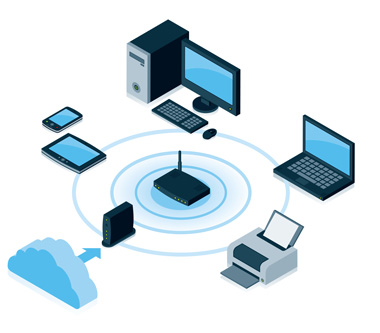
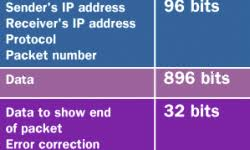
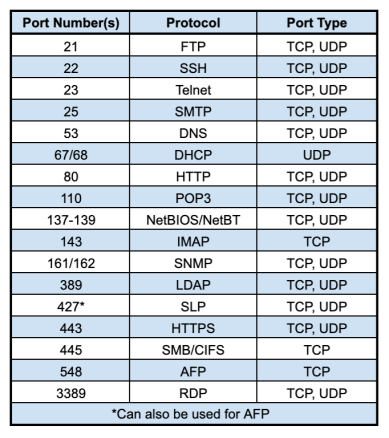
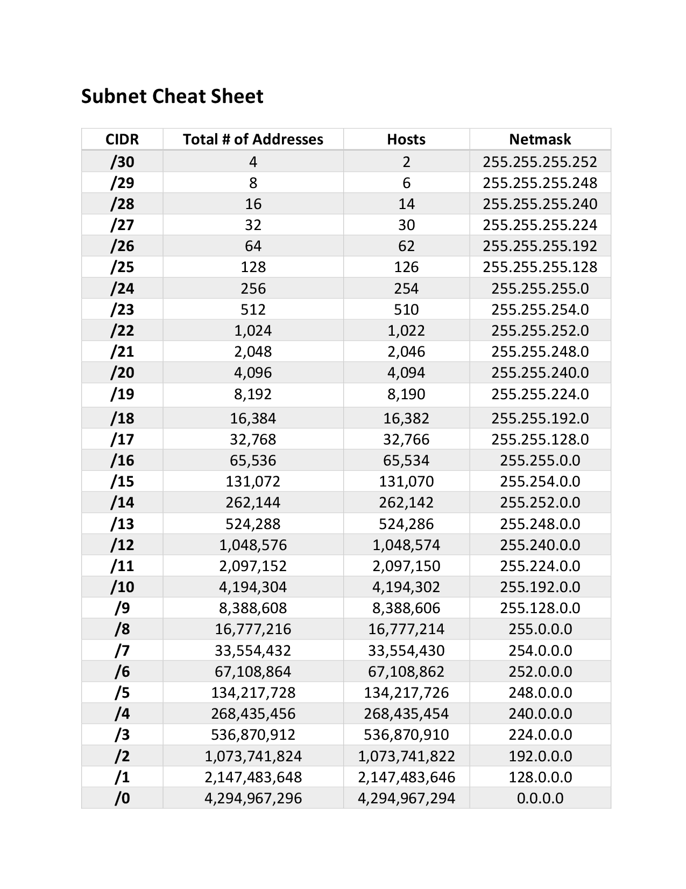

### ⏱ Agenda

1. [🏆 Learning Objectives](#%f0%9f%8f%86-learning-objectives)
1. [📖 Network Types](#%f0%9f%93%96-network-types)
1. [🐍 Network Protocols](#%f0%9f%90%8d-network-protocols)
1. [✏️ Ports](#%e2%9c%8f%ef%b8%8f-ports)
1. [🍵 Subnetting](#%f0%9f%8d%b5-subnetting)
1. [📚 Resources & Credits](#%f0%9f%93%9a-resources-amp-credits)

> Networks

### Personal Area Networks

A personal area network (PAN) provides networking needs around an individual. An example of a PAN is where a smartphone, smartwatch, tablet, and laptop all connect and share data without the need to connect to an access point or other third-party network services. PAN networks typically use Bluetooth to communicate because it provides a low-power, short-range data-sharing capability. The network standards associated with a PAN are Bluetooth and IEEE 802.15.

Here's an example of a PAN (Personal Area Network):

### Local Area Networks & Wide Area Networks

A wide area network (WAN) provides networking capabilities between two different geographical locations locally or worldwide. For example, a WAN is used to connect an organization's head office with branch offices all over the country. A WAN links multiple LANs together to create one super network. As a MAN, you use a virtual private network (VPN) to manage the connection between different LANs.

A LAN is a privately operated network typically contained in a single building.

A LAN operates at speeds of 10 Gbps or higher.

A LAN is less congested compared to other network types.

A LAN can be managed and administrated in-house.

A wide area network (WAN) provides networking capabilities between two different geographical locations locally or worldwide. For example, a WAN is used to connect an organization's head office with branch offices all over the country. A WAN links multiple LANs together to create one super network. As a MAN, you use a virtual private network (VPN) to manage the connection between different LANs.	

A WAN is used to connected geographically separate offices to each other.

Multiple organizations might operate WANs.

A WAN typically operates at speeds of less than 1 Gbps.

A WAN is more congested compared to other network types.

A WAN typically requires the use of a third party to configure and set up, which increases cost.

### Network infrastructure

There are several network standard-compliant devices that make up the structure of your networks. Depending on the network's size, you might use several of these devices to build the backbone of your network. These devices are:

Repeaters

Hubs

Bridges

Switches

Routers

### Network Addresses

A network address is a unique identifier that identifies a network-enabled device. A network-enabled device might have more than one address type. Although there are more address types, for this discussion, we'll focus on only two of these address types.

The first type is a media access control (MAC) address that identifies the network interface on the hardware level. The second type is an Internet Protocol (IP) address that identifies the network interface on a software level.

### Data Packets

A data packet is a unit that's used to describe the message two devices on a network send each other. A data packet consists of raw data, headers, and potentially also a trailer. The header contains several information items. For example, it includes the sender and destination device addresses, the size of the packet, the protocol used, and the packet number. The trailer in a data packet deals with error checking.

The concept is similar to sending someone a letter in the mail. But instead of sending several pages in one envelope, each page is sent in a separate envelope. Enough information is sent in each envelope to allow the recipient to piece together the complete message after they have all the pages.

### Routing and Routing Protocols

Routing, in the context of networks, refers to the mechanism used to make sure that data packets follow the correct delivery path between the sending and receiving devices on different networks.

For example, think about the system you are using to connect everyone on a video call and the server that's hosting the call. Multiple networks connect each person to the server hosting the call in order for everyone to communicate with one another.

Here's an example of how data is transferred between computing systems:

### Network communication protocols

Communication protocols focus on establishing and maintaining a connection between devices. As you work with different devices and network services, you'll make use of various network communication protocols.

First, we need to define three foundational protocols of all internet-based networks. These three protocols are Transmission Control Protocol (TCP), Internet Protocol (IP), and User Datagram Protocol (UDP). These protocols are concerned with the logical transmission of data over the network.

### Transmission Control Protocol: 

TCP chunks up data into data packets that can be sent securely and quickly while minimizing the chance of data loss. It provides a stable and reliable mechanism for the delivery of data packets across an IP-based network. Even though TCP is an effective connection-oriented protocol, it has overhead.

### Internet Protocol: 

IP is responsible for the addressing of a data packet. IP encapsulates the data packet to be delivered and adds an address header. The header contains information on the sender and recipient IP addresses. This protocol isn't concerned about the order in which the packets are sent or received. It also doesn't guarantee that a packet will be delivered, only the address.
User Datagram Protocol: UDP is a connectionless protocol that offers a low-latency and loss-tolerant implementation. UDP is used with processes that don't need to verify that the recipient device received a datagram.

The rest of the protocols that we'll discuss here are based on a type of application, for example, an email client or a web browser. Here are the most commonly used network communication protocols:

### Hypertext Transfer Protocol (HTTP): 

The HTTP protocol uses TCP/IP to deliver web page content from a server to your browser. HTTP can also handle the download and upload of files from remote servers.
File Transfer Protocol (FTP): FTP is used to transfer files between different computers on a network. Typically, FTP is used to upload files to a server from a remote location. While you can use FTP to download files, web-based downloads are typically handled through HTTP.

### Post Office Protocol 3 (POP3): 

POP3 is one of three email protocols. It's most commonly used by an email client to allow you to receive emails. This protocol uses TCP for the management and delivery of an email.
Simple Mail Transfer Protocol (SMTP): SMTP is another one of the three email protocols. It's most commonly used to send emails from an email client via an email server. This protocol uses the TCP for management and transmission of the email.

### Interactive Mail Access Protocol (IMAP): 

IMAP is the more powerful of the three email protocols. With IMAP and an email client, you can manage a single mailbox on an email server in your organization.

### Network security protocols

Network security protocols are designed to maintain the security and network of data across your network. These protocols encrypt in-transmission messages between users, services, and applications. Network security protocols use encryption and cryptographic principles to secure messages. To implement a secure network, you must match the right security protocols for your needs.

### Secure Socket Layer (SSL): 

SSL is a standard encryption and security protocol. It provides a secure and encrypted connection between your computer and the target server or device that you accessed over the internet.

### Transport Layer Security (TLS): 

TLS is the successor to SSL and provides a stronger and more robust security encryption protocol. Based on the Internet Engineering Task Force (IETF) standard, it's designed to stop message forgery and tampering and eavesdropping. It's typically used to protect web browser communications, email, VoIP, and instant messaging. While TLS is now used, the replacement security protocol is often still called SSL.

### Hypertext Transfer Protocol Secure (HTTPS): 

HTTPS provides a more secure version of the standard HTTP protocol by using the TLS or SSL encryption standard. This combination of protocols ensures that all data transmitted between the server and the web browser is encrypted and secure from eavesdropping or data packet sniffing. The same principle is applied to the POP, SMTP, and IMAP protocols listed previously to create secure versions known as POPS, SMTPS, and IMAPS.

### Secure Shell (SSH): 

SSH is a cryptographic network security protocol that provides a secure data connection across a network. SSH is designed to support command-line execution of instructions, which includes remote authentication to servers. FTP uses many of the SSH functions to provide a secure file transfer mechanism.
Kerberos: This validation protocol provides a robust authentication for client-server-based applications through secret-key cryptography. Kerberos assumes that all endpoints in the network are insecure. It enforces strong encryption for all communications and data at all times.

### Network management protocols

In your network, it's perfectly acceptable to have multiple different protocols running concurrently. Previously, we discussed communications and security protocols. Equally important to the successful day-to-day running and operating of a network are the management protocols. The focus of this type of protocol is the sustainability of the network by looking at faults and performance.

Network administrators need to monitor their networks and any devices attached to them. Each device in your network exposes some indicators about the state and health of the device. These indicators are requested by the network administrator tool and can be used for monitoring and reporting.

Two network management protocols are available:

### Simple Network Management Protocol (SNMP):

SNMP is an internet protocol that allows for the collection of data from devices on your network and the management of those devices. The device has to support SNMP to gather information. Devices that typically support SNMP include switches, routers, servers, laptops, desktops, and printers.

### Internet Control Message Protocol (ICMP):

ICMP is one of the protocols included within the Internet Protocol suite (IPS). It allows network-connected devices to send warning and error messages, along with operation information about the success or failure of a connection request, or if a service is unavailable. Unlike other network transport protocols like UDP and TCP, ICMP isn't used to send or receive data from devices on the network.

### Ports

A port is a logical construct that allows the routing of incoming messages to specific processes. There's a particular port for every type of IPS. A port is an unsigned 16-bit number in the range 0 to 65535 and is also known as a port number. Ports are assigned by the sending TCP or UDP layer based on the communications protocol used. There are specific port numbers reserved for every service. The first 1,024 ports, called the well-known port numbers, are reserved for the commonly used services. The high-numbered ports, called the ephemeral ports, are unreserved and used by dedicated applications. Every port links to a specific service or communications protocol. It means that the target network device, say a server, can receive multiple requests on each port and service each of them without conflict.

### Well-known port numbers

Much in the same way that IP addresses are split into classes, so are ports. There are three ranges of ports: the well-known ports, the registered ports, and the dynamic/private ports.

The Internet Assigned Numbers Authority (IANA) manages the allocation of port numbers, the regional assignment of IP addresses, and Domain Name System (DNS) root zones. IANA also manages a central repository for protocol names and the registry used in internet protocols.

### Port number	Assignment

20	File Transfer Protocol for data transfer

21	File Transfer Protocol for command control

22	Secure Shell for secure authentication

23	Telnet remote authentication service for unencrypted text messages

25	Simple Mail Transfer Protocol for email routing

53	Domain Name System service

80	Hypertext Transfer Protocol for use in the web

110	Post Office Protocol

119	Network News Transfer Protocol (NNTP)

123	Network Time Protocol (NTP)

143	Internet Message Access Protocol for management of digital mail

161	Simple Network Management Protocol

194	Internet Relay Chat (IRC)

443	HTTP Secure HTTP over TLS/SSL

### Address Resolution Protocol (ARP)

Here's an example of a the most common ports:

The Address Resolution Protocol (ARP) is a communications protocol within the Internet Protocol suite. It's a request-response protocol used to resolve the media access control (MAC) address for a given IP address. ARP supports many data link layer technologies, such as Internet Protocol version 4 (IPv4), DECnet, and PUP. When an Internet Protocol version 6 (IPv6) address is resolved, the Neighbor Discovery Protocol (NDP) is used instead of ARP. Without ARP, there would be no means to resolve an IP address to a physical device address.

There's also the Reverse Address Resolution Protocol (RARP), which retrieves an IP address based on the given MAC address.

### TCP/IP

The Transmission Control Protocol/Internet Protocol is a collection of different communication protocols that support and define how network-enabled devices interconnect with each other over an IP-based network. At its heart are two key protocols: TCP and IP. TCP/IP makes the internet possible, as well as private and public networks like intranets and extranets.

TCP/IP defines the way data is shared between network-enabled devices by defining the end-to-end communication process. It manages how the message is broken down into packets of data, which are sometimes known as datagrams. TCP/IP also determines how the packet is addressed and transmitted, routed, and received. TCP/IP can determine the most efficient route across a network.

The TCP/IP model is designed to be stateless.

This design means the network stack treats each request as new because it isn't related to the previous request. One part of the TCP/IP model isn't stateless. The transport layer operates in a stateful mode because it maintains a connection until all the packets in the message are received.

TCP/IP is an open standard. 

It's governed, but it's not owned by any one organization, so it works with all operating systems, networks, and hardware.

TCP/IP model layers

The TCP/IP model is made up of four distinct layers. Each layer uses a different type of protocol. Notice how the TCP/IP model is similar to the Internet Protocol suite discussed earlier.

### Application layer:

The application layer is responsible for determining which communication protocols are used. This layer includes HyperText Transfer Protocol (HTTP), DNS, File Transfer Protocol (FTP), Internet Message Access Protocol (IMAP), Lightweight Directory Access Protocol (LDAP), Post Office Protocol (POP), Simple Mail Transfer Protocol (SMTP), Simple Network Management Protocol (SNMP), Secure Shell (SSH), Telnet, and TLS/SSL.
Transport layer: This layer splits the application data into manageable ordered chunks by using the right port for the application protocol that's used. The protocols associated with this layer are TCP and the User Datagram Protocol (UDP).

Internet layer: Also known as the network layer, this layer ensures the data packet gets to its destination. The protocols associated with this layer are IP, IPv4, IPv6, Internet Control Message Protocol (ICMP), and Internet Protocol Security (IPsec).

Network access layer: This layer is responsible for defining how the data is sent across the network. The protocols associated with this layer are ARP, MAC, Ethernet, digital subscriber line (DSL), and Integrated Services Digital Network (ISDN).

### Internet Protocol standards

Recall from earlier that the Internet Protocol isn't concerned about the order in which the packets are sent or received. It also doesn't guarantee that a packet will be delivered. The Internet Protocol only provides a logical addressing system that's used to route and forward messages to their destinations.

### IPv4

Internet Protocol version 4 was released in 1983 and is the standard for all packet-switch-based networks in use today. IPv4 uses a 32-bit address space that gives an upper limit of 4,293,967,296 (4.3 billion) unique logical IP addresses. A large number of these available IP addresses are reserved for a specific purpose, for example, private networks, local hosts, internet relays, documentation, and subnets.

Structure of an IPv4 address

The structure of an IPv4 address is four decimal numbers in the range of 0 to 255, each separated with a dot. It's also known as the dotted-decimal format. An example of an IP address is 192.168.0.1.

Parts of an IPv4 address

There are two parts to an IP address, the network and the host. Let's use the address 192.168.0.1 as an example.

The network part of an IP address covers the first set of decimal numbers. In the example, that's 192.168.0. This number is unique to the network and specifies the class of the network. The are a number of network classes available, which we'll discuss next.

The host part of the IP address covers the next set of decimal numbers. In the example, that's 1. This number represents the device and has to be unique within the network to avoid address conflicts. Each device on a network segment must have a unique address.

IPv4 Address Classes

The Internet Protocol's local address space is split into five logical classes or ranges of IP addresses, each represented by a letter of the alphabet.

IPv4 Address Classes

Class	Start address	End address	Number of networks	IP addresses per network	

Total IP addresses available	Subnet mask

A	0.0.0.0	127.255.255.255	128	16,777,216	2,147,483,648	255.0.0.0

B	128.0.0.0	191.255.255.255	16,384	65,536	1,073,741,824	255.255.0.0

C	192.0.0.0	223.255.255.255	2,097,152	256	536,870,912	255.255.255.0

D	224.0.0.0	239.255.255.255	-	-	268,435,456	-

E	240.0.0.0	255.255.255.255	-	-	268,435,456	-

For classes A, B, and C, the start and end IP addresses are reserved and shouldn't be used. Class D is reserved for multicast traffic only. Class E is reserved and can't be used on public networks, like the internet.

In the previous table, the last column is marked as a subnet mask. The subnet mask uses the same format of the IP address. But its purpose is to identify valid IP addresses in an IP range.

For example, assume you have an IP address range that starts at 192.168.0.1, and you have a subnet of 255.255.255.0.You'll apply the subnet mask in the following way. For each address segment value specified as 255 in the mask, the corresponding address segment is static. When you want to pick an IP address, you have to pick an address that matches 192.168.0. Where the segment has a value of 0, you're allowed to use any value between 0 to 255. A subnet mask of 255.255.255.0 gives an IP address range of 192.168.0.0 to 192.168.0.255, which are valid values to select.

### Subnets

A subnet defines one or more logical networks within the class A, B, or C network. Without subnets, you're restricted to a single network in each of the class A, B, or C networks.

Subnets allow multiple subnetworks to exist within one network. They can be used to enhance routing performance. Subnets can be arranged hierarchically to create routing trees.

Special-use addresses
Each of the classes has restrictions on the ranges of IP addresses that can be used. This table shows the more common ones.

SPECIAL-USE ADDRESSES

Address range	Scope	Description

10.0.0.0–10.255.255.255	Private network	Used for local communications within a private network

127.0.0.0–127.255.255.255	Host	Used for loopback addresses

172.16.0.0–172.31.255.255	Private network	Used for local communications within a private network

192.88.99.0–192.88.99.255	Internet	Reserved

192.168.0.0–192.168.255.255	Private network	Used for local communications within a private network

255.255.255.255	Subnet	Reserved for the "limited broadcast" destination address

Here's an example of a Subnet Addressing:

An IP address, also known as a network address or routing prefix, represents the address of the device or computer to send the packet of data. A subnet, or host address, represents which network or subnetwork to use. A subnet is a 32-bit number framed by using the dotted-decimal format. For example, 255.255.255.0 is a standard subnet mask.

In an IPv4 network, for a packet of data to be routed to the correct network and the right network device, a routing prefix is needed. A routing prefix is created by taking the subnet mask and applying a bitwise AND to the IP address.

A more common way to define the subnet and the routing prefix is to use the Classless Interdomain Routing (CIDR) notation. CIDR applies to the IP address as the number of bits you want to allocate to your subnet. Using CIDR notation, at the end of the IP address, add a "/" and then the number of bits. For example, 198.51.100.0/24 is the same as using the dotted-decimal format subnet mask 255.255.255.0. It offers an address range of 198.51.100.0 to 198.51.100.255.
