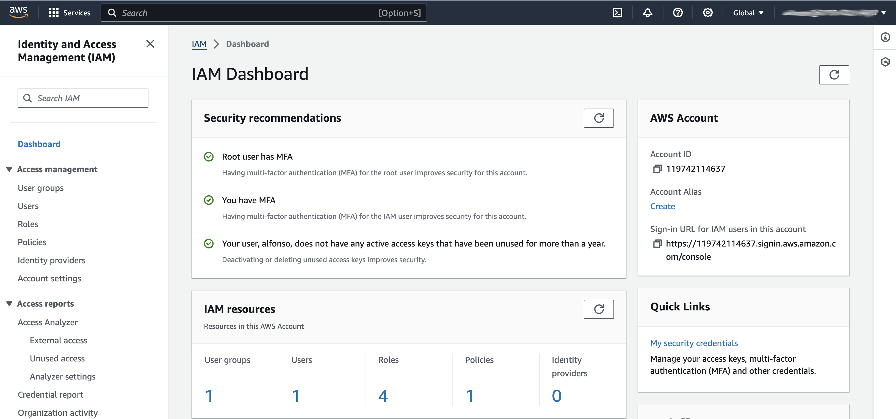
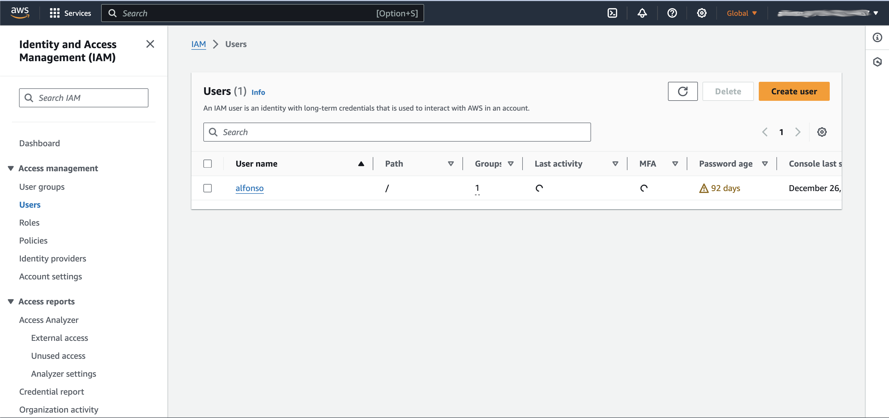
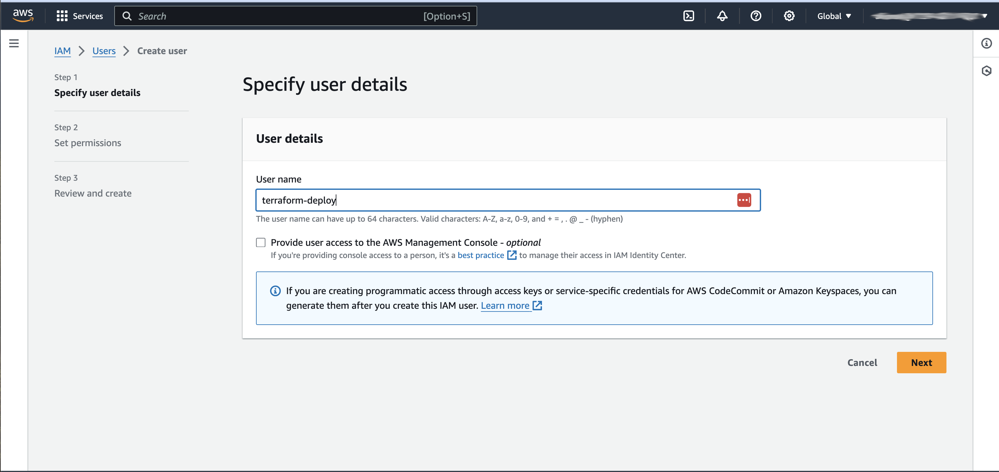

# Jenkins (CI/CD Pipeline) 

## 1.Initial Setup

### What is Jenkins and Why is it so widely used?

Jenkins is a CI/CD platform, which means that it allows users to Integrate (Build, Compile, Test etc), and Deliver (Deploy, Upload, Publish) code from different resources in one single platform. A quick search can show you a list of alternatives, but the reason Jenkins is so widely used because it is open source, and the community had worked hard to create and maintain very useful plugins. One day will come when a definite alternative arrives and Jenkins becomes obsolete, but even then, learning to use Jenkins and it's functionalities will provide very useful and transferable knowledge on how to create and manage CI/CD platforms.

### Installation and Prep

Jenkins can be setup as either a Java .Jar (Java ARchive) application or as a Docker container. For the purposes of our lab we are going to setup and configure Jenkins using Docker. We will run this locally on your laptop via localhost.

The Docker Image can be Downloaded from your terminal on your Mac by running the following command.

`docker image pull jenkins/jenkins:lts`

The Next Step is to run the container:

`docker run -d -p 8080:8080 -p 50000:50000 -v /Users/admin:/var/jenkins_home jenkins/jenkins`

Some comments about your command arguments

For '-d', allows you to run your container in detached mode so that you have access to the terminal after running the command. Please note you can use docker ps to see which docker containers that are currently running on your sysetm.

For '-p', try to use a port that is available (8081, 8082 ...). This important as selecting a port that already is being used It can cause conflicts not only for Jenkins, but for whatever other service is operating in that port. Port 8080 is used for for both web traffic and http proxies.

A general way to check if something is already using the port is to open it on a web browser (Ex. type localhost:8081 or whatever port you choose) and see if you get a response.

For a more thorough approach, Windows, Linux and Mac offer tools to verify you port status.

For Windows type 

`netstat -ab`

For Linux:

`netstat -tulpn | grep LISTEN`

For Mac
`lsof -i -n -P | grep LISTEN`

For '-v' Choose a name for this Jenkins Instance (Ex. Jenkins1)

A Volume is important because it is where all your information will be stored. It will be accessible even if your Jenkins Instance fails.

After this step is completed, and you will be able to see you Jenkins Instance by typing your Localhost:PORT on any web browser

### Admin Configuration

The First thing you will notice is that Jenkins will request you to input the master password in order to unlock the instance. You can find this password on your command line by typing:

`docker logs [container_id]` Please note the container ID can be obtained by running a `docker ps` command.

Then, you should use these steps below to launch the configuration by going to either of the URL's  `http://127.0.0.1:8080` or `http://localhost:8080`

And there you have it, your own Jenkins instance you can configure.

## 2.The Dashboard

Please use the illustratioasn below to complete the confiugraiton of Jenkins via the browser.

### Manage Jenkins 

#### System Configuration

1. Configure System:\

This is the control center of your Jenkins instance. It should only be accessed by the Admin since any change affects the whole system. I will explain most of these options as we learn more about the infrastructure. Also, keep in mind that more options will become available the more plugins we install.

2. Global Tool Configuration :\

This is were we configure third party tools/apps that you or your org might want to use with a specific version.

3. Plugin Manager:\

The Plugin Manager is one of the most powerful parts of Jenkins. A wide array of software tools have been created by the OSS community and will make your CI/CD infrastructure more robust. We will be using some of the most important ones, but the most important thing to remember is that Plugins also come with Versions, which means that they are interdependent and changes (Updates) to a plugin can affect others as well. Moreover, Upgrading your Jenkins version (which you will constantly need to, due to the continuing security patches) will also make some plugins incompatible. 

- Here is where the mention of a Staging server first becomes important. It is always considered best practice to keep a copy of your production Jenkins environment purely for the purpose of making upgrades and making sure the overall environment remains stable.

- If your Jenkins instance sits on a server with a corporate network, you might have trouble downloading plugins unless you setup the configuration for the HTTP proxy under the Advanced option.

- Updating plugins will require Jenkins to "Reboot", something it can only do when no Jobs are running on the server. Make sure you schedule updates so that no one is affected by it.

- We will cover the creation of new plugins for the more advanced part of this course.

- In order to complete the setup of the plugins you will need to install the Git plugin as well as the Terraform plugin.

1. For the Git plugin you will need to specify the directory it is installed in which is the `/usr/bin`. However, in the plugin you will need to specify the path along with the name of the binary so the plugin path should read `/usr/bin/git`.

plugin-screenshot

2. Finally for the Terraform plugin you will need to install Terraform inside your Jenkins instance by logging into it via Docker as root. To accomplish this task you need to run the following command. In order to obtain the container_id you need to run the `docker ps` command.

`docker exec -u 0 -it <container_id> /bin/bash` This should get you access to the Jenkins Docker container console.
`sudo apt install terraform` This will install Terraform which is what is required in order to execute the code in the repository.

3. Please note exploring the Jenkins plugins and configuration options in Jenkins will give you insight into how CI/CD pipelines are created and configured. 

4. Clone this repository

https://github.com/tekperfect/jenkins-terraform

5. You will need to copy the contents of the Jenkins file when creating your first CI/CD pipeline job

#### Security

1. Prior to configuraiton the security on Jenkins we also need to create credentials for our CI/CD pipeline in AWS.

2. This will require the use of IAM to create an account via AWS, by using IAM you can create an  access key and secret that will be used in the Jenkins configuration.

3. Please note you must take great care when creating and storing AWS credentials.

4. See the illustrations below for the steps on how to create the AWS IAM account and access key along with the secret.

1. Configure Global Security: \

Go to the following url or naviagte to the place featured in the illustration below

`http://localhost:8080/manage/credentials/store/system/domain/_/`

From the global configuration page you are need to add two secret keys that you will generate from the IAM Dashboard

They are going to be callled the `aws-access-key-id` and the `aws-secret-access-key`

CAUTION "Revealing or checking these credentials into any github or online repositor can comprimise your AWS account allowing a bad actor or attacker to take over your account and spin up resources without your knowledge"

These credentials should only be stored in LastPass or Jenkins in an environment that does not expose the to the public

After you create the credentials and store them in Jenkins you are ready to deploy your first EC2 instance using IaC

2. Manage Credentials: \

This is the place where you store credentials, such as Git tokens, API ID and Secrets, Username/password combinations and more. Stored credentials are masked and can be used by anyone who had access to Configure or Build Jobs. 
- When storing credentials you should also provide the __ID__ (The credential's nickname) and __Description__ options. They are necessary so the users know what are each of these credentials are when selecting them in their projects. Providing these two options is also best practice since if omitted, Jenkins will provide random values for its ID and make it ambiguous for the users.
- Another good best practice is to make sure only service accounts are added to the credentials page, and prevent individuals from adding their own credentials. User credentials and Tokens usually have expiry dates, and it could be detrimental and not to say messy, that Jobs rely on these types of credentials to build. Always think about what you can do to make a system more stable.

3. Configure Credential Providers:\

This page allows you to disable credential type options. Not really necessary if your Admin team doesn't allow normal users to create their own credentials.

4. Manage Users

If you or your Admin team have an authentication (Ex: LDAP) system in place, there is no need to worry about this page, unless the Admin team wants to maintain specific elevated accounts for Admins in different sites.

5. In addition to adding your AWS access key and secret key you will also need to add your github credentials in the form of your username and access token you should have created in previous code lessons. 

#### Status Information

1. System Information:\

Provides you with a list of names for System properties, environment variables, and Plugins. They will come in handy when your Job experiences failures, since the return status will provide information about what went wrong. 

- Another thing to take from this page is that the Jenkins Environment Variables can be used in your Jenkins jobs just as you would any other environment variables you create for your jobs.

2. System Log

### Build Executors

### Verify Environment

## 3.Pipelines

### Create your first job
