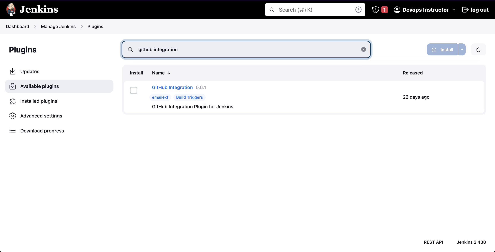
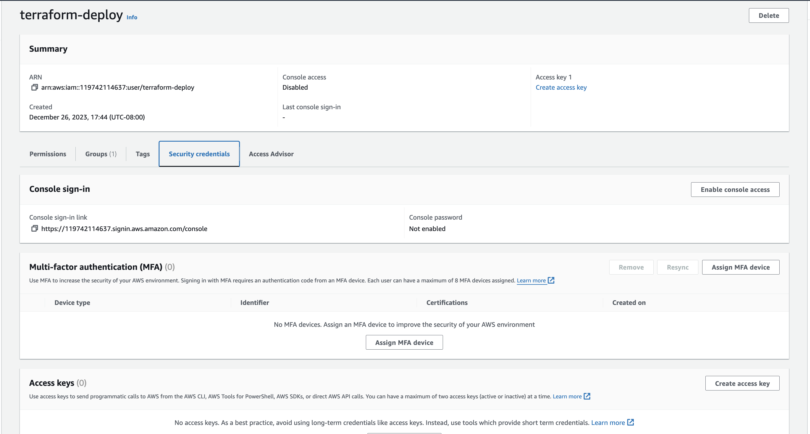

# Jenkins (CI/CD Pipeline) 

## Initial Setup

### What is Jenkins and Why is it so widely used?

Jenkins is a CI/CD platform, which means that it allows users to Integrate (Build, Compile, Test etc), and Deliver (Deploy, Upload, Publish) code from different resources in one single platform. A quick search can show you a list of alternatives, but the reason Jenkins is so widely used because it is open source, and the community had worked hard to create and maintain very useful plugins. One day will come when a definite alternative arrives and Jenkins becomes obsolete, but even then, learning to use Jenkins and it's functionalities will provide very useful and transferable knowledge on how to create and manage CI/CD platforms.

### Installation and Prep

Jenkins can be setup as either a Java .Jar (Java ARchive) application or as a Docker container. For the purposes of our lab we are going to setup and configure Jenkins using Docker. We will run this locally on your laptop via localhost.

The Docker Image can be Downloaded from your terminal on your Mac by running the following command. If you receive an error when trying to run the docker command either Docker is not installed properly or your need to start the Docker Hub application on your system.

`docker image pull jenkins/jenkins:lts`

The Next Step is to run the container:

`docker run -d -p 8080:8080 -p 50000:50000 -v /Users/admin:/var/jenkins_home jenkins/jenkins`

Some comments about your command arguments

1. The `-d` switch  allows you to run your container in detached mode so that you have access to the terminal after running the command. Please note you can use docker ps to see which docker containers that are currently running on your sysetm.

2. The `-p` switch specifics the port you are using to access the container. The importance of selecting a port is to make sure that port is not  already being used. It can cause conflicts not only for Jenkins, but for whatever other service is operating in that port. Port 8080 is used for for both web traffic and http proxies so just be aware.

For a more thorough approach, Windows, Linux and Mac offer tools to verify you port status.

For Windows type your can run the command `netstat -ab`, for Linux your can run the command `netstat -tulpn | grep LISTEN`, and for the Mac you can run the command `lsof -i -n -P | grep LISTEN`

3. For the `-v` switch it specifies the volume or path to your local disk where your container will store it's data. It will be accessible even if your Jenkins instance fails.

After this step is completed, and you will be able to see you Jenkins instance by typing your `http://Localhost:8080` from any web browser.

### Admin Configuration

The First thing you will notice is that Jenkins will request you to input the master password in order to unlock the instance. You can find this password on your command line by typing:

`docker logs [container_id]` Please note the container ID can be obtained by running a `docker ps` command.

4. After obtaining the password you will need to input that password into the browser to continue the setup of the Jenkins server.

## The Dashboard

Please use the illustratioasn below to complete the confiugraiton of Jenkins via the browser.

1. To begin please accept any defaults if prompted to allow Docker or Jenkins access to your disk or to proceed in the browser until your see the "Getting Started Screen" once the getting started screen. Please make sure you select the  `Install Suggested Plugins` when starting the initial configuration of Jenkins.

2. In this step you will create a user account to manage your Jenkins instance please make sure you document and save the username and password for this instance via Lastpass.

3. From the instance configuration selection please accept the default of `http://localhost:8080` 

4. Now you are ready to start Jenkins by clicking on the `Start using Jenkins` button.

5. From the Jenkins Welcome screen we need to complete a few tasks before we begin using the CI/CD tool.

6. We will begin by selecting `Manage Jenkins` and then selecting `Plugins`.

7. From the plugins menu selection we need to install 3 plugins by clicking on the Available plugins and typing in the name of these three plugins seperately and installing them, These plugins are `github integration`, `github authenication', and 'terraform'.

8. After these plugins are downloaded and installed you should probably select the restart Jenkins after install check box at the botton of the installation screen.
 

9. Please note you will need to run the Docker command to launch Jenkins again once Jenkins has been restarted after installing the Plugins. That command is `docker run -d -p 8080:8080 -p 50000:50000 -v /Users/admin:/var/jenkins_home jenkins/jenkins`. You will also need log back into Jenkins with the username and password you created eariler.

10. After logging back into Jenkins select `Manage Jenkins` and then select `Tools`. This is where we will configure the plugins you just installed.

11. For the Git and Terraform plugins please configure them  using the illustration below. For Git to work properly it must be pointed to the path of the binary file it needs to run the git commands.

12. For the Git plugin you will need to specify the directory it is installed in which is the `/usr/bin`. However, in the plugin you will need to specify the path along with the name of the binary so the plugin path should read `/usr/bin/git`.

13. Now that you have the Github and Terraform plugins completed you may be wondering about the 3rd plugin we installed. Hold tight we will get to that one after we do some additional preparation work.

14. To finish up the configuration of the Terraform plugin we need to install Terraform inside the Jenkins Docker container. To accomplish this task we need to run the following command.

`docker exec -u 0 -it <container_id> /bin/bash` This should get you access to the Jenkins Docker container console.

15. Do you remeber what command you need to run in order to obtain the container_id?

16. Now that you are on the command line and inside the docker container you should proceed with running the following command to install Terraform

`apt update`

`apt install software-properties-common`

`apt-add-repository "deb [arch=amd64] https://apt.releases.hashicorp.com buster main"`

`apt install terraform`

17. Now that Terraform is installed you can proceed with the final steps of configuring the last plugin which related to Github authenication and creating secrets for your Terraform deploy. However before we do that you need to create the account and obtain the access key and secret in AWS. Please follow the steps below to create an account to obtain the AWS access key and secret that you will store in Jenkin and your LastPass account for security purposes.

## IAM Credentials

1. Prior to configuraiton the security on Jenkins we also need to create credentials for our CI/CD pipeline in AWS.

2. This will require the use of IAM to create an account via AWS, by using IAM you can create an  access key and secret that will be used in the Jenkins configuration.

3. Please note you must take great care when creating and storing AWS credentials.

4. See the illustrations below for the steps on how to create the AWS IAM account and access key along with the secret.

5. Login to AWS and go to IAM

6. From the IAM dashboard select users and click on the create user button.

7. Create a new user account called terraform-deploy. Please note do not check the box to provide this account with console access because it is a code driven deploy account and will never need console access. Rember the rule about security. No account should have more priviliges than it needs to operate.

8. Next please select the Super Admin group or group that you created when we setup your AWS account to grant this account admin priviliges.

9. Now click on the create user button to create the users.
 

10. Now with the terraform-deploy account created select it from the list so that we can create the AWS access key and secret.
 

11. After selecting the account go to the `Security Credentials` tab and click on the `Create Access Key` button.
 

12. From the use case option select the `Local Code` radio button and place a check mark in the `I understand ...` box.

13.  In the description of the access key you can type in anything you want but it should be related to what the key is being used for.

14. At this point I want you to stop and consult with your instructor to make sure your access key and secret are stored and save properly. These credentials will allow anyone with them to deploy infrastructure into your AWS account. I strongly recommend that you consult with your instructor before proceeding past this step to make certain you did it correctly.

15. With the credentials properly secured we can proceed with the final configuration of the Jenkins plugin and establishing best practices for handling these credentials.

## Back to Jenkins

1. Login to Jenkins and go to `Manage Jenkins`, `Credentials`, `System`, `Global credentials (unrestricted)`.

`http://localhost:8080/manage/credentials/store/system/domain/_/`

From the global configuration page you are need to add two secret keys that you will generate from the IAM Dashboard

They are going to be callled the `aws-access-key-id` and the `aws-secret-access-key`

CAUTION "Revealing or checking these credentials into any github or online repositor can comprimise your AWS account allowing a bad actor or attacker to take over your account and spin up resources without your knowledge"

These credentials should only be stored in LastPass or Jenkins in an environment that does not expose the to the public

After you create the credentials and store them in Jenkins you are ready to deploy your first EC2 instance using IaC

2. From here you are going to add the AWS key, Secret, and your Github Authenication credentials.

3. Please use the illustrations below as an example to setup your AWS access key, secret, and Github authenication.

4. When your credentials and keys are configured they should look similar to this.

5. You have completed all the preliminary steps to setup your Jenkins environment congratulations you now need to take the final step of setting up your Jenkins job so that you can deploy to AWS.

### Create Jenkins Jobs 

1. To create a Jenkins job please enter the following parameters to create the job.

2. Please use the following repository when configuring the Jenkins job. `https://github.com/tekperfect/jenkins-terraform.git`

3. You will need to copy the contents of the Jenkins file when creating your first CI/CD pipeline job

4. After the job is created you will need to verify that the instance is deployed in your AWS account in the us-east-1 region.

5. If you were successful in getting your instance deploy please run the job again to destroy the instance per your instructors instructions.

6. The next steps in this process will include forking the code from your instructor and customizing the job so that you can utilize your own private key to access the AWS instance along with some other custom configuration changes to ensure the intance is deployed in accorgance with security best practices.
