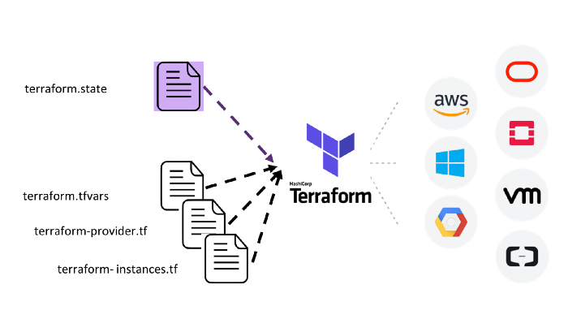

# Terraform (Infrastrucutre as Code)

## Installation and Prep

Go to the following website and download the latest version of Terraform

https://www.terraform.io/downloads.html or use one of the following methods below

### Terraform Windows Download 👇🏾

### Terraform Mac/Linux Install
`brew install terraform` (Use this method to install it for Mac)
`apt-get install terraform` (Use this method to install it for Linux)

## Install GPG

### GPG Mac/Linux install 👇🏾
`brew install gnupg` (Use this method to install it for Mac)
`apt-get install gnupg` (Use this method to install it for Linux)

### GPG Windows Download 👇🏾

## Why GPG?

We are using GPG to encrypt credentials files and other sensitive files to protect them from being compromised. In a production environment it is essential to protect credentials and make sure they are not stored anywhere in clear text. This ensures two things.

1. If they are leaked or compromised then the other party who gained access to them would need the password to unencrypt them.

2. Encrypted credentials can be stored safely in code because they are not stored in clear text but we recommend they not be stored anywhere they can be accessed publicly.

### Verify Install

Run the following commands to verify Terrform is installed `terraform`

The output of the command should look something like this.

Usage: terraform [-version] [-help] <command> [args]

The available commands for execution are listed below.
The most common, useful commands are shown first, followed by
less common or more advanced commands. If you're just getting
started with Terraform, stick with the common commands. For the
other commands, please read the help and docs before usage.

Common commands:

    apply              Builds or changes infrastructure

    console            Interactive console for Terraform interpolations

    destroy            Destroy Terraform-managed infrastructure

    env                Workspace management

    fmt                Rewrites config files to canonical format

    get                Download and install modules for the configuration

    graph              Create a visual graph of Terraform resources

    import             Import existing infrastructure into Terraform

    init               Initialize a Terraform working directory

    output             Read an output from a state file

    plan               Generate and show an execution plan

    providers          Prints a tree of the providers used in the configuration

    refresh            Update local state file against real resources

    show               Inspect Terraform state or plan

    taint              Manually mark a resource for recreation

    untaint            Manually unmark a resource as tainted

    validate           Validates the Terraform files

    version            Prints the Terraform version

    workspace          Workspace management

All other commands:

    0.12upgrade        Rewrites pre-0.12 module source code for v0.12

    debug              Debug output management (experimental)

    force-unlock       Manually unlock the terraform state

    push               Obsolete command for Terraform Enterprise legacy (v1)
    state              Advanced state management

## Get the example code

1. Login to your Github account

2. Prepare for lesson by forking or cloning the scripts repo https://github.com/alfonsoh/scripts.git

3. Each of you are going to do the following create a Windows, Linux, S3 bucket, and VPC using Terraform code

4. You will each use the code in the examples folder under the terrafrom directory under the scrips folder you forked or cloned.

5. Please make sure you edit your .gitignore file and entries for terraform.tfvars, any public or private keys or anything that could be potentially sensitive that you do not want checked in. This is a very important step especially if you plan to use this code in your own Github accounts. Handling credentials improperly could jeopardize the security of your environment.

6. As you attempt to deploy each project you may run into errors that you do not recognize. When this occurs and it will you should use sources like Stackoverflow https://stackoverflow.com/ and Google to determine how to resolve those issues.

7. If you find yourself in a situation where you cannot deploy your code you should also ask your fellow classmates and an instructor to see if they can help you resolve the issue.

8. When deploying code using Terraform we request that each of individual follow three simple rules. Do not spin up infrastructure that is larger than what you need. Meaning use the free tier instances whenever possible.

9. After performing the lessons associated with terraform plan & terraform apply. Please use the terraform destroy to remove any infrastructure you created to avoid unnecessary costs.

10. Practice, ask questions, repeat in order to get better at your craft.

### Prep your environment

1. Obtain keys to deploy code (these are the sensitive credentials that we will encrypt to protect the integrity of the environment)

2. Create a basic deploy script for the infrastructure you are creating. (Examples of scripts you can use can be found below)

### Example Deploy and Destroy Scripts 👇🏾

3. Run the following command to prepare your directory `terraform init`

### Deploy your code

1. Run the following commands once you believe you have all the right code in your repository

2. `terraform plan` (Verifies that the code you have written will allow you to deploy the kind of infrastrcuture you are interested in)

3. `terraform apply` (Deploys the code you created)

4. `terraform destroy` (Destroys the instance created by the Terraform code you deployed)

5. `terraform plan -out=plan-name` (Creates a Terraform plan that can be applied by the given name)

6. `terrafrom apply plan-name` (Applies the Terraform plan crated by the code and deploys the infrastructure change outlined in the plan.)

7. `terraform destroy plan-name` (Destroys infrastructure created by a specific Terraform plan)

8. Once you have verified you can run the basic commands without a script then you should utilize your scripts to streamline your deploy process.

### Considerations before deploying code

1. Where are you storing your secrets when deploying your code?

2. How secure are the files?

3. How do you prevent sensitive data from being checked into your repository?

4. What tools could you use to protect the secrets stored on your system?

5. What other measure could you take to protect the code you plan to deploy?

6. What industry best practices are available to secure your secrets?
