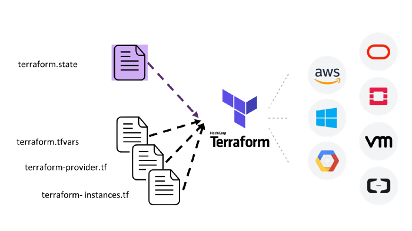

# Terraform (Infrastrucutre as Code)

## Installation and Prep


### Terraform Windows Install 👇🏾


Make sure Chocolatey is installed for Windows and then run the following command `choco install terraform`


### Terraform Mac/Linux Install 👇🏾


To use Terraform safely on your Mac you can use the following program

## AWS Vault

1. `brew install aws-vault`


# Add the Vault Credentials to your Keychain

2. `aws-vault add profile_name`

# Enter the access key from the IAM account you created in the Jenkins lesson
3. Enter Access Key Id: `xxxxxxxxxxxxxxxxxxxxxxx`

# Enter the secret key from the IAM account you created in the Jenkins lesson
4. Enter Secret Key: `xxxxxxxxxxxxxxxxxxxxxxxxxx`

5. List credentials you just stored by running `aws-vault list`, the command should display the profile you just created

6. Downloand and install the aws cli packages from the following url `https://awscli.amazonaws.com/AWSCLIV2.pkg` for the MacOS or the link if you are running terraform on a Windows host `https://awscli.amazonaws.com/AWSCLIV2.msi`

7. Verify terraform is installed correctly by running the `terraform` command at the command line. It should display the options for the command if it has been installed successfully.

# AWS CLI Configuration

8. Type in the following command `aws configure`

9. Press enter when asked to enter the AWS Access Key and AWS Secret.

10. Enter the region you want to deploy the AWS instance into

11. Press enter on the last option of the aws configure command and you are now ready to deploy using terrafrom.

12. cd to a folder where you have cloned your terraform code repository

13. Run the following command `aws-vault exec profile_name -- terraform init`

14. Run the following command `aws-vault exec profile_name -- terraform plan`

15. Run the following command `aws-vault exec profile_name -- terraform apply`

16. Please make sure your run the final command when you are finished with the instance you created `aws-vault exec profile_name -- terraform destroy`

17. You have now successfully created and destroyed an instance safely using terraform.

18. Please note if you run terraform from a directory where your code is cloned it will create files in that folder that you cannot and should not check into that repository.

19.  It is recommened that you copy your code to a non cloned folder to run your Terraform commands in to prevent large files and other non essential items from being checked into your repository.

20. Please practice the deployments using Terrform using Jenkins and stand alone so you understand the process of creating infrastructure using code.

# Writing your first Terraform Configuration

To properly use Terraform to manage infrastructure as code, you must define the resources you wish to create in files ending with `.tf`.

### 1. The `main.tf` file

Create a new directory for your project, navigate into it, and create a file named `main.tf`.

```hcl
terraform {
  required_providers {
    aws = {
      source  = "hashicorp/aws"
      version = "~> 4.16"
    }
  }

  required_version = ">= 1.2.0"
}

provider "aws" {
  region = "us-west-2"
}

resource "aws_instance" "app_server" {
  ami           = "ami-08d70e59c07c61a3a"
  instance_type = "t2.micro"

  tags = {
    Name = "ExampleAppServerInstance"
  }
}
```
This is a basic configuration. It specifies the `aws` provider and explicitly states it wants to create an `aws_instance` parameter.

### 2. State Management (`terraform.tfstate`)

When you run `terraform apply`, Terraform creates a state file (`terraform.tfstate`) locally.
- This file keeps track of the IDs of created resources so that Terraform knows what to update or destroy in future runs.
- **IMPORTANT**: Do not commit your local `terraform.tfstate` file to version control (add it to `.gitignore`), as it can contain sensitive information like passwords or tokens.
- For team environments, remote state management (e.g., using S3 and DynamoDB) is highly recommended.

### 3. Variables (`variables.tf`)

To make your Terraform configurations reusable, you should separate parameters into variables.
Create `variables.tf`:

```hcl
variable "instance_name" {
  description = "Value of the Name tag for the EC2 instance"
  type        = string
  default     = "ExampleAppServerInstance"
}
```

Then update your `main.tf` to reference this variable:
```hcl
  tags = {
    Name = var.instance_name
  }
```

Now you can override variables on the command line when deploying without having to alter the codebase:
`terraform apply -var="instance_name=MyNewServer"`
