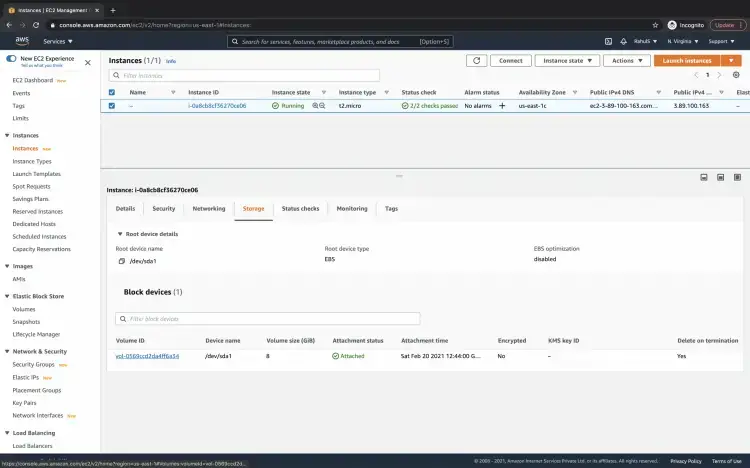
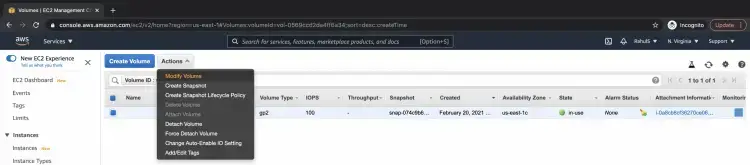
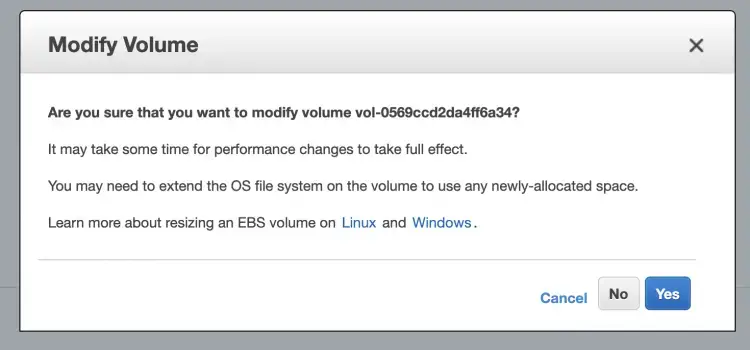
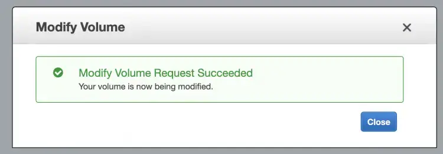
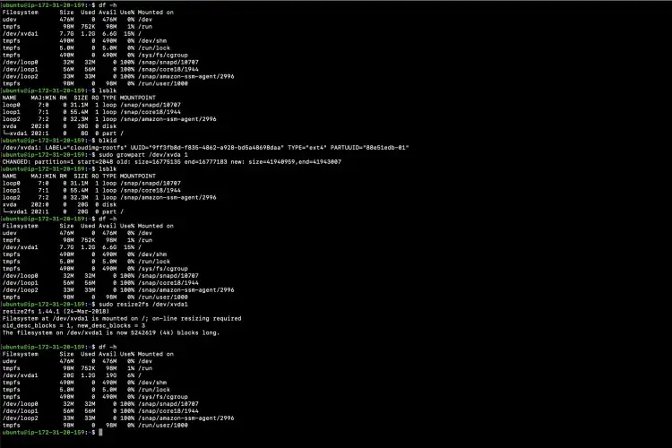

### Adding a Disk to Ubuntu

1. Using the fdisk tool you can add a new disk to your Ubuntu server and partition it so that the disk space can be mounted as a new mount point or change and existing mount point to point to the new disk

`fdisk -l`

This will list the current partitions and configurations.

New disk added is shown as /dev/sdb1. If we are adding physical disk it will show as /dev/sda based of the disk type. Here I used a virtual disk.

To partition a particular hard disk, for example /dev/sdb1.

`fdisk /dev/sdb1`

2. These are the most frequently used switches

`n` – Create partition
`p` – print partition table
`d` – delete a partition
`q` – exit without saving the changes
`w` – write the changes and exit

3. Since we are creating a partition we want to use the `n` option

4. Create either primary/extended partitions. By default we can have upto 4 primary partitions.

5. Give the partition number as desired. Recommended to go for the default value 1

6. Give the value of the first sector. If it is a new disk, always select default value. If you are creating a second partition on the same disk, we need to add 1 to the last sector of the previous partition.

5-fdisk.png

7. Give the value of the last sector or the partition size. Always recommended to give the size of the partition. Always prefix + to avoid value out of range error.

8. Save the changes and exit.

9. Now format the disk with mkfs command.

`mkfs.ext4 /dev/sdb1`

10. Once formatting has been completed, now mount the partition as shown below

mount /dev/sdb1 /data

11. Make an entry in /etc/fstab file for permanent mount at boot time

`/dev/sda1	/data	ext4	defaults     0   0`

12. You have successfully partitioned, formatted, and mounted a new disk

### Resizing an existing Ubuntu Disk

Resizing an existing disk is even easier than adding a new one. The following steps will walk you through the process.

1. Go to the EC2 instance -- > Volume attached to the instance.

2. Here you see the volume, click on "Actions" --> "Modify Volumes".

3. On the pop-up screen, specify the desired size. I have specified 30 GBs, earlier it was 8 GBs. Click on the "Modify" button, this will change the disk size to 30GBs.

4. Confirm the modification by clicking on the "Yes" option.

You will see that the disk has been modified. At this point we have just changed the disk size, it is not yet available for use. Now we need to extend the volume's file system to make use of the new storage capacity.

5. At this point, if you check the disk space you will see that the / volume still has 7.7 GBs.

`df -h`

6. To extend the volume size, get information about the block devices attached to your instance using the lsblk command

`lsblk`

7. Check the file system type, use the following command.

`blkid`

8. In our case, the file system is of type ext4 of the volume. Use the following command to extend the volume of the ext4 type.

`sudo resize2fs /dev/sda`

9. If you check the disk size this time, you will see that the disk has been extended and now we have 28 GBs(Approx 30 GBs) for / partition.

`df -h`

