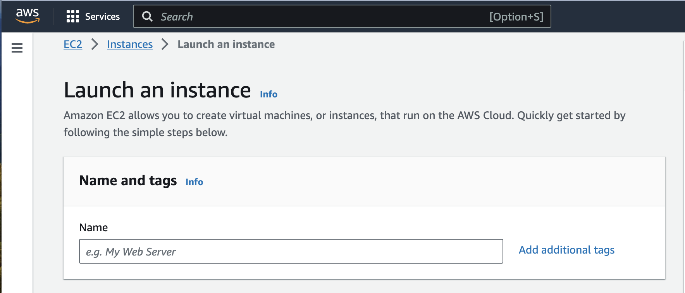
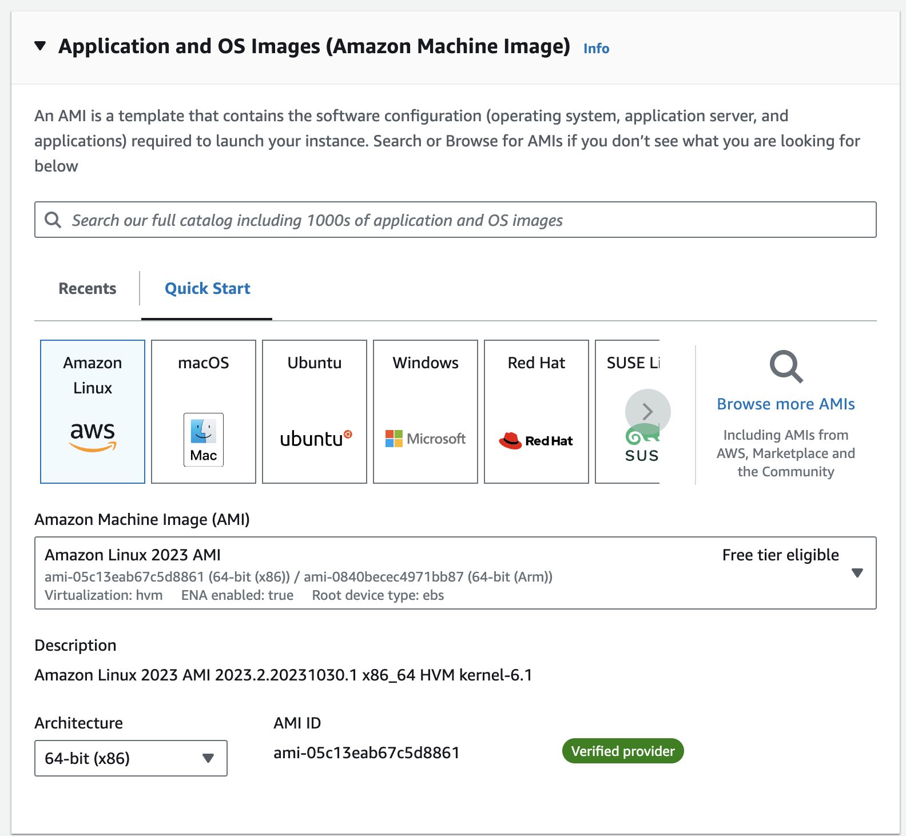
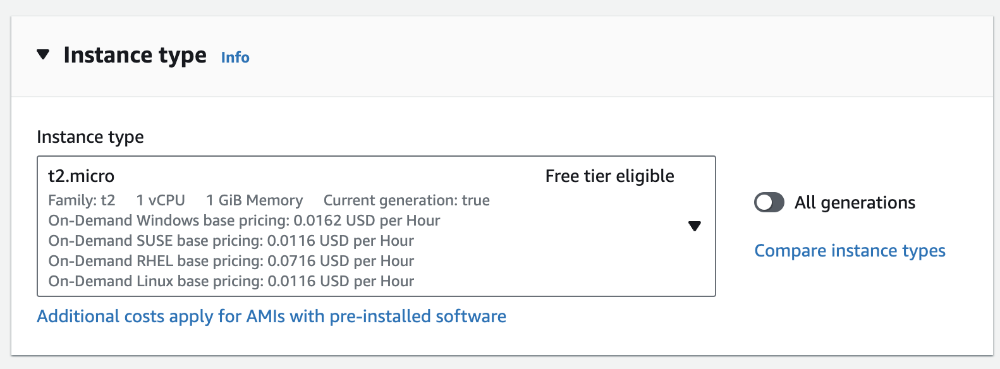
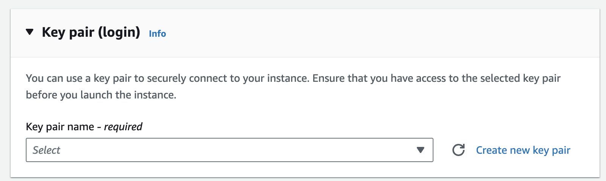
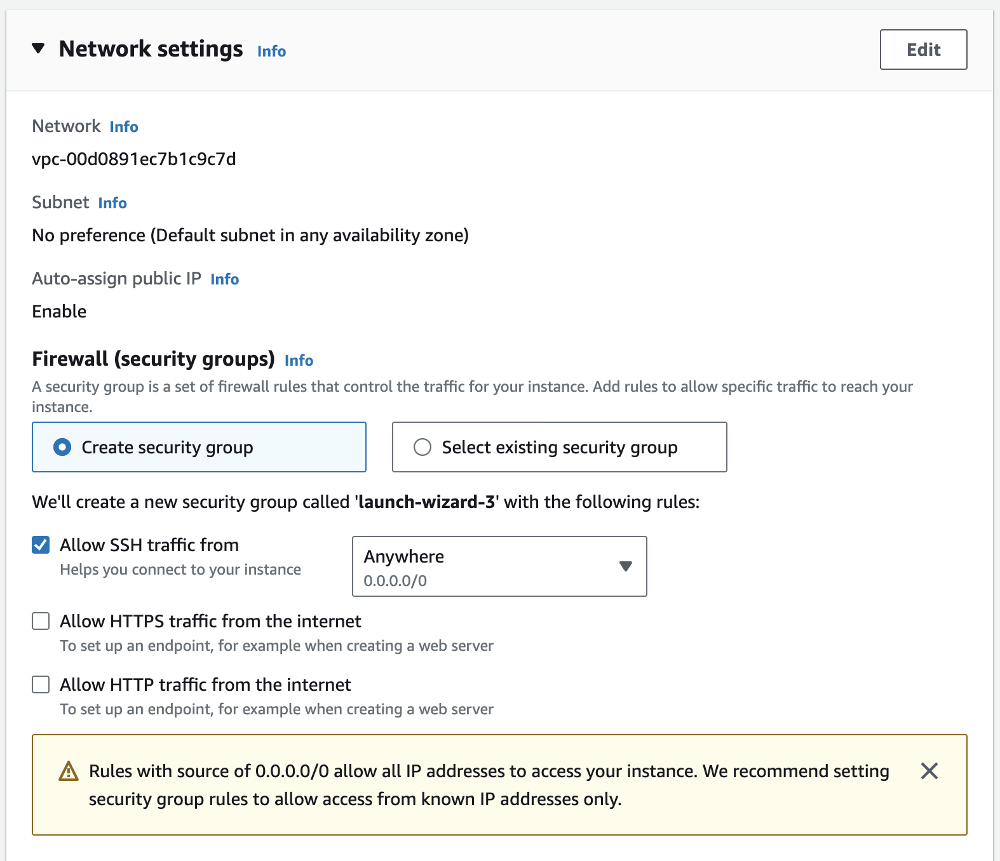
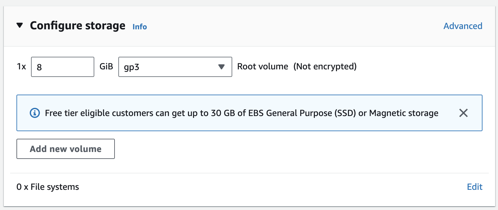
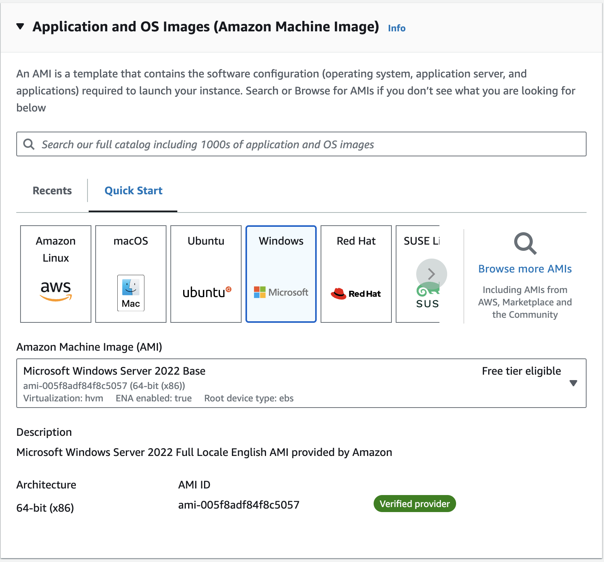
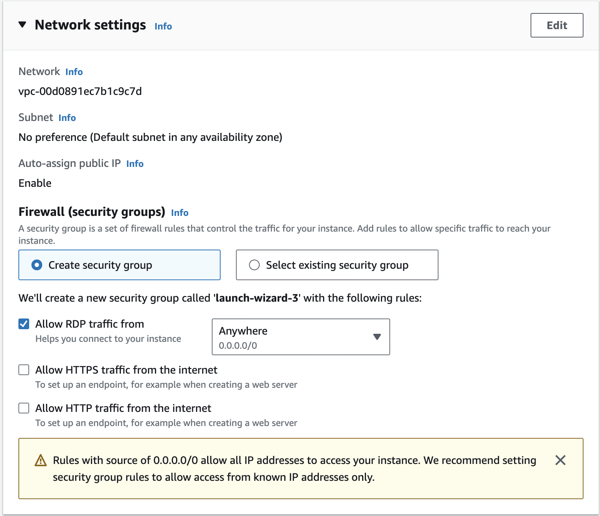
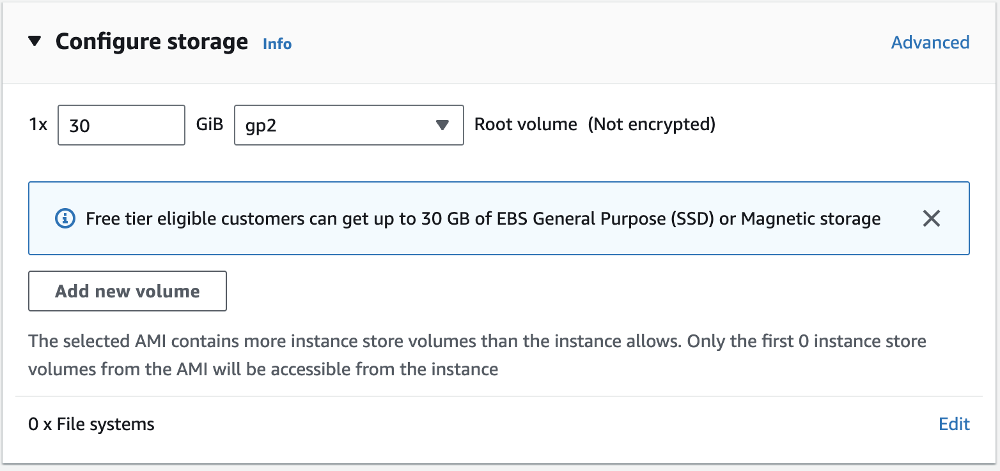

# Amazon Web Services EC2

1. One of the most widely used services in AWS is EC2. Which stands for Elastic Compute Cloud.

2. One of the exercises we will do today is create two instances one Windows and One Ubuntu. The purpose of this exercise is to prepare you for navigating the platform as it relates to EC2. 

3. We will begin by launching instances using the free tier model so you do not incur any costs, and doing so will give you ample time to get comfortable with the interface and creating an environment where you can learn and thrive.

4. Please pay careful attention to your instructors warnings about EC2 and AWS usage. The goal of this first lesson is to launch a t2.micro instance with 8GB of disk space and the default amount of RAM.

5. Due to the how small a footprint Ubuntu has it can easily run well on a system with a small amount of disk space and RAM.

### Launching An Instance

1. To create an instance login to aws with a non root account. This is very important because your instructor should have helped you all create a policy that will restrict the types of instances you can create. Which should prevent individuals from launching instances that do not qualify for free tier usage.

2. From the main AWS menu in the upper left hand corner of the screen select "Services" selection with the 9 dots that make a square and select EC2. If EC2 is not listed you can type it in the search box and select it.

3. Once you have selected EC2 we will begin the process of creating an instance.

4. To launch and instance we are going to click the "Launch" Instance button

5. After clicking on the button we are going to review the various options below to make sure the appropriate selections are made.

6. Under the Name and Tag option we are going to give our server a name. Since this is our first instance we are going to create we are going to name it "Ubuntu Sandbox".

7. Under the Application and Os Images option we are going to select the Ubunt icon.

8. Now under instance type please make sure t2 micro with free tier eligible is selected.

9. Now under the keypair selection your are going to select Create New Keypair and make sure you download the keypair because without it you will not be able to login to the instance.

10. Now under the network settings selection we are going to leave "Create security group selected" and change the dropdown that says Anywhere and chagne to My IP. When you do that the warning which states "Rules with source of 0.0.0.0/0 allow all IP addresses to access your instance. We recommend setting security group rules to allow access from known IP addresses only."

11. Why is this important? Because you don't want the entire world to be able to ssh to your Ubuntu instance.

12. Now under the configure storage selection you are going to leave the defaults

13. Now with all the proper settings selected you are now ready to click on the Launch Insance button to finalize your changes and deploy your first cloud based VM.

14. Congrats you are now a cloud engineer... Sorta ;-)

### Windows EC2 Instance

1. To launch a Windows instance we are going to click the "Launch" Instance button

2. After clicking on the button we are going to review the various options below to make sure the appropriate selections are made.

3. Under the Name and Tag option we are going to give our server a name. Since this is our first instance we are going to create we are going to name it "Windows Sandbox".

4. Under the Application and Os Images option we are going to select the Ubunt icon.

5. Now under instance type please make sure t2 micro with free tier eligible is selected.

6. Now under the keypair selection your are going to select Create New Keypair and make sure you download the keypair because without it you will not be able to login to the instance.

7. Now under the network settings selection we are going to leave "Create security group selected" and change the dropdown that says Anywhere and chagne to My IP. When you do that the warning which states "Rules with source of 0.0.0.0/0 allow all IP addresses to access your instance. We recommend setting security group rules to allow access from known IP addresses only."

8. Why is this important? Because you don't want the entire world to be able to ssh to your Ubuntu instance.

9. Now under the configure storage selection you are going to leave the defaults

10. Now with all the proper settings selected you are now ready to click on the Launch Insance button to finalize your changes and deploy your first cloud based VM.

