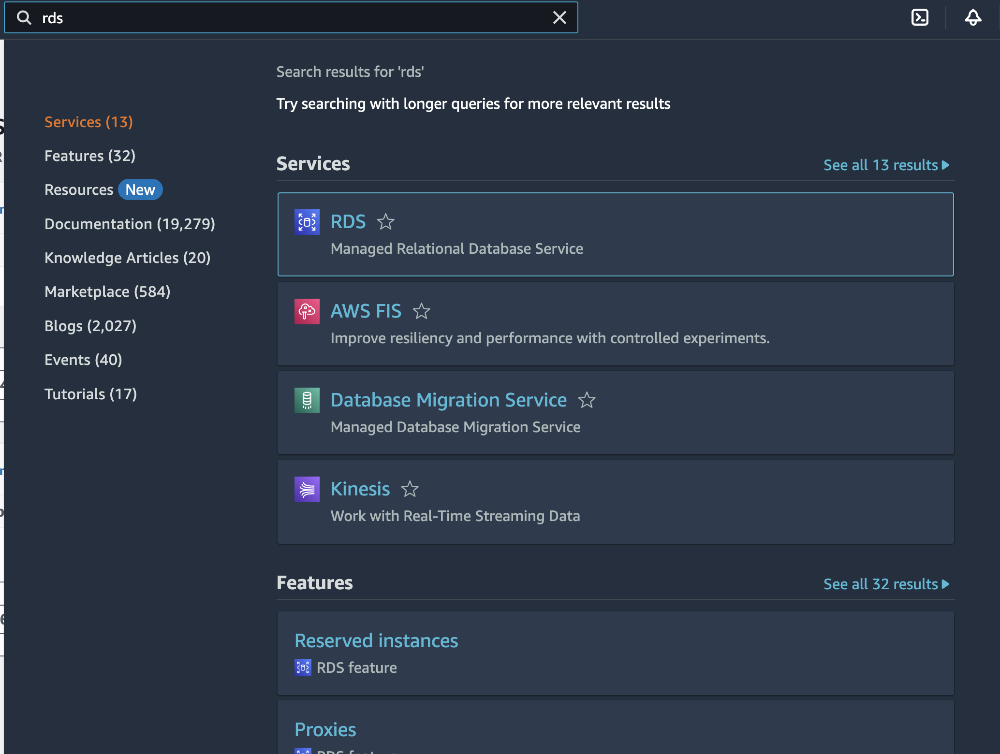
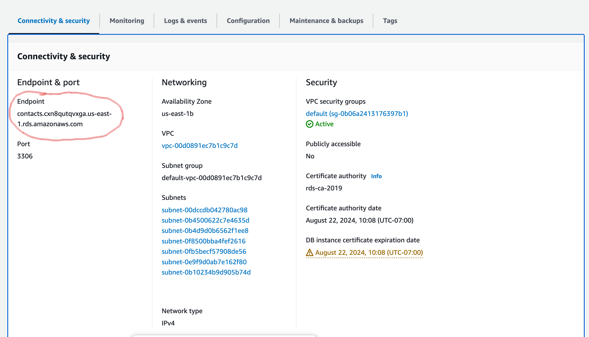
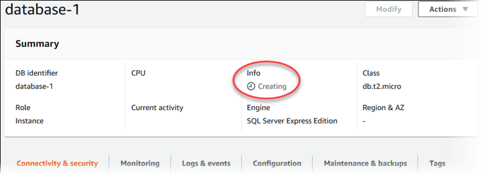
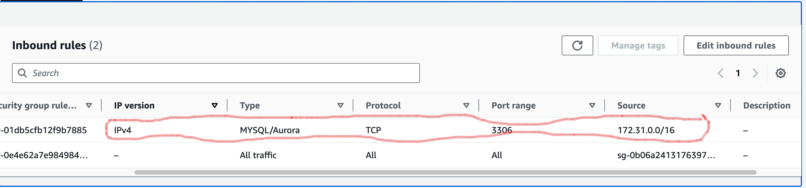

###  What is S3

1. Amazon Relational Database Service (Amazon RDS) is a web service that makes it easier to set up, operate, and scale a relational database in the AWS Cloud. It provides cost-efficient, resizable capacity for an industry-standard relational database and manages common database administration tasks.

2. Sign in to the AWS Management Console and open the Amazon RDS console from the services meun or type in RDS via the search box.



3. In the upper-right corner of the Amazon RDS console, choose the AWS Region in which you want to create the DB instance.

4. In the navigation pane, choose Databases.

5. Choose Create database, then choose Standard create.

6. For Engine type, choose MySQL.




7. For Edition choose MySQL choose the DB.

8. MySQL has only one option for the edition.


9. In Templates, choose the template that matches your use case. We recommend the smallest instance you can create which should be free tier.

10. Multi-AZ failover option (We don't need this now and it costs money)

11. Do not Enable deletion protection option because we are going to destroy this database shortly after creating it.

12. Make sure you enter save the password you are using for the admin account for the database.

13. If you choose to change the name from admin to something else also please make sure you document that.

14. If you want to specify a password, clear the Auto generate a password check box if it is selected.

15. (Optional) Change the Master username value.

16. Enter the same password in Master password and Confirm password.

17. (Optional) Set up a connection to a compute resource for this DB instance.

18. You can configure connectivity between an Amazon EC2 instance and the new DB instance during DB instance creation.

19. In the Connectivity section under VPC security group (firewall), if you select Create new, a VPC security group is created with an inbound rule that allows your local computer's IP address to access the database.

20. Choose Create database.

21. If you chose to use an automatically generated password, the View credential details button appears on the Databases page.

22. To view the master username and password for the DB instance, choose View credential details.

23. To connect to the DB instance as the master user, use the username and password that appear.

24. For Databases, choose the name of the new DB instance.

25. On the RDS console, the details for the new DB instance appear. The DB instance has a status of Creating until the DB instance is created and ready for use. When the state changes to Available, you can connect to the DB instance. Depending on the DB instance class and storage allocated, it can take several minutes for the new instance to be available.



26. Now that you have a database setup now you need something to connect it to.

27. Please note if you were unable to connect an EC2 instance initially to your Ubuntu linux instance please add the following rule to the RDS security group.



### Test Database Access

1. Open up a terminal and ssh to your ubuntu instance and use the following command example to login to your RDS MySQL instance `mysql -h db_name.xxxxxxxxxxxx.us-xxxx-1.rds.amazonaws.com -P 3306 -u admin -p`

2. Please note you must use the full db url name which should be found in properties of the RDS instance you created.

### Prep for Wordpress Install

1. Run the following commands `sudo apt update`

`sudo apt install apache2 ghostscript libapache2-mod-php mysql-server php php-bcmath php-curl php-imagick php-intl php-json php-mbstring php-mysql php-xml php-zip`

`sudo mkdir -p /srv/www`

`sudo chown www-data: /srv/www`

`curl https://wordpress.org/latest.tar.gz | sudo -u www-data tar zx -C /srv/www`

2. Create Apache site for WordPress. 

3. Create a file by running the following command 
`sudo vi /etc/apache2/sites-available/wordpress.conf` and add the following lines to the file:

```
<VirtualHost *:80>
    DocumentRoot /srv/www/wordpress
    <Directory /srv/www/wordpress>
        Options FollowSymLinks
        AllowOverride Limit Options FileInfo
        DirectoryIndex index.php
        Require all granted
    </Directory>
    <Directory /srv/www/wordpress/wp-content>
        Options FollowSymLinks
        Require all granted
    </Directory>
</VirtualHost>

```

4. Run the following commands

`sudo a2ensite wordpress`

`sudo a2enmod rewrite`

`sudo a2dissite 000-default`

`sudo /etc/init.d/apache2 restart`

### Connect to your RDS MySQL instance

`mysql -h db_name.xxxxxxxxxxxx.us-xxxx-1.rds.amazonaws.com -P 3306 -u admin -p`

1. Run the following commands

`CREATE DATABASE wordpress;`

`CREATE USER wordpress@localhost IDENTIFIED BY '<your-password>';`

`GRANT SELECT,INSERT,UPDATE,DELETE,CREATE,DROP,ALTER ON wordpress.* TO wordpress@localhost;`

`FLUSH PRIVILEGES;`

`quit;`


`sudo -u www-data cp /srv/www/wordpress/wp-config-sample.php /srv/www/wordpress/wp-config.php`

2. When editing the wp-config.php file you need to update the fields associated with the db_name, database_name, username, and password. Please note you should use the admin password you created when setting up the database in order for wordpress to work properly so you can configure it.

`sudo -u www-data vi /srv/www/wordpress/wp-config.php`

2a. Use the following variables to edit your wp-config.php file

```

// ** Database settings - You can get this info from your web host ** //
/** The name of the database for WordPress */
define( 'DB_NAME', 'wordpress' );

/** Database username */
define( 'DB_USER', 'admin' );

/** Database password */
define( 'DB_PASSWORD', 'xxxxx' );

/** Database hostname */
define( 'DB_HOST', 'db_name.xxxxxxxxxx.us-east-1.rds.amazonaws.com' );

/** Database charset to use in creating database tables. */
define( 'DB_CHARSET', 'utf8' );

/** The database collate type. Don't change this if in doubt. */
define( 'DB_COLLATE', '' );

```

3. Configure your wordpress site by opening up a url to the public IP

http://xxx.xxx.xxx.xxx/wp-admin

4. Please note you will need to add a security group rule to allow http so that you can browse the wordpress site you created.


