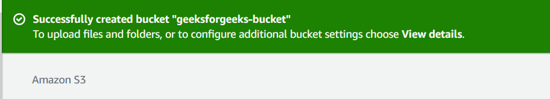
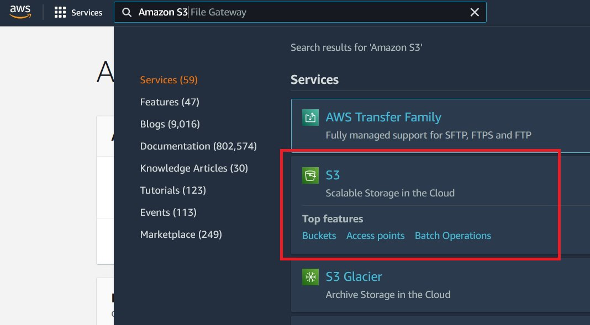
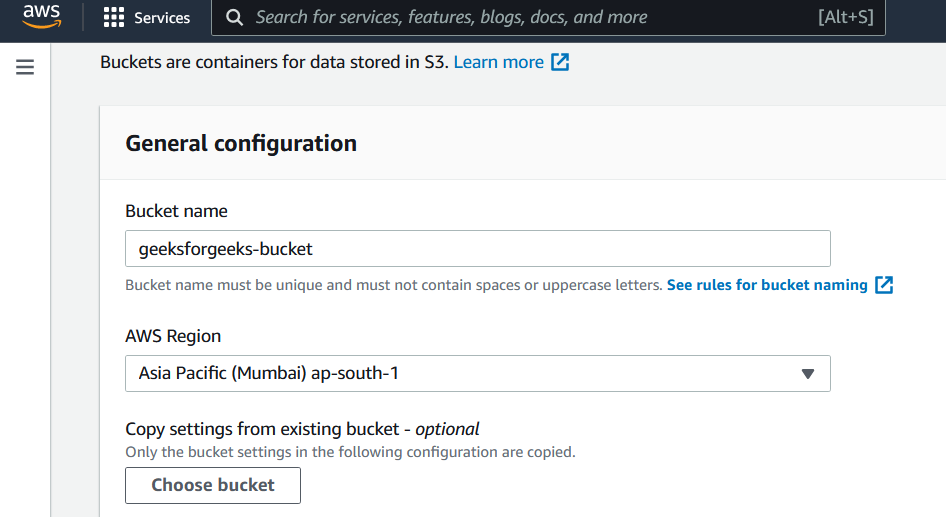

###  What is S3

1. Amazon Simple Storage Service (Amazon S3) is an object storage service that offers industry-leading scalability, data availability, security, and performance. Customers of all sizes and industries can use Amazon S3 to store and protect any amount of data for a range of use cases, such as video sharing, image storage, data lakes, websites, mobile applications, backup and restore, archive, enterprise applications, IoT devices, and big data analytics. Amazon S3 provides management features so that you can optimize, organize, and configure access to your data to meet your specific business, organizational, and compliance requirements.

1. Sign in to the AWS Management Console form the service menu select S3 or search for it by typing in S3.

2. In the left navigation pane, choose Buckets.

3. Choose Create bucket... The Create bucket page opens.

4. For Bucket name, enter a name for your bucket. The bucket name must be unique within a partition. When entering the bucket name try to make it as unique as possible because generic names are almost always taken.

5. Consist only of lowercase letters, numbers, dots (.), and hyphens (-). For best compatibility, we recommend that you avoid using dots (.) in bucket names, except for buckets that are used only for static website hosting. They should also begin and end with a letter or number.

6. After you create the bucket, you cannot change its name.

7. Important... Please avoid including sensitive information, such as account numbers, PII or PHI in the bucket name. The bucket name is visible in the URLs that point to the objects in the bucket.

8. For Region, choose the AWS Region where you want the bucket to reside.

9. To minimize latency and costs and address regulatory requirements, choose a Region close to you. Objects stored in a Region never leave that Region unless you explicitly transfer them to another Region.

10. Under Object Ownership, to disable or enable ACLs and control ownership of objects uploaded in your bucket, choose one of the following settings:

11. ACLs disabled - Bucket owner enforced (default) – ACLs are disabled, and the bucket owner automatically owns and has full control over every object in the bucket. ACLs no longer affect access permissions to data in the S3 bucket. The bucket uses policies exclusively to define access control.

12. By default, ACLs are disabled. A majority of modern use cases in Amazon S3 no longer require the use of ACLs. We recommend that you keep ACLs disabled, except in unusual circumstances where you must control access for each object individually.

13. ACLs enabled - Bucket owner preferred – The bucket owner owns and has full control over new objects that other accounts write to the bucket with the bucket-owner-full-control canned ACL.

14. If you apply the Bucket owner preferred setting, to require all Amazon S3 uploads to include the bucket-owner-full-control canned ACL, you can add a bucket policy that allows only object uploads that use this ACL.

15. Object writer – The AWS account that uploads an object owns the object, has full control over it, and can grant other users access to it through ACLs.

16. Please note the default setting is Bucket owner enforced. To apply the default setting and keep ACLs disabled, only the s3:CreateBucket permission is needed. To enable ACLs, you must have the s3:PutBucketOwnershipControls permission.

17. Under Block Public Access settings for this bucket, choose the Block Public Access settings that you want to apply to the bucket.

18. By default, all four Block Public Access settings are enabled. We recommend that you keep all settings enabled, unless you know that you need to turn off one or more of them for your specific use case. For more information about blocking public access, see Blocking public access to your Amazon S3 storage.

19. To enable all Block Public Access settings, only the s3:CreateBucket permission is required. To turn off any Block Public Access settings, you must have the s3:PutBucketPublicAccessBlock permission.

20. (Optional) Under Bucket Versioning, you can choose if you wish to keep variants of objects in your bucket. For more information about versioning, see Using versioning in S3 buckets.

21. To disable or enable versioning on your bucket, choose either Disable or Enable.

22. (Optional) Under Tags, you can choose to add tags to your bucket. Tags are key-value pairs used to categorize storage.

23. To add a bucket tag, enter a Key and optionally a Value and choose Add Tag.

24. Under Default encryption, choose Edit.

25. To configure default encryption, under Encryption type, choose one of the following:

26. Amazon S3 managed key (SSE-S3), AWS Key Management Service key (SSE-KMS)

27. Then select Create bucket.

