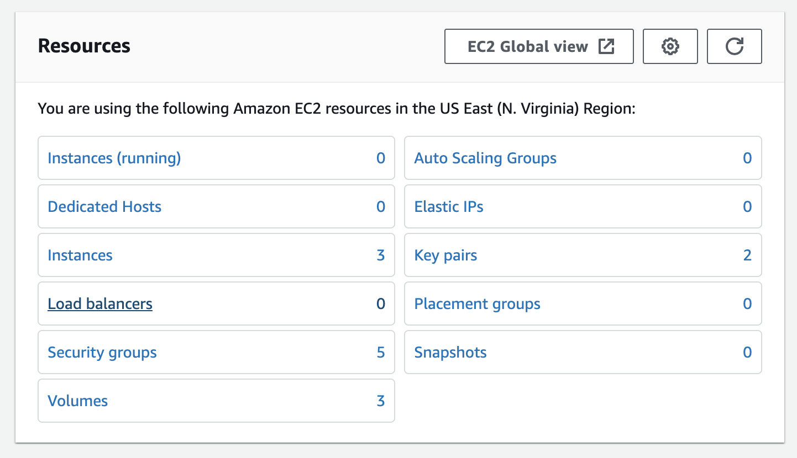
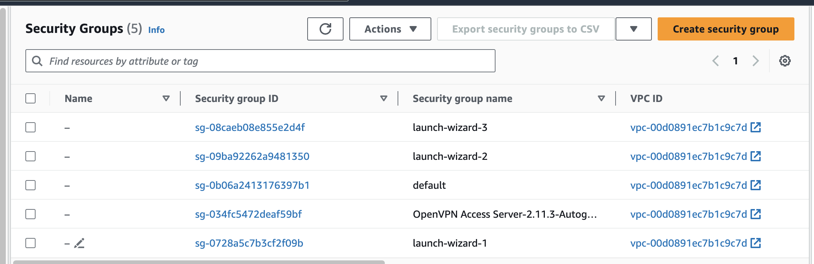
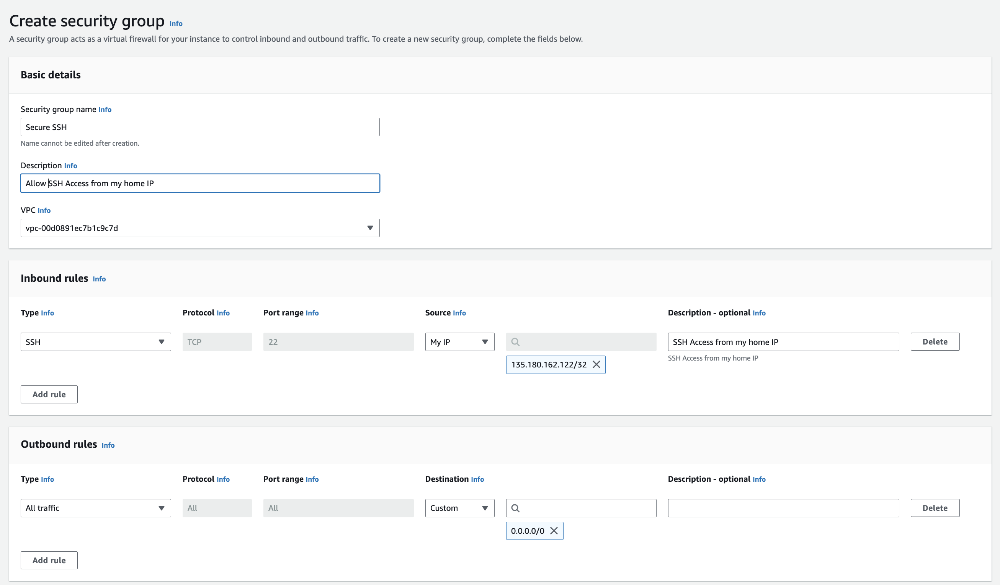
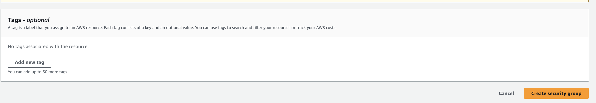
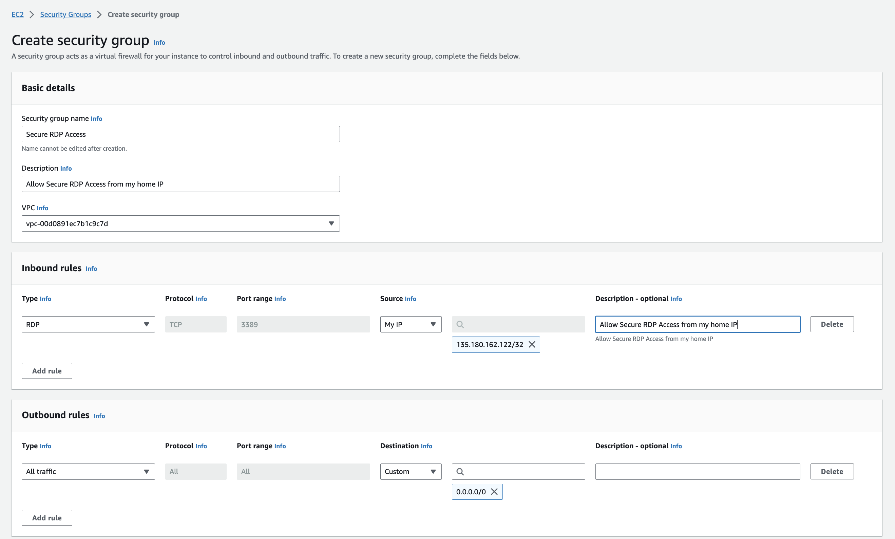

## Security Groups

###  Why Are They Important?

When looking at security of the networks in AWS it is important to remember to use a least priviliged use model. The principle of least privilege (PoLP) is an information security concept which maintains that a user or entity should only have access to the specific data, resources and applications needed to complete a required task and noting more.

With that said we are going to create two foundational security groups for your to use with your AWS instances that should cover the baseline security your need to allow you access to ssh and rdp to the hosts you create and no one else. Please follow these instructions to create these two groups.

1. Sign in to the AWS Management Console and navigate to the EC2 service.

2. From the resources box select "Security Groups"

3. Now select the create "Security Group" button in the upper right hand corner of the screen.

4. In the Secrity Group Name field type in Secure SSH, in the Incound rules type field select SSH from the dropdown menu, and from the source field select My IP from the dropdown menu, and in the description field type SSH Access From My Home IP.

5. Do not change anything in the outbound rules section and proceed to the bottom right hand side of the page and click on the create security group button.

6. Now we are going to create a security group for Windows systems.

7. Click on the create security group button again and enter the following information.

8. In the Secrity Group Name field type in Secure RDP, in the Incound rules type field select RDP from the dropdown menu, and from the source field select My IP from the dropdown menu, and in the description field type RDP Access From My Home IP. 

9. Do not change anything in the outbound rules section and proceed to the bottom right hand side of the page and click on the create security group button.

10. You have successfully created 2 security groups that you will use on your instances going forward.
