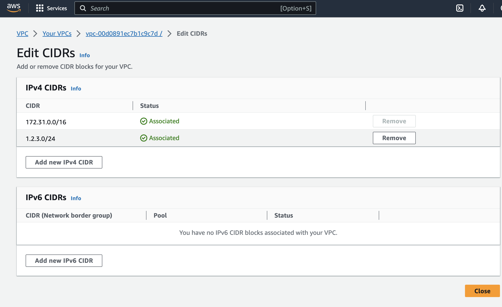

## Open VPN

###  What is a VPC

In AWS an (Amazon VPC), are virtual networks that you've defined that are modeled after a traditional network that you'd operate in your own office or data center. These netowrks are typically VPC (Virtual Private Cloud) networks that let you organize resources so they can communicate with one another securely without fear of being compromised if they were publically accessiable on the Internet.

To create a CIDR in your existing VPC's you can follow these steps.

1. To create a CIDR or subnet in your VPC select VPC from the AWS services menu and then select Your VPC's from the side navigation window on the left hand side of your screen.

2. Now select your VPC and go the Action menu and select edit CIDR's. This will allow you to create a new subnet you can define when you launch instances. For example if you wanted to creat a small 1.2.3.0/24 CIDR that you can put your Windows and Linux instances in. It would allow you to create the CIDR and then all the resoures in that CIDR could talk to one another as long as you have a security group assigned to those instances that allows communication between the nodes.

