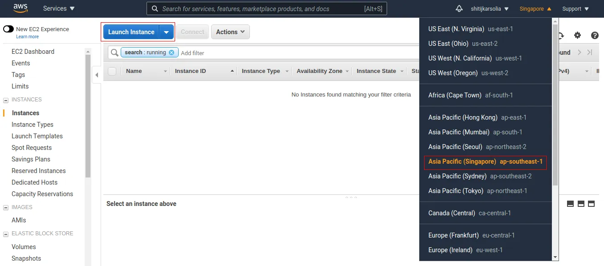

## Open VPN

###  What is a VPN

A virtual private network (VPN) is a network designed for creating a secure connection between a computing device and a computer network, or between two networks, using an insecure communication medium such as the public Internet.

A VPN can extend access to a private network (one that disallows or restricts public access) to users who do not have direct access to it, such as an office network allowing secure access from off-site over the Internet. The benefits of a VPN include security, reduced costs for dedicated communication lines, and greater flexibility for remote workers. VPNs are also used to bypass Internet censorship. Encryption is common, although not an inherent part of a VPN connection.

A VPN is created by establishing a virtual point-to-point connection through the use of tunneling protocols over existing networks. A VPN available from the public Internet can provide some of the benefits of a private wide area network (WAN). From a user perspective, the resources available within the private network can be accessed remotely.

### Why Are They Needed?

To protect your valueable data so that hackers and other individuals attempting to compromise your data cannot get access to it because it is being encrypted and transimitted via a private tunnel.

### VPN Networking

One of the advantages of having a VPN or private tunnel between two networks is that resources in those networks can be accessed in a protected manner to ensure privacy is maintained.

### Security

When looking at security of these networks it is important to remember to use a least priviliged use model. The principle of least privilege (PoLP) is an information security concept which maintains that a user or entity should only have access to the specific data, resources and applications needed to complete a required task and noting more.

### Setup OpenVPN

1. Launch OpenVPN Access Server from AWS Marketplace

2. Sign in to the AWS Management Console and navigate to the EC2 service.

3. In the dashboard, click AWS Marketplace menu and type OpenVPN. Select the first one with the Free Tier Eligible badge.

4. On the next page click Continue and Select t2.micro from the instance type list and click on Review and Launch button.

5. Create a new key pair (or use an existing one if you already have one), enter a name, and click download key pair. Then click Launch Instance and wait for the instance to go to running state.

6. Configure the Server

7. If you’re using a Linux or Mac machine, open your terminal and SSH to your server as openvpnas:

ssh -i "{keyname}.pem" openvpnas@xxx.xxx.xxx.xxx

8. Next, type yes for the agreement, then you’ll be prompted with how you want to configure your VPN.

9. Type yes for the following 2 prompts:

Should client traffic be routed by default through the VPN?

10. Just hit enter for the rest to have all the defaults confirmed. Once you reached the end, change the password for the user. Enter a new password twice and you’re all set.

> Press ENTER for default [no]: yes
Should client DNS traffic be routed by default through the VPN?

> Press ENTER for default [no]: yes

11. Next, open a browser window and type https://xxx.xxx.xxx.xxx:943/admin 

12. Login with openvpn and the password you just set.

14. Once in the Admin dashboard of OpenVPN, click configuration and go to “VPN Settings”

15. Scroll down and then apply the following changes:

16. Make sure the toggle for Should client Internet traffic be routed through the VPN? is set to Yes

17. Change the toggle for Have clients use specific DNS servers to Yes

18. Enter custom DNS server and set Primary DNS Server to 8.8.8.8 (Google DNS) and the Secondary DNS Server to 8.8.4.4

19. Save the settings and then click on Update Running Server

20. A VPN Client is required that can handle capturing the traffic you wish to send through the OpenVPN tunnel, and encrypting it, and passing it to the OpenVPN server.

21. To obtain the Official OpenVPN Connect app, go to the url of your OpenVPN's server Public IPv4 IP Address found in the AWS console.  

https://xxx.xxx.xxx.xxx

22. You should be provided a client to download the VPN from the web UI after you provide the openvpn username and password. After you install the application you will need to launch it.

23. Open the app & start the import process by entering the IP-address of your running EC2 instance xxx.xxx.xxx.xxx

24. Input the username as openvpn and the password you had set.

25. Once the import has completed, you are ready to use the app!

25. If you run into any issues please review the steps and ask your instructor for assistance.

### Questions?

Did you understand everything in these exercises?

Did you lookup things that you did not understand or were confusing?

How do you learn more about AWS, VPN, Security groups, and VLAN's?
