### What is a blockchain?

A blockchain is a distributed database or ledger that is shared among the nodes of a computer network. As a database, a blockchain stores information electronically in digital format. Blockchains are best known for their crucial role in cryptocurrency systems, such as Bitcoin, for maintaining a secure and decentralized record of transactions. The innovation with a blockchain is that it guarantees the fidelity and security of a record of data and generates trust without the need for a trusted third party.

One key difference between a typical database and a blockchain is how the data is structured. A blockchain collects information together in groups, known as blocks, that hold sets of information. Blocks have certain storage capacities and, when filled, are closed and linked to the previously filled block, forming a chain of data known as the blockchain. All new information that follows that freshly added block is compiled into a newly formed block that will then also be added to the chain once filled.

A database usually structures its data into tables, whereas a blockchain, as its name implies, structures its data into chunks (blocks) that are strung together. This data structure inherently makes an irreversible timeline of data when implemented in a decentralized nature. When a block is filled, it is set in stone and becomes a part of this timeline. Each block in the chain is given an exact timestamp when it is added to the chain.

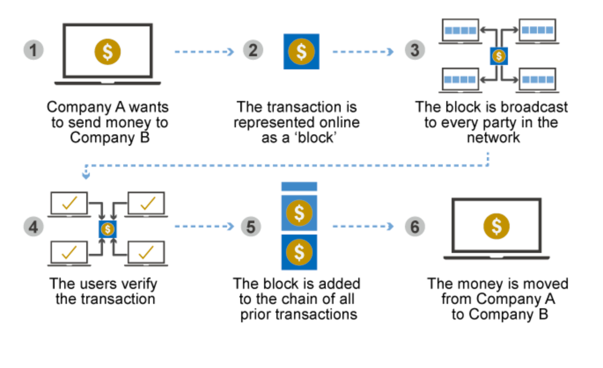

### Smart contracts

Smart contracts are self-executing lines of code with the terms of an agreement between buyer and seller automatically verified and executed via a computer network.

Smart contracts deployed to blockchains render transactions traceable, transparent, and irreversible.

How Smart Contracts Work

Smart contracts were first proposed in 1994 by Nick Szabo, an American computer scientist who invented a virtual currency called "Bit Gold" in 1998, fully 10 years before the invention of bitcoin. In fact, Szabo is often rumored to be the real Satoshi Nakamoto, the anonymous inventor of bitcoin, which he has denied

Szabo defined smart contracts as computerized transaction protocols that execute terms of a contract. He wanted to extend the functionality of electronic transaction methods, such as POS (point of sale), to the digital realm. 

In his paper, Szabo also proposed the execution of a contract for synthetic assets, such as derivatives and bonds. Szabo wrote: "These new securities are formed by combining securities (such as bonds) and derivatives (options and futures) in a wide variety of ways. Very complex term structures for payments can now be built into standardized contracts and traded with low transaction costs, due to computerized analysis of these complex term structures.

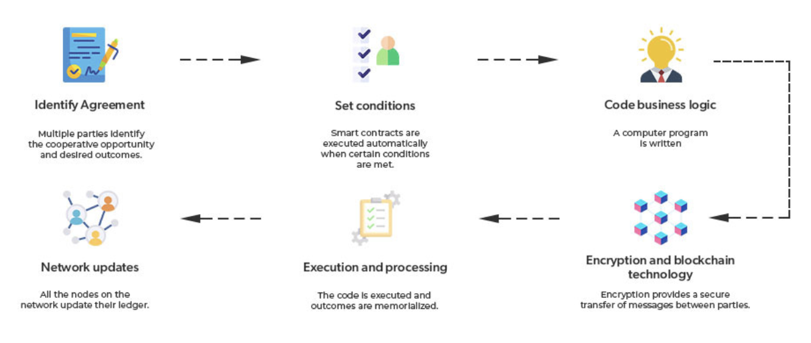

### Create a Wallet

Open your chrome browser and go to https://chrome.google.com/webstore/search/metamask

Install the Metamask Cromee extension

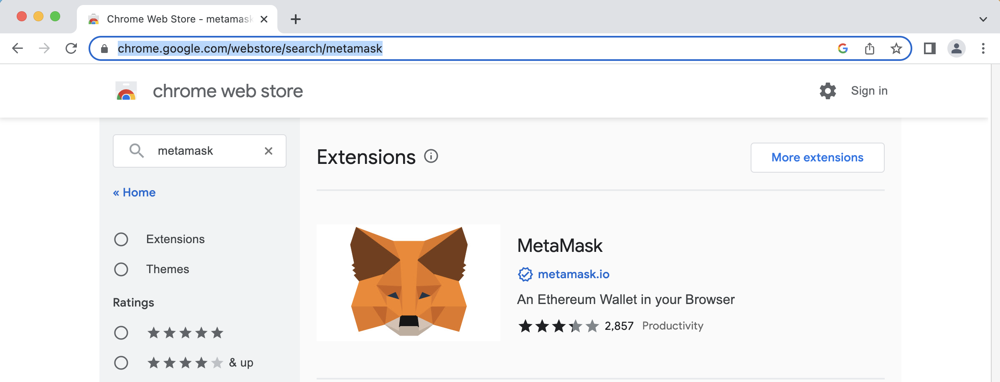

Click on the "Add to Chrome" button

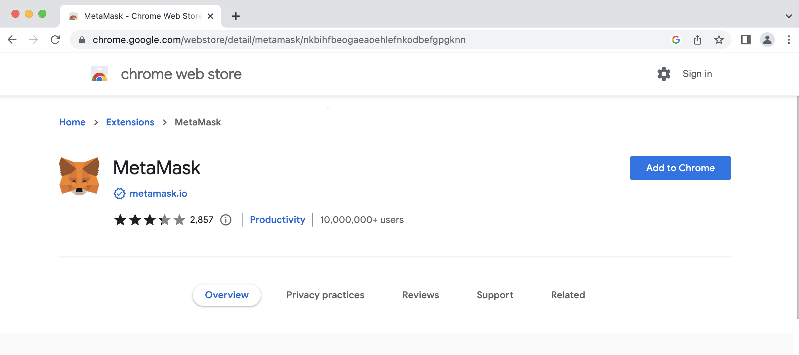

Now click on the "Add Extension button"

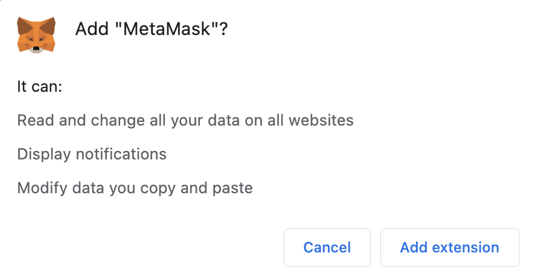

Once the extension is installed you will be prompted to create a wallet or import an existing one

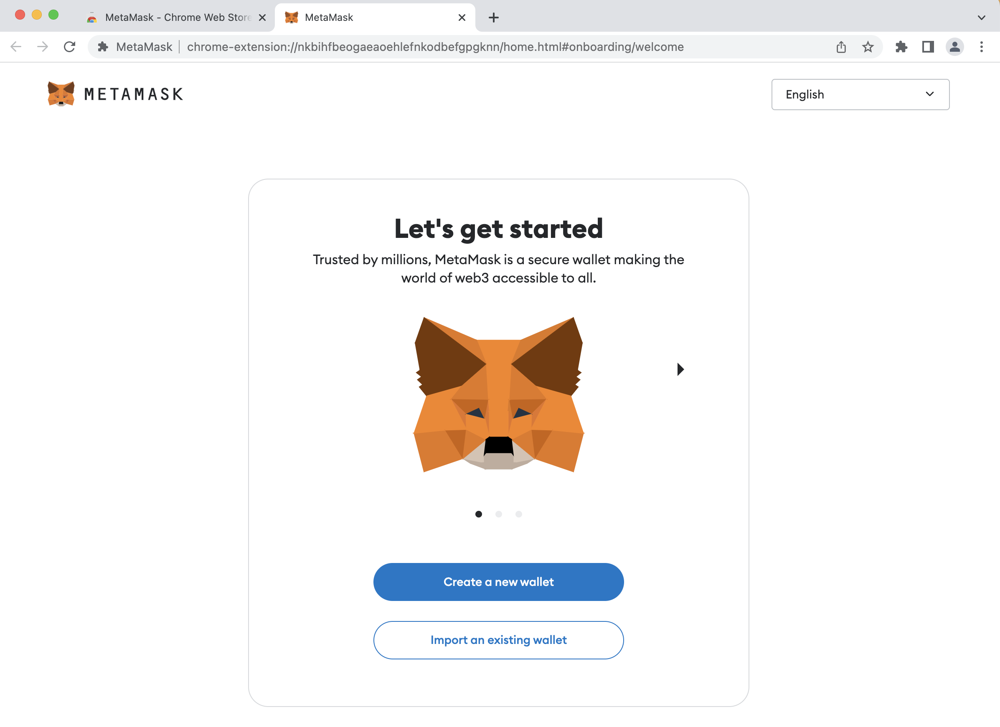

For the purposes of this exercise we are going to create a new wallet by clicking on the "Create a new wallet" button

You will be prompted with a disclaimer to help improve the quality of Metamask you can agree or select no thanks depending on your comfort level with the statement.

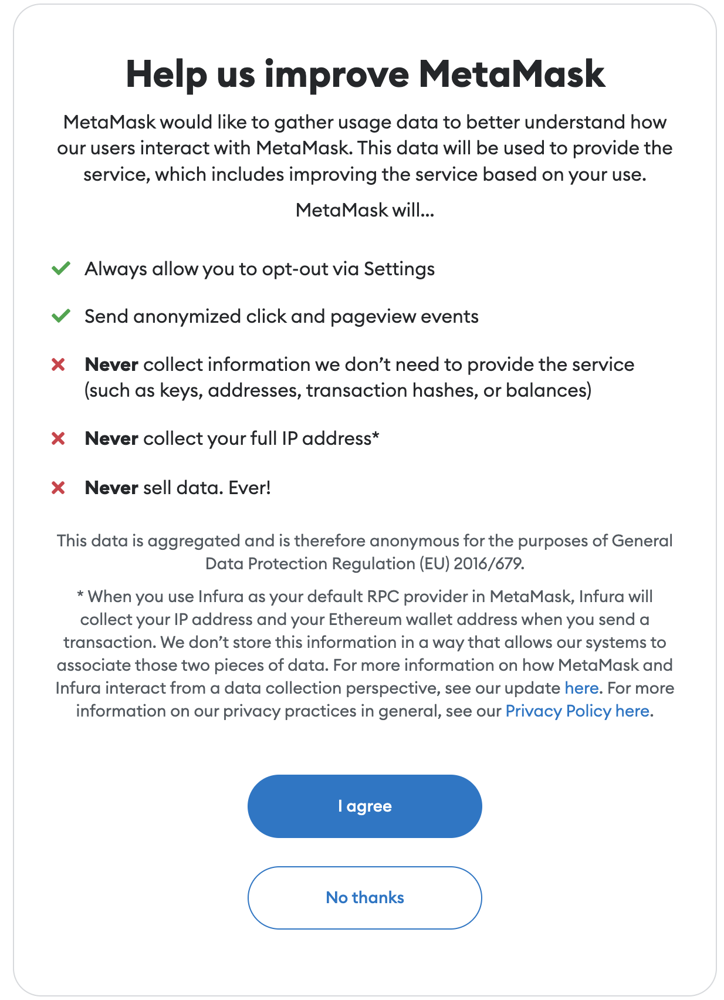

You will be prompted to create a password for your wallet this password will be used to login to Metamask to access your wallet. Please note the password must be at least 8 characters but we recommend a 12 or more character password that utilized uppercase, lowercase, numbers, and special characters.

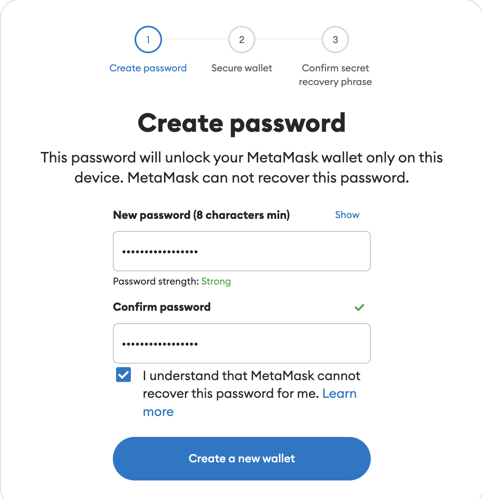

You will be prompted to watch a video to secure your wallet. It's a 90 second video on best practices. I would not recommend skipping it because the information about securing your wallet is extremely important and then click on the secure my wallet recommended button

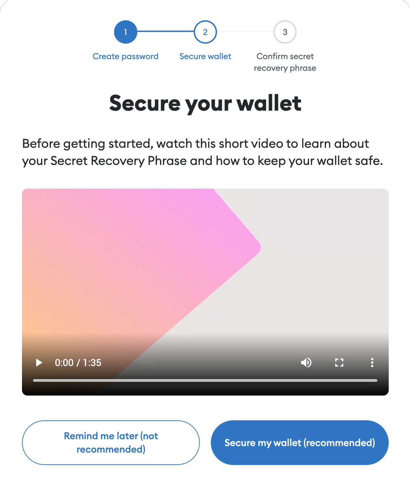

Next you will be taken to a screen where your 12-word secret pharase will be revealed please make sure you are in a place where no one can see this 12 word phrase because it would provide them with access to your wallet. When you are ready click on the reveal secret recovery phase button.

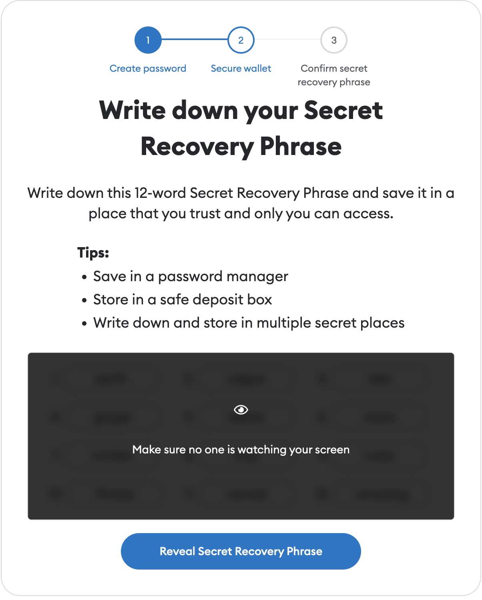

Once the 12-word passphase is revealed you should store it in a secure location such as a password manager, a piece of paper that you store in a safe, or a safe deposit box of some kind. Please note anyone with access to any of these online or offline places could potentially obtain access to your wallet.

Next you will be promoted to confirm the phrase before you continue which may require you to supply the words missing from the 12-word phrase in the correct order. Please do so in order to proceed with finalizing the  creation of your wallet.

Finally you will be promoted to confirm your wallet has been created successfully. You can click on the Got it button or click on the advanced configuration option to make additional changes. We recommend completing the wallet setup and return to the configuration later once you understand the various options to configuring a wallet.

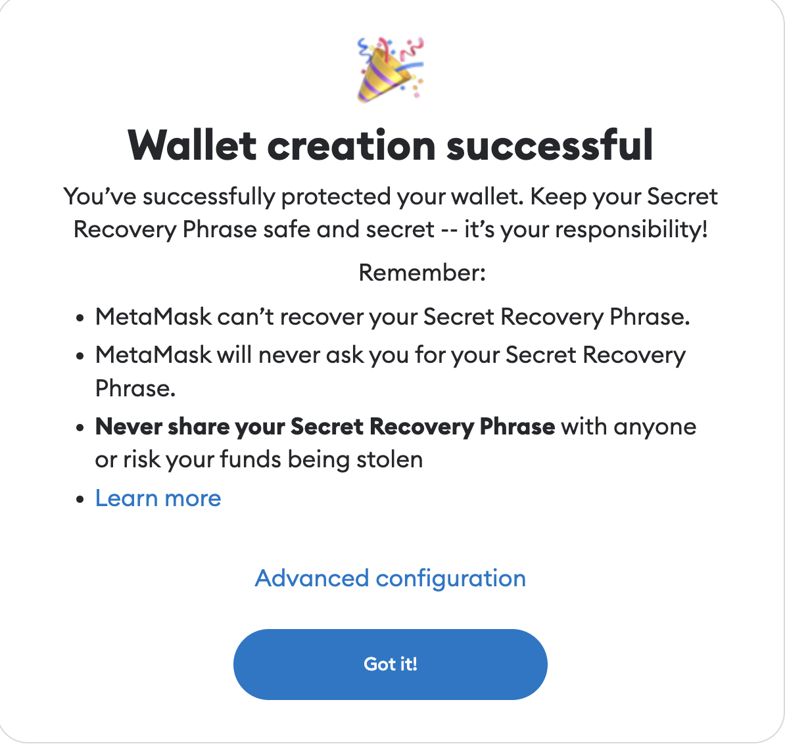
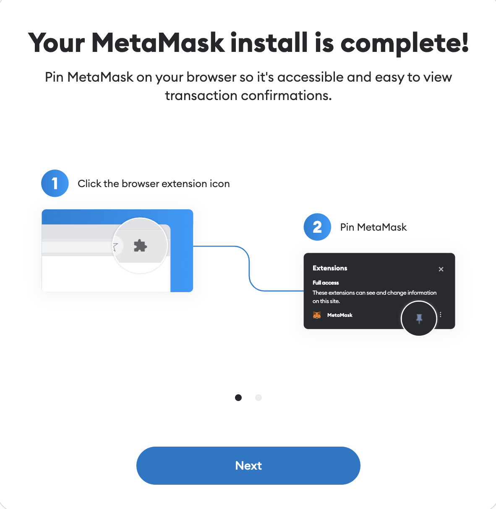
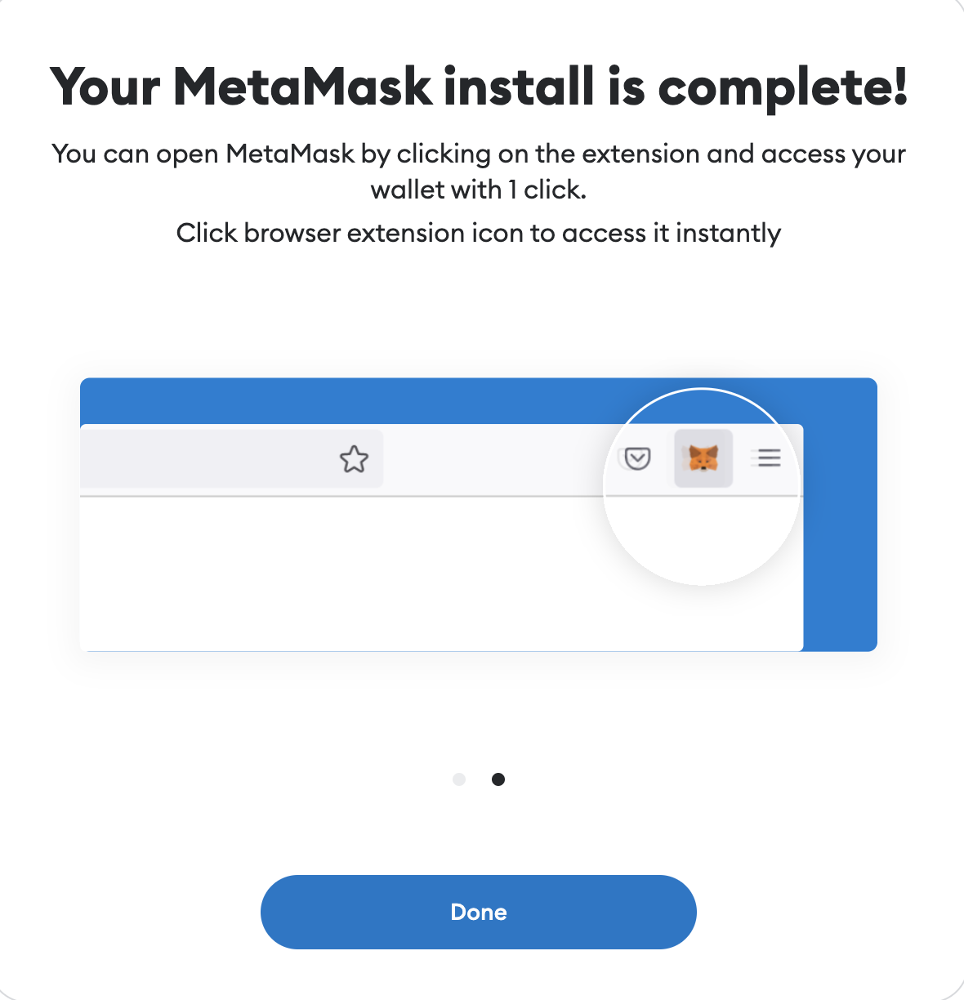

Once the setup is complete you will be taken to a screen wher you can reveal the wallet address to send funds to in addition to a place for you to buy, sell, and swap crypto currency.

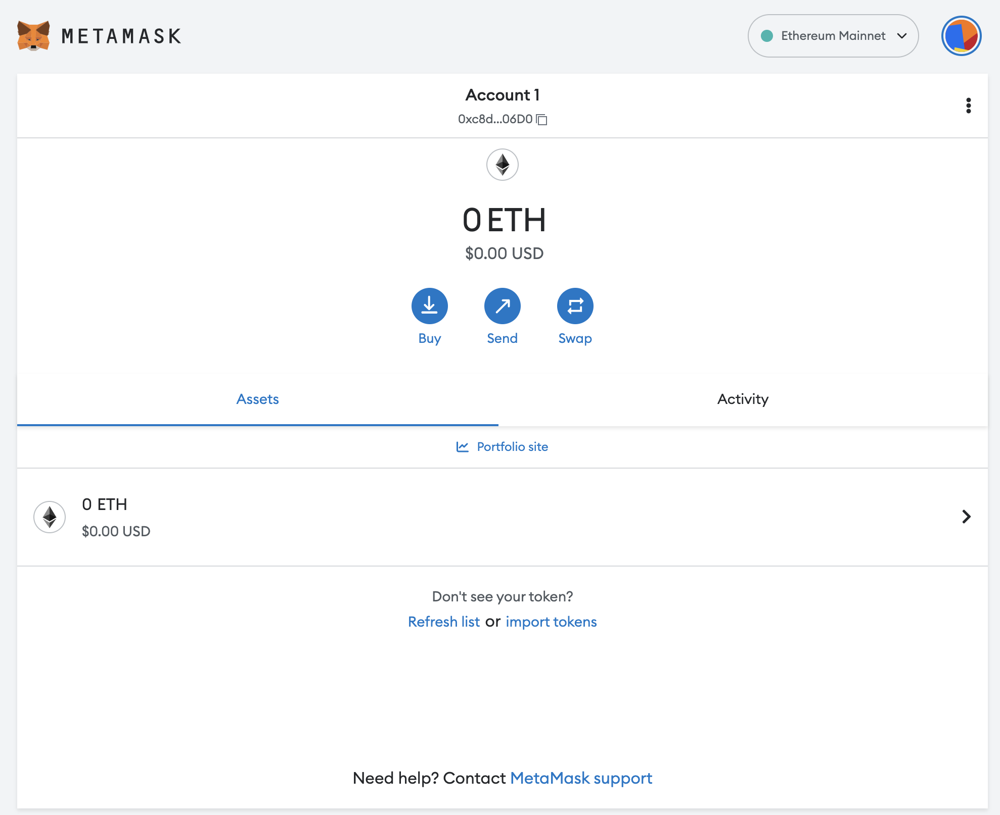
