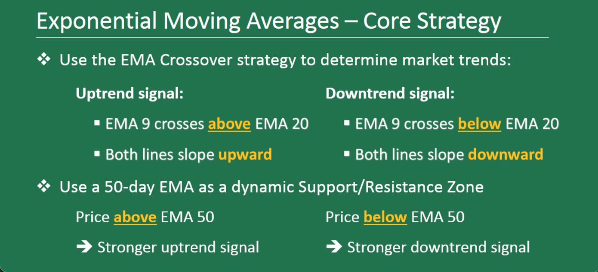

### Trading Foundations

## Why should I invest in the market?

Stocks offer investors the greatest potential for growth (capital appreciation) over a time period. Investors willing to stick with stocks over long periods of time, generally are rewarded with strong, positive returns.

But stock prices also fall. There’s no guarantee in the market, so you can lose money you invest in a specific company or fund.

If a company goes out of business and its assets are liquidated, common stockholders are the last to be paid out. The company’s bondholders will be paid first, then holders of preferred stock. If you are a common stockholder, you get whatever is remaining.

Even when companies aren’t in danger of failing, their stock price may fluctuate up or down. Large company stocks as a group, for example, have lost money on average about one out of every three years. If you have to sell shares on a day when the stock price is below the price you paid for the shares, you will lose money on the sale.

Market fluctuations can be unnerving to some investors. A stock’s price can be affected by factors inside the company, such as a faulty product, or by events the company has no control over, such as war, market manupilation, bad press, or failure in leadership.

Stocks usually are one part of an investor’s holdings. If you are young and saving for a long-term goal such as retirement, you may want to hold more stocks than bonds. Investors nearing or in retirement may want to hold more bonds than stocks.

The risks of stock holdings can be offset in part by investing in a number of different stocks. Investing in other kinds of assets that are not stocks, such as bonds, is another way to offset some of the risks of owning stocks.

### Exponential Moving Average

## EMA Example👇🏾
%20x%20(1%2Dmultiplier))

An exponential moving average (EMA) is an average price calculation over a specific time period that puts more weight on the most recent price data causing it to react faster to price change.

Traders use moving averages on charts to help determine trend, direction, and strength, and are often used as entry and exit points.

A moving average is essentially a measure of the average price of a security that is derived by averaging out the prices over a given period of time. Traders often use moving averages to gauge market trends in order to raise their chances of success and take trades in the direction of the market.

Moving averages are also useful for identifying support and resistance levels. In addition, they allow traders to take a look at past performance and give a glimpse into where stock prices might go in the future.

What is exponential moving average
The exponential moving average is an average price calculation over a certain time period that applies more weight on the most current price data causing it to react faster to price change.

EMA is one of the oldest trading indicators and is used by thousands of traders today. Day traders incorporate this indicator into charts to help determine trend, direction, and strength. Others also rely on it to identify entry and exit points.

How it is calculated
Calculating an exponential moving average (EMA) involves three steps. First, you need to calculate the simple moving average (SMA) for the initial EMA value. Since an EMA has to start somewhere, a simple moving average is used as the previous period’s EMA in the first calculation.

If you want to calculate the SMA of the last 20 days, we simply sum up the values of the last 20 closing prices and divide by 20.

For example: Suppose closing price of a stock for the last 10 days are 1,2,3,4,5,6,7,8,9,10…the simple average is 1+2+3+4+5+6+7+8+9+10/ 10 = 5.5…here 10 is number of days. As new data comes in the average is recalculated, thereby creating a “moving average.”

The second step involves calculating the weighting multiplier for the number of periods you want to calculate for the EMA. To calculate the weighting multiplier, use the following formula.

EMA(current) = ((Price(current) – EMA (prev)) x Multiplier) + EMA(prev)

Keep in mind that the number of periods always has a significant impact on the weighting multiplier.

Once you have determined the SMA and weighting multiplier values, the EMA can then be calculated using the following formula:

(Closing price-EMA(previous day)) x multiplier + EMA(previous day)

Difference between EMA and SMA
Exponential moving average and simple moving average are similar in that they are used to measure trends. Another similarity between the two indicators is that they are used to smooth price fluctuations in a trade and both follow the same principles. However, some differences exist between the two indicators.

EMA gives more weight to current data of a trading period, while SMA calculates the average price data of the entire period.
Exponential moving average is different from simple moving average in that a given day’s EMA calculation depends on the EMA calculations for all the days prior to that day. You need far more than 10 days of data to calculate a reasonably accurate 10-day EMA.
Another difference is that the EMA is slightly more sensitive to price changes compared to the simple moving average. High sensitivity makes it possible for traders to identify a trend faster compared to the SMA.

As you can see in the chart above, the red moving average is a 20-day exponential moving average (EMA) and the yellow moving average is the 20-day simple moving average (SMA). The EMA sticks closer to the price action while the SMA is smoother and slower to react to the same price changes. Day traders generally prefer the EMA due to its quickness.

It is important to note the direction of the moving average for market direction for the time period you are trading. Generally traders want to trade in the direction of the trend to improve odds and go with the flow. The 8- and 20-day EMA tend to be the most popular time frames for day traders while the 50 and 200-day EMA are better suited for long term investors.

Sometimes markets will flat-line, making moving averages hard to use, which is why trending markets will bring out their true benefits. Moving Averages can also be beneficial for identifying reversals when stocks are over-bought or over-sold.

Generally stock prices will only get so far away from the moving averages before coming back to test the moving averages and then continue on their trend. Whether you are new to trading or have been doing it for a while, you will definitely find them to be beneficial in your trading.

Using EMA to make trade decisions with example
There a few ways that traders can trade with the exponential moving average.

Generating buy and sell signals:  Traders can rely on the EMA to generate buy and or/sell signals. This happens when one moving average crosses over another. For example, you can trigger a trade signal by having a slow average cross a fast average.
Example

The chart below shows the Nasdaq 100 index with 20 and 50 day exponential moving averages.

A buy signal would be generated when the 20 day EMA (green line) crosses above the longer term 50 day EMA (red line). On the other hand, a sell signal would be generated when the more sensitive 20 day EMA crosses below the 50 day EMA.

The blue arrows represent the buy signals, while the red arrows show the sell signals.

Provide dynamic support and resistance levels: Exponential moving average periods like the 20, 50, 100 and 200 can also work as support and resistance zones, which is the key to price action and profit in the market.
Trend trading: Other traders use the EMA to track the primary trend. If the stock closes beyond the average, the trader exits the trade.
Limitations of EMA
As with all moving averages, exponential moving average has its limitations which we will lay out in this section.

It has the lagging indicator as it relies on some past price movements. This means the stock may or may not go up in future as per the EMA.
Although it indicates present trend of the stock, it can’t surely forecast future trend of the stock.
Crossover strategy for entry fails to work many times.
It is more vulnerable to false signals and getting whipsawed back and forth.
Bottom line
The exponential moving average is one of the most commonly utilized stock trading tools. It is often used by traders to determine entry and exit points of a trade based on where the price action sits on their trading charts. If it is low, the trader may consider a buy, and conversely if it is low, a sale or short sale.

However, traders ought to use the EMA along with other trading tools, most commonly relative strength index (RSI), moving average convergence divergence (MACD), and others.

### MACD

What Is Moving Average Convergence/Divergence (MACD)?
Moving average convergence/divergence (MACD, or MAC-D) is a trend-following momentum indicator that shows the relationship between two exponential moving averages (EMAs) of a security’s price. The MACD line is calculated by subtracting the 26-period EMA from the 12-period EMA.

The result of that calculation is the MACD line. A nine-day EMA of the MACD line is called the signal line, which is then plotted on top of the MACD line, which can function as a trigger for buy or sell signals. Traders may buy the security when the MACD line crosses above the signal line and sell—or short—the security when the MACD line crosses below the signal line. MACD indicators can be interpreted in several ways, but the more common methods are crossovers, divergences, and rapid rises/falls.

MACD Formula

MACD = 12-Period EMA − 26-Period EMA

MACD is calculated by subtracting the long-term EMA (26 periods) from the short-term EMA (12 periods). An EMA is a type of moving average (MA) that places a greater weight and significance on the most recent data points.

The exponential moving average is also referred to as the exponentially weighted moving average. An exponentially weighted moving average reacts more significantly to recent price changes than a simple moving average (SMA), which applies an equal weight to all observations in the period.

Learning from MACD
MACD has a positive value (shown as the blue line in the lower chart) whenever the 12-period EMA (indicated by the red line on the price chart) is above the 26-period EMA (the blue line in the price chart) and a negative value when the 12-period EMA is below the 26-period EMA. The level of distance that MACD is above or below its baseline indicates that the distance between the two EMAs is growing.

In the following chart, you can see how the two EMAs applied to the price chart correspond to the MACD (blue) crossing above or below its baseline (red dashed) in the indicator below the price chart.

MACD is often displayed with a histogram (see the chart below) that graphs the distance between MACD and its signal line. If MACD is above the signal line, the histogram will be above the MACD’s baseline, or zero line. If MACD is below its signal line, the histogram will be below the MACD’s baseline. Traders use the MACD’s histogram to identify when bullish or bearish momentum is high—and possibly overbought/oversold.

MACD vs. Relative Strength
The relative strength index (RSI) aims to signal whether a market is considered to be overbought or oversold in relation to recent price levels. The RSI is an oscillator that calculates average price gains and losses over a given period of time. The default time period is 14 periods with values bounded from 0 to 100. A reading above 70 suggests an overbought condition, while a reading below 30 is considered oversold, with both potentially signaling a top is forming, or vice versa (a bottom is forming).

The MACD lines, however, do not have concrete overbought/oversold levels like the RSI and other oscillator studies. Rather, they function on a relative basis. That’s to say an investor or trader should focus on the level and direction of the MACD/signal lines compared with preceding price movements in the security at hand, as shown below.

MACD measures the relationship between two EMAs, while the RSI measures price change in relation to recent price highs and lows. These two indicators are often used together to give analysts a more complete technical picture of a market.

These indicators both measure momentum in a market, but because they measure different factors, they sometimes give contrary indications. For example, the RSI may show a reading above 70 (overbought) for a sustained period of time, indicating a market is overextended to the buy side in relation to recent prices, while MACD indicates the market is still increasing in buying momentum. Either indicator may signal an upcoming trend change by showing divergence from price (price continues higher while the indicator turns lower, or vice versa).

Limitations of MACD and Confirmation
One of the main problems with a moving average divergence is that it can often signal a possible reversal, but then no actual reversal happens—it produces a false positive. The other problem is that divergence doesn’t forecast all reversals. In other words, it predicts too many reversals that don’t occur and not enough real price reversals.

This suggests confirmation should be sought by trend-following indicators, such as the Directional Movement Index (DMI) system and its key component, the Average Directional Index (ADX). The ADX is designed to indicate whether a trend is in place or not, with a reading above 25 indicating a trend is in place (in either direction) and a reading below 20 suggesting no trend is in place.

Investors following MACD crossovers and divergences should double-check with the ADX before making a trade on an MACD signal. For example, while MACD may be showing a bearish divergence, a check of the ADX may tell you that a trend higher is in place—in which case you would avoid the bearish MACD trade signal and wait to see how the market develops over the next few days.

On the other hand, if MACD is showing a bearish crossover and the ADX is in non-trending territory (<25) and has likely shown a peak and reversal on its own, you could have good cause to take the bearish trade.

Furthermore, false positive divergences often occur when the price of an asset moves sideways in a consolidation, such as in a range or triangle pattern following a trend. A slowdown in the momentum—sideways movement or slow trending movement—of the price will cause MACD to pull away from its prior extremes and gravitate toward the zero lines even in the absence of a true reversal. Again, double-check the ADX and whether a trend is in place before acting.

Example of MACD Crossovers
As shown on the following chart, when MACD falls below the signal line, it is a bearish signal indicating that it may be time to sell. Conversely, when MACD rises above the signal line, the indicator gives a bullish signal, suggesting that the price of the asset is likely to experience upward momentum. Some traders wait for a confirmed cross above the signal line before entering a position to reduce the chances of being faked out and entering a position too early.

Crossovers are more reliable when they conform to the prevailing trend. If MACD crosses above its signal line after a brief downside correction within a longer-term uptrend, it qualifies as a bullish confirmation and the likely continuation of the uptrend.

Example of Rapid Rises or Falls
When MACD rises or falls rapidly (the shorter-term moving average pulls away from the longer-term moving average), it is a signal that the security is overbought or oversold and will soon return to normal levels. Traders will often combine this analysis with the RSI or other technical indicators to verify overbought or oversold conditions.

How do traders use moving average convergence/divergence (MACD)?
Traders use MACD to identify changes in the direction or strength of a stock’s price trend. MACD can seem complicated at first glance, because it relies on additional statistical concepts such as the exponential moving average (EMA). But fundamentally, MACD helps traders detect when the recent momentum in a stock’s price may signal a change in its underlying trend. This can help traders decide when to enter, add to, or exit a position.

MACD is based on EMAs (more weight is placed on the most recent data), which means that it can react very quickly to changes of direction in the current price move. But that quickness can also be a two-edged sword. Crossovers of MACD lines should be noted, but confirmation should be sought from other technical signals, such as the RSI, or perhaps a few candlestick price charts. Further, because it is a lagging indicator, it argues that confirmation in subsequent price action should develop before taking the signal.

### RSI

What Is the Relative Strength Index (RSI)?
The relative strength index (RSI) is a momentum indicator used in technical analysis. RSI measures the speed and magnitude of a security's recent price changes to evaluate overvalued or undervalued conditions in the price of that security.

The RSI is displayed as an oscillator (a line graph) on a scale of zero to 100. The indicator was developed by J. Welles Wilder Jr. and introduced in his seminal 1978 book, New Concepts in Technical Trading Systems.
1

The RSI can do more than point to overbought and oversold securities. It can also indicate securities that may be primed for a trend reversal or corrective pullback in price. It can signal when to buy and sell. Traditionally, an RSI reading of 70 or above indicates an overbought situation. A reading of 30 or below indicates an oversold condition.

How the Relative Strength Index (RSI) Works
As a momentum indicator, the relative strength index compares a security's strength on days when prices go up to its strength on days when prices go down. Relating the result of this comparison to price action can give traders an idea of how a security may perform. The RSI, used in conjunction with other technical indicators, can help traders make better-informed trading decisions.

Calculating RSI

The RSI uses a two-part calculation that starts with the following formula:

insert RSI image1

The average gain or loss used in this calculation is the average percentage gain or loss during a look-back period. The formula uses a positive value for the average loss. Periods with price losses are counted as zero in the calculations of average gain. Periods with price increases are counted as zero in the calculations of average loss.

insert RSI image2

The standard number of periods used to calculate the initial RSI value is 14. For example, imagine the market closed higher seven out of the past 14 days with an average gain of 1%. The remaining seven days all closed lower with an average loss of −0.8%.

The first calculation for the RSI would look like the following expanded calculation:

insert RSI image3

Once there are 14 periods of data available, the second calculation can be done. Its purpose is to smooth the results so that the RSI only nears 100 or zero in a strongly trending market.

The Difference Between RSI and MACD
The moving average convergence divergence (MACD) is another trend-following momentum indicator that shows the relationship between two moving averages of a security’s price. The MACD is calculated by subtracting the 26-period exponential moving average (EMA) from the 12-period EMA. The result of that calculation is the MACD line.

A nine-day EMA of the MACD, called the signal line, is then plotted on top of the MACD line. It can function as a trigger for buy and sell signals. Traders may buy the security when the MACD crosses above its signal line and sell, or short, the security when the MACD crosses below the signal line.

The RSI was designed to indicate whether a security is overbought or oversold in relation to recent price levels. It's calculated using average price gains and losses over a given period of time. The default time period is 14 periods, with values bounded from 0 to 100.

The MACD measures the relationship between two EMAs, while the RSI measures price change momentum in relation to recent price highs and lows. These two indicators are often used together to provide analysts with a more complete technical picture of a market.

These indicators both measure the momentum of an asset. However, they measure different factors, so they sometimes give contradictory indications. For example, the RSI may show a reading above 70 for a sustained period of time, indicating a security is overextended on the buy side.

At the same time, the MACD could indicate that buying momentum is still increasing for the security. Either indicator may signal an upcoming trend change by showing divergence from price (the price continues higher while the indicator turns lower, or vice versa).

### VWAP Volume Weighted Average Price

What Is the Volume-Weighted Average Price (VWAP)?
The volume-weighted average price (VWAP) is a technical analysis indicator used on intraday charts that resets at the start of every new trading session.

It's a trading benchmark that represents the average price a security has traded at throughout the day, based on both volume and price.

VWAP is important because it provides traders with pricing insight into both the trend and value of a security.

Volume Weighted Average Price
Understanding the Volume-Weighted Average Price
VWAP is calculated by totaling the dollars traded for every transaction (price multiplied by the volume) and then dividing by the total shares traded.

VWAP = Cumulative Typical Price x Volume/Cumulative Volume

Where Typical Price = High price + Low price + Closing Price/3

Cumulative = total since the trading session opened.
How to calculate VWAP
By adding the VWAP indicator to a streaming chart, the calculation will be made automatically. However, to calculate the VWAP yourself, follow the steps below.

Assume a 5-minute chart. The calculation is the same regardless of what intraday time frame is used.

Find the average price the stock traded at over the first 5-minute period of the day. To do this, add the high, low, and close, then divide by three. Multiply this by the volume for that period. Record the result in a spreadsheet, under column PV.
Divide PV by the volume for that period. This will produce the VWAP.
To maintain the VWAP throughout the day, continue to add the PV value from each period to the prior values. Divide this total by total volume up to that point.
To make Step 3 easier in a spreadsheet, create columns for cumulative PV and cumulative volume and apply the formula to them.

How Is VWAP Used?
VWAP is used in different ways by traders. Traders may use VWAP as a trend confirmation tool and build trading rules around it. For instance, they may consider stocks with prices below VWAP as undervalued and those with prices above it, overvalued. If prices below VWAP move above it, traders may go long the stock. If prices above VWAP move below it, they may sell their positions or initiate short positions.

Institutional buyers including mutual funds use VWAP to help move into or out of stocks with as small of a market impact as possible. Therefore, when they can, institutions will try to buy below the VWAP, or sell above it. This way their actions push the price back toward the average, instead of away from it.

The Difference Between VWAP and a Simple Moving Average
On a chart, VWAP and a simple moving average (SMA) may look similar. However, these two indicators are calculated differently and represent different results.

VWAP is calculated by multiplying typical price by volume, and the dividing by total volume.

A simple moving average incorporates price but not volume. The SMA is calculated by totaling closing prices over a certain period (say 10 days) and then dividing the total by the number of periods (10).

Limitations of VWAP
VWAP is a single-day indicator and restarts at the open of each new trading day. Attempting to create an average VWAP over many days could distort it and result in an incorrect indicator.

While some institutions may prefer to buy when the price of a security is below the VWAP, or sell when it is above, VWAP is not the only factor to consider. In strong uptrends, the price may continue to move higher for many days without dropping below the VWAP at all or only occasionally. Therefore, waiting for the price to fall below VWAP could mean a missed opportunity if prices are rising quickly.

VWAP is based on historical values and does not inherently have predictive qualities or calculations. VWAP is anchored to the opening price range of the day. Therefore, the indicator increases its lag as the day goes on.

This can be seen in the way a 1-minute period VWAP calculation after 330 minutes (the length of a typical trading session) will often resemble a 390-minute moving average at the end of the trading day.

What Is the Volume-Weighted Average Price (VWAP)?
The volume-weighted average price (VWAP) is a measurement that shows the average price of a security, adjusted for its volume. It is calculated during a specific trading session by taking the total dollar value of trading in the security and dividing it by the volume of trades. The formula for calculating VWAP is cumulative typical price x volume divided by cumulative volume.

Why Is the Volume-Weighted Average Price Important?
VWAP gives traders a smoothed-out indication of a security’s price (adjusted for volume) over time. It is used by institutional traders to ensure that their trades do not move the price of the security they are trying to buy or sell too extremely.

For example, a hedge fund might refrain from submitting a buy order for a price above the security’s VWAP, in order to avoid artificially inflating the price of that security. Likewise, it might avoid submitting orders too far below the VWAP, so that the price is not dragged down by its sale.

What Is the Difference Between the Volume-Weighted Average Price and a Simple Moving Average (SMA)?
Like the VWAP, the simple moving average provides traders with a less volatile view of the recent price trend of a security. Unlike the VWAP, however, the simple moving average does not take into account the level of volume in that security’s trading.

VWAP weights each day’s price change by the amount of volume occurring in that day, whereas the simple moving average incorporates price and no volume.
