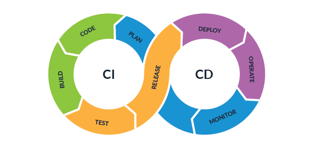

## Evaluation

## CI/CD Pipeline Jenkins Team Exercise
## Final Technical Evaluation

1. Fork the `https://github.com/tekperfect/jenkins-terraform.git` repository and name id jenkins_cicd

2. Create 3 Pipelines and Name them `Dev`, `Staging`, and `Production`.

3. Each pipeline should be configured to use the same repository or 3 different repositories. Meaning you can use the same repository if you can figure out how to have 1 repository use different branches. 5 extra points for accomplishing this goal.

4. 1 Point for figuring out how to deploy an Ubuntu instance. This should be a given since the code already works.

5. 1 Point for configuring your instance so all team members can login to it via ssh without opening it up to the entire world meaning NO instance should allow access to it via ssh from 0.0.0.0/0. This is bad and it actually will result in a deduction of a point.

6. 1 Point for creating a security group with terraform code that allows ssh access to only the members of your teams public IP's

7. 1 Point for adding an additional volume to your instance meaning it should have two disk. I recommend making the second disk 10GB or less.

8. 1 Point for creating a VPC with terraform code

9. 1 Point for creating your Ubuntu instance and making it part of the VPC.

10. 1 Point for creating a private VLAN in AWS with the following IP scope 10.10.10.0/24

11. 1 Point for using terraform to install Apache on your Ubuntu instace or run any bash script that will demonstrate that you can run post deployment code using Terrafrom.

12. 1 Point for creating an S3 bucket using terraform

13. 1 Point for allowing all your team members IP's to access the S3 bucket.

14. 2 bonus points for setting up your Apache instance so that it displays a non default page on your instance using Terraform code.

15. 2 bonus points creating a web page on your Ubuntu instance that displays the photos of all your team members using terraform code.

16. 2 bonus points for creating Terrafrom code that launches a Windows instance.

17. 2 bonus points for writing terraform code that runs a powershell script of any kind.

18. 2 bonus points for writing terraform code that can launch both the Windows and Ubuntu instance at the same time.

19. 5 bonus points for making sure each team members code works for each of the baseline point goals.

20. 10 bonus points for making sure each team members code works for the baseline and bonus point goals.

## Deadline is Friday at 5 PM PST.
